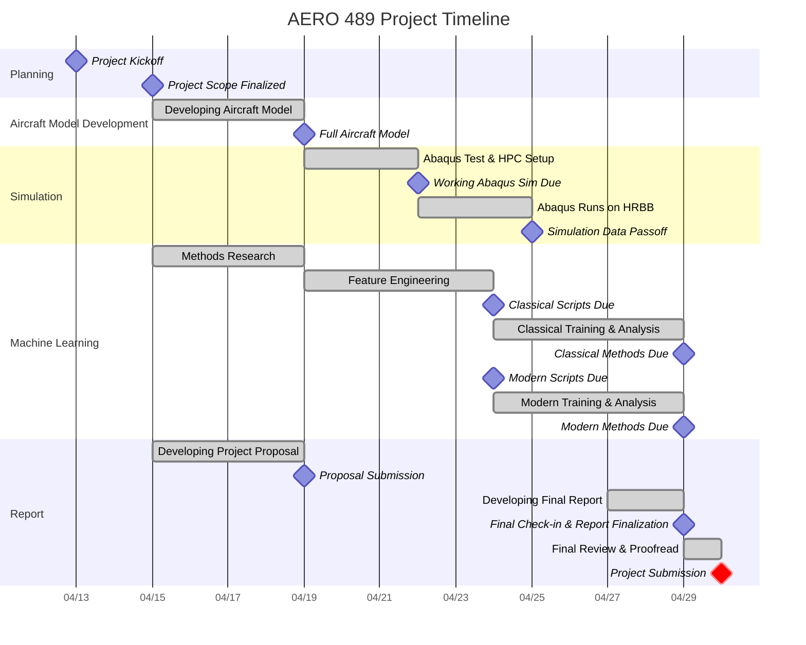

# AERO 489 Project Timeline

```mermaid
gantt
    title AERO 489 Project Timeline
    dateFormat  YYYY-MM-DD
    axisFormat  %m/%d
    todayMarker off

    section Planning
    Project Kickoff                :milestone, 2026-04-13, 0d
    Project Scope Finalized        :milestone, 2026-04-15, 0d

    section Aircraft Model Development
    Developing Aircraft Model      :done, 2026-04-15, 4d
    Full Aircraft Model            :milestone, 2026-04-19, 0d

    section Simulation
    Abaqus Test & HPC Setup        :done, 2026-04-19, 3d
    Working Abaqus Sim Due     :milestone, 2026-04-22, 0d
    Abaqus Runs on HRBB            :done, 2026-04-22, 3d
    Simulation Data Passoff        :milestone, 2026-04-25, 0d

    section Machine Learning
    Methods Research               :done, 2026-04-15, 4d
    Feature Engineering            :done, 2026-04-19, 5d
    Classical Scripts Due          :milestone, 2026-04-24, 0d
    Classical Training & Analysis  :done, 2026-04-24, 5d
    Classical Methods Due          :milestone, 2026-04-29, 0d
    Modern Scripts Due             :milestone, 2026-04-24, 0d
    Modern Training & Analysis     :done, 2026-04-24, 5d
    Modern Methods Due             :milestone, 2026-04-29, 0d

    section Report
    Developing Project Proposal    :done, 2026-04-15, 4d
    Proposal Submission            :milestone, 2026-04-19, 0d
    Developing Final Report        :done, 2026-04-27, 2d
    Final Check-in & Report Finalization :milestone, 2026-04-29, 0d
    Final Review & Proofread       :done, 2026-04-29, 1d
    Project Submission             :milestone, crit, 2026-04-30, 0d
```
