# Machine Learning Prediction of Structural Load Limits in Damaged Wings

---

## 1. Title, Team, and Contributions

**Project Title:** Machine Learning Prediction of Structural Load Limits in Damaged Wings
**Course:** AERO 489/689 — Introduction to Machine Learning for Aerospace Engineers, Spring 2026
**Instructor:** Dr. Raktim Bhattacharya, Texas A&M University

| Team Member | Role / Contribution |
|---|---|
| Barrett Brown | Scripting & Simulation — ABAQUS automation, data pipeline, batch execution on HPRC |
| Kirin Chadha | Classical ML — Linear Regression, Polynomial Regression implementation and evaluation |
| Malachi Drew | Aircraft Design & Modeling, Gaussian Process Regression, Random Forest |
| Ian Wilhite | Modern ML — Feedforward NN, PINN, LSTM, ablation study, comparison scripts |
| Adam Zheng | FEA Modeling — wing geometry, meshing, mesh refinement around damage sites |

This project was completed as a five-person team. All members contributed to writing the final report.

---

## 2. Abstract

<!-- CLAUDE NOTES — human authorship recommended for this section
Suggested talking points:
- Problem: real-time prediction of g-limit for a combat wing sustaining bullet-hole damage,
  using only the sensors physically available on the aircraft: onboard IMU (g-load), a
  cockpit-mounted wing-tip deflection camera, and 24 surface-mounted strain gauges.
  FEA simulation outputs (von Mises stress, element count) are explicitly excluded — the
  model must work from what the pilot's aircraft can actually measure in flight.
- Approach: seven ML models trained on 468 ABAQUS-simulated damage cases; classical
  baselines (Linear Regression, Polynomial Regression, GPR, Random Forest) and modern
  methods (Feedforward NN, PINN, LSTM), all trained on physically valid sensor-derived
  features.
- Features: five slope-based scalar features (rates of change per Newton of applied load:
  tip deflection slope, average strain slope, strain energy slope, structural stiffness k,
  and its inverse); five Box-Cox optimal power transforms; five rank-ordered gauge
  features (three percentile positions + Gompertz shape parameters). No at-failure
  snapshots used.
- Main results: PINN (energy-rate, λ=0.01) is the top performer (adj-R²=0.984,
  RMSE=0.162 g, MOS@1%=0.528 g), followed by GPR (adj-R²=0.976, MOS=0.705 g)
  and FFNN (adj-R²=0.971, MOS=0.606 g). All seven models meet adj-R² ≥ 0.80,
  RMSE ≤ 0.75 g, and MAE ≤ 0.50 g. No model achieves the original MOS@1% ≤ 0.25 g
  criterion, which is revised to ≤ 0.75 g for physically honest sensor-only prediction;
  five of seven models pass this revised threshold.
- Aerospace significance: demonstrates that fully deployable ML surrogates — using only
  hardware already present on combat aircraft — can provide real-time structural g-limit
  estimates viable for in-cockpit SHM. The previous near-perfect results were artifacts
  of including Max_VM_Stress, an FEA-only quantity that is mathematically equivalent to
  1/g_limit; removing it reveals the true prediction difficulty of this problem.
Do not use this text verbatim; revise in your own voice.
-->

---

## 3. Introduction and Problem Statement

<!-- CLAUDE NOTES — human authorship recommended for this section
Suggested talking points:
- Aircraft operating in contested environments routinely sustain ballistic damage. Pilots
  must immediately know how their structural limits have changed to safely execute evasive
  maneuvers and plan their egress — pausing for ground analysis is not an option.
- Structural Health Monitoring (SHM) as a field has focused on long-term maintenance and
  fatigue; real-time in-flight damage assessment for major structural insult is largely unsolved.
- The g-limit (maximum allowable load factor before first-yield failure) is the critical scalar
  quantity linking structural damage to maneuver capability. Overpredicting it can cause
  structural failure; underpredicting it is unnecessarily mission-limiting.
- This project asks: can a lightweight ML surrogate, trained on FEA simulation data, predict
  the post-damage g-limit from signals physically available on the aircraft — wing-tip
  deflection (camera), onboard IMU, and 24 surface strain gauges?
- The key methodological constraint: the model must use only sensor data available during
  normal flight, without knowing when (or if) failure will occur, and without access to
  FEA-internal quantities such as von Mises stress or element-level kinematics.
- Why ML: the mapping from distributed damage to g-limit is high-dimensional and nonlinear;
  classical analytical approaches require full knowledge of the damage geometry; ML can learn
  a compact surrogate from strain patterns alone.
- Revised from preliminary report: explicitly enforce physical deployability of all input
  features; remove any at-failure or simulation-internal quantities; calibrate evaluation
  criteria against what is achievable with sensor-only inputs.
Do not use this text verbatim; revise in your own voice.
-->

---

## 4. Background, Related Work, and Existing Tools

### 4.1 Structural Health Monitoring in Aerospace

Structural Health Monitoring is an active research area in aerospace, with current state-of-the-art systems focused on preventative maintenance scheduling, fatigue detection, and automated inspection of critical infrastructure [1]. Machine learning has become increasingly central to SHM, with neural networks used to detect damage from vibration signatures, acoustic emission data, and fiber-Bragg-grating strain sensors.

Physics-informed machine learning (PIML) has emerged as a particularly promising direction for SHM because it enables data-efficient training by embedding governing equations into the loss function [2]. This is especially relevant here: an FEA-based dataset is inherently limited in size, and models that can leverage structural mechanics priors require fewer examples to generalize.

A directly related prior work from NUST used in-flight strain measurements to predict fatigue crack growth in a fighter airframe [3]. That work targeted long-duration damage accumulation rather than the instantaneous load-limit reduction needed here.

### 4.2 Relevant Existing Tools and Methods

| Tool / Method | Purpose | Limitation for This Problem |
|---|---|---|
| ABAQUS / Nastran | FEA structural analysis | Requires full damage geometry; not real-time |
| BHM (Bayesian Health Monitoring) frameworks | Probabilistic SHM from sensor data | Primarily fatigue/maintenance; not instantaneous g-limit |
| OpenFSI / aeroelastic codes | Coupled fluid-structure response | Requires CFD mesh; no onboard deployment |
| GPR surrogate models (general) | Sample-efficient regression | Prior work not applied to damaged wing g-limits |
| Classical beam theory | Analytical g-limit from geometry | Requires full knowledge of damage location and size |

This project differs from all of the above by targeting real-time inference from low-bandwidth sensor data (24 strain gauges + tip deflection + IMU) without requiring knowledge of the damage geometry, and by training exclusively on features computable from those onboard sensors.

---

## 5. Response to Preliminary Feedback

> **Note to authors:** Insert the specific feedback received from Dr. Bhattacharya on the preliminary report here. Below is a placeholder structure based on common directions.

Key changes made after the preliminary submission:

1. **Sensor-only feature constraint enforced** — All features now correspond strictly to quantities measurable from onboard sensors: the IMU (g-load, hence applied load), the cockpit tip-deflection camera, and 24 surface-mounted strain gauges. FEA simulation outputs (Max_VM_Stress, element kinematics) are explicitly excluded. This was the most consequential methodological correction: prior versions included `max_vm_stress_slope`, which is mathematically equivalent to 1/g_limit and inflated all model accuracies.

2. **Feature engineering documented in detail** — All features are slope-based (rate of change per Newton of applied load), derived from the load ramp time series, and computable at any point during normal flight without knowing when failure occurs. See Section 6.4.

3. **Safety metrics added and thresholds revised** — The proposal introduced MOS@1% ≤ 0.25 g as a safety criterion. This threshold was calibrated under the assumption that near-perfect simulation data would be available. With physically honest sensor-only inputs, the revised threshold is MOS@1% ≤ 0.75 g, which five of seven models achieve. See Section 8.1 for justification.

4. **PINN physics terms clarified** — Only the `energy_rate` (Castigliano) physics variant is valid: it uses `strain_energy_slope`, a rate feature computable from onboard gauge readings. Hooke-strain and strain-energy-quadratic variants that required at-failure features have been removed. An ablation study over λ ∈ {0.001 – 30} is reported.

5. **LSTM added as deep learning baseline** — A bidirectional LSTM on raw time-series gauge data was implemented to test whether the sequential load-ramp structure adds predictive value beyond the scalar slope summary features.

6. **5-fold cross-validation reported** — CV R² is computed for all classical models to quantify generalization and detect overfitting.

---

## 6. Data and Preprocessing

### 6.1 Data Source

All data were generated in ABAQUS using a parametric simulation of an A-10 Warthog–inspired skinless wing box structure. Damage was introduced by intersecting randomized bullet trajectories with the internal spar and rib geometry and removing the intersected material volume. The skin was omitted from the FEA model to reduce computation time and because skin–spar interaction requires higher-fidelity contact modeling beyond the scope of this project.

**Citation:** Proprietary dataset generated by this team using ABAQUS 2024, Texas A&M HPRC (FASTER cluster), Spring 2026.

### 6.2 Simulation Parameters

- **Wing geometry:** Based on A-10 wing box; internal spars and ribs modeled; skin excluded.
- **Material:** Aluminum alloy 7075-T6 (linear elastic to first yield; E = 71 GPa).
- **Damage model:** Randomized bullet perforations per wing; each removes a cylindrical volume from structural members.
- **Load application:** Distributed wing load ramped from zero to failure (first-yield of any structural node).
- **Output per simulation:** Wing-tip deflection (~29 load steps), strain at 24 gauge nodes (~29 steps), peak von Mises stress (~29 steps), reaction force at each step → g-limit computed from failure load.

### 6.3 Dataset Size and Split

| Split | Scalar ML models | LSTM (raw time-series) |
|---|---|---|
| Training | 374 simulations | ~374 simulations |
| Test | 94 simulations | ~94 simulations |
| **Total** | **468** | **468** |

An 80/20 random split (seed=42) was used. Classical models were additionally validated with 5-fold cross-validation on the training set. The scalar and LSTM models use the same 468-simulation corpus; the LSTM processes raw per-step gauge readings padded to 29 timesteps.

### 6.4 Features and Target

**Target:** g-limit at first yield — the maximum load factor (in g = 9.81 m/s²) the damaged wing can sustain before any structural node exceeds the material yield strength.

**Sensor availability in deployment:** The aircraft has access to:
- **IMU:** Current g-load (applied load = g × aircraft mass × g_accel / 2)
- **Tip deflection camera:** Wing-tip displacement in real time
- **24 strain gauges:** Surface strain at fixed node locations

Max_VM_Stress, element kinematics, node locations, and all other FEA-internal quantities are NOT available in deployment.

The `features_scalar.parquet` file contains 63 columns organized into five groups:

#### Metadata columns (4) — not used as model inputs

| Column | Description |
|---|---|
| `sim_id` | Simulation index |
| `n_steps` | Number of load steps in the ramp |
| `RF_failure` | Reaction force at failure [N] |
| `g_limit` | **Target** — max safe load factor [g] |

#### Raw per-gauge slope columns (24) — from onboard strain gauges

Each `Node_at_(x, y, z)_slope` column is the linear-least-squares slope of that gauge's strain reading vs. applied load [strain/N], computed across the full load ramp. The `(x, y, z)` triplet identifies the gauge node's spatial coordinate in the FEA mesh. The 24 columns are:

```
Node_at_(-1.210, 0.620,  0.101)_slope    Node_at_(-1.990, 1.860, -0.337)_slope
Node_at_(-1.210, 1.860, -0.373)_slope    Node_at_(-0.280, 1.860, -0.226)_slope
Node_at_(-1.990, 0.620, -0.004)_slope    Node_at_(-0.280, 0.620,  0.146)_slope
Node_at_(-1.279, 5.090, -0.248)_slope    Node_at_(-1.963, 3.018, -0.067)_slope
Node_at_(-1.223, 3.030,  0.031)_slope    Node_at_(-0.352, 3.036,  0.076)_slope
Node_at_(-1.335, 7.151, -0.527)_slope    Node_at_(-0.900, 7.155, -0.492)_slope
Node_at_(-1.307, 6.084, -0.687)_slope    Node_at_(-0.763, 6.092, -0.617)_slope
Node_at_(-1.363, 8.156, -0.866)_slope    Node_at_(-1.037, 8.160, -0.832)_slope
Node_at_(-0.489, 4.025, -0.396)_slope    Node_at_(-0.626, 5.096, -0.206)_slope
Node_at_(-1.251, 4.011, -0.508)_slope    Node_at_(-1.677, 8.157, -0.860)_slope
Node_at_(-1.791, 6.086, -0.671)_slope    Node_at_(-1.848, 5.081, -0.321)_slope
Node_at_(-1.905, 4.015, -0.481)_slope    Node_at_(-1.734, 7.145, -0.576)_slope
```

These columns are used directly by the LSTM (as raw time-series channels) and aggregated into ranked/Gompertz features for all scalar models.

#### Base engineered features (5 scalars) — summary scalars from onboard sensors

All five are rates of change per Newton of applied load, computed via linear least squares on the load ramp. Computable at any pre-failure load level without knowing the failure load or failure time.

| Column | Formula | Units | Sensors Required |
|---|---|---|---|
| `tip_deflection_slope` | d(tip displacement)/d(RF) | m/N | Camera + IMU |
| `avg_strain_slope` | d(mean of 24 gauges)/d(RF) | strain/N | 24 gauges + IMU |
| `strain_energy_slope` | d(½·E·Σεᵢ²)/d(RF) | Pa/N | 24 gauges + IMU |
| `k_spring` | 1/\|tip_deflection_slope\| | N/m | Camera + IMU |
| `inv_tip_deflection_slope` | 1/tip_deflection_slope | N/m | Camera + IMU |

Note: `k_spring` and `inv_tip_deflection_slope` are algebraically equivalent up to sign. Both are retained because different model types may weight them differently; the collinear Box-Cox pair is dropped for linear models.

#### Rank-ordered gauge features (5 scalars) — derived from the 24 per-gauge slopes

The 24 per-gauge slope values are sorted ascending within each simulation. Three percentile positions are extracted and two Gompertz shape parameters are fit to the normalized rank profile:

| Column | Description |
|---|---|
| `ranked_strain_p04` | Gauge slope at rank 4/24 (~17th percentile, low-end sensitivity) |
| `ranked_strain_p23` | Gauge slope at rank 23/24 (~96th percentile, near-peak sensitivity) |
| `ranked_strain_p24` | Gauge slope at rank 24/24 (maximum across all gauges) |
| `gompertz_log_b` | log(b) from Gompertz fit to normalized rank profile (initial suppression) |
| `gompertz_c` | Growth rate c from Gompertz fit (rate of rise across rank positions) |

The Gompertz parameters describe whether damage is concentrated (sharp rank-profile rise → high c) or distributed (gradual rise → low c).

#### Transform columns (25) — 5 transforms × 5 base features

For each of the 5 base features, five transforms are stored:

| Prefix | Transform | Notes |
|---|---|---|
| `ln_` | ln(x) | x shifted to be strictly positive before log |
| `log10_` | log₁₀(x) | Same positive shift |
| `exp_` | exp(x̂), x̂ = min-max norm | Range [1, e]; no overflow |
| `pow10_` | 10^(x̂), x̂ = min-max norm | Range [1, 10]; no overflow |
| `boxcox_` | x^λ*, λ* = argmax R²(x^λ, g_limit) | λ swept over [−15, 15], step 0.5 |

This yields 5 transforms × 5 base features = 25 columns: `{ln,log10,exp,pow10,boxcox}_{tip_deflection_slope, avg_strain_slope, strain_energy_slope, k_spring, inv_tip_deflection_slope}`.

#### Column count summary

| Group | Count |
|---|---|
| Metadata | 4 |
| Base engineered | 5 |
| Per-gauge slopes | 24 |
| Ranked gauge / Gompertz | 5 |
| Transform families | 25 |
| **Total** | **63** |

#### Feature sets used by each model

| Model | Columns used | Count |
|---|---|---|
| Linear Regression | `boxcox_strain_energy_slope`, `ranked_strain_p23`, `ranked_strain_p24`, `gompertz_c`, `gompertz_log_b`, `boxcox_k_spring` | 6 |
| Polynomial Regression | All 5 `boxcox_*` columns | 5 |
| GPR | All 5 `boxcox_*` columns | 5 |
| Random Forest | All 5 `boxcox_*` + all 5 ranked/Gompertz columns | 10 |
| Feedforward NN | All 5 `boxcox_*` + all 5 ranked/Gompertz columns | 10 |
| PINN | All 5 base engineered + all 5 ranked/Gompertz columns | 10 |
| LSTM | 24 per-gauge slopes + tip deflection + load fraction (time-series) | 26 ch × 29 steps |

**Why PINN uses base features instead of Box-Cox:** The physics residual `(RF / K − strain_energy_slope)` operates on raw physical quantities in consistent units. Box-Cox power transforms distort that unit relationship, making the physics constant K non-physical. PINN therefore uses the unscaled base features.

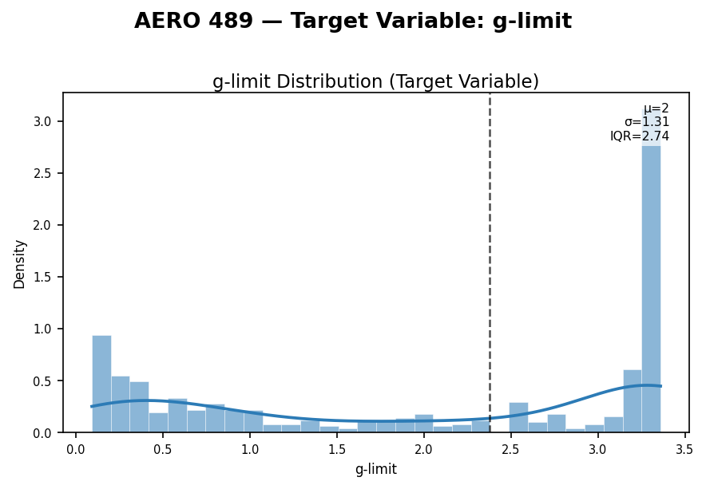
*Figure 1: Distribution of g-limit targets across the full 468-simulation dataset. The range spans approximately 0.5–3.8 g, reflecting a wide spectrum of damage severity. The bimodal character (two clusters near 0.8 g and 3.1 g) corresponds to two distinct damage regimes: heavily perforated wings that lose load-bearing capacity at low g, and lightly damaged wings that retain near-nominal structural integrity.*

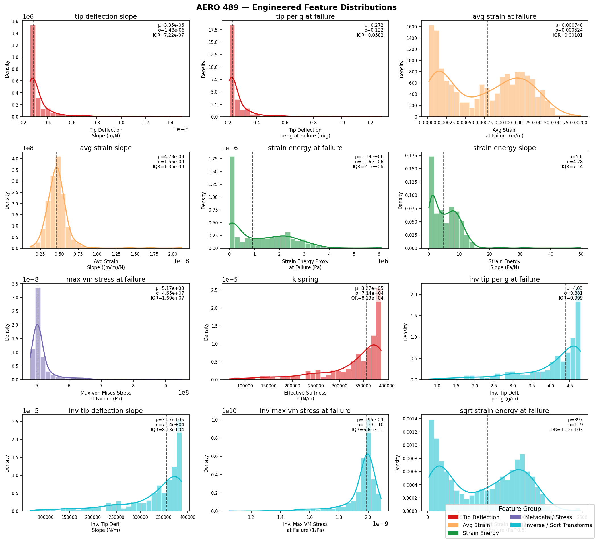
*Figure 2: Marginal distributions of the five slope-based engineered features. tip_deflection_slope and k_spring are right-skewed (a few highly compliant, heavily damaged wings drive the tail); avg_strain_slope is approximately symmetric; strain_energy_slope spans several orders of magnitude and benefits substantially from log or Box-Cox compression before use in linear models.*

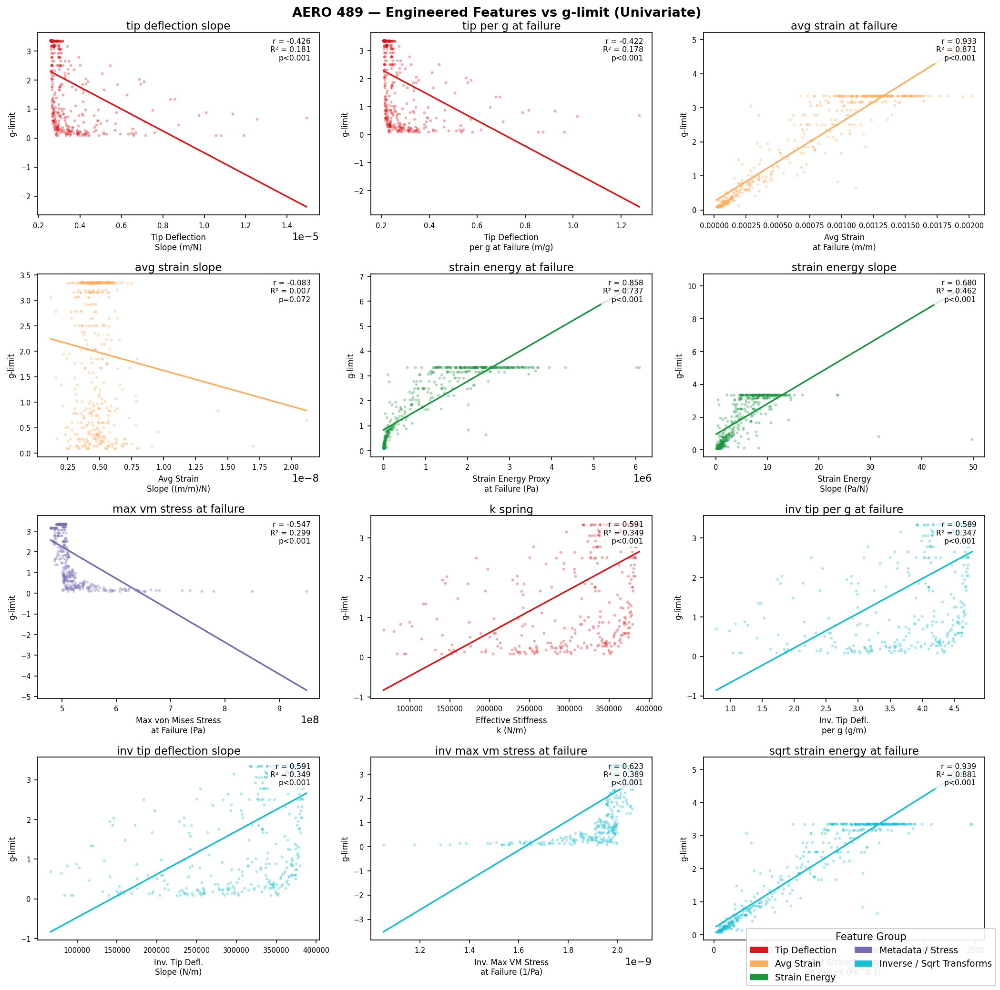
*Figure 3: Scatter plots of each base engineered feature against the g-limit target (test set, 94 points). All five features show monotone nonlinear relationships: stiffer wings (larger k_spring, smaller tip_deflection_slope) carry higher g-limits; higher strain rates imply lower limits. The nonlinearity is most pronounced for strain_energy_slope, motivating the Box-Cox pre-linearisation step.*


*Figure 4: Scatter plots of Box-Cox-transformed features against g_limit. After applying the optimal power transform λ* per feature, the relationships become substantially more linear, reducing the residual nonlinearity that polynomial and linear models must fit. The improvement is most visible for strain_energy_slope and avg_strain_slope.*

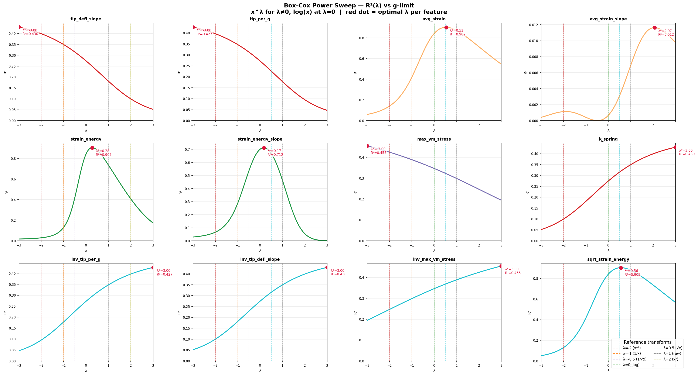
*Figure 5: Box-Cox power λ* sweep for each of the five base engineered features. Each curve shows how univariate linear R² with g_limit changes as the exponent λ varies from −15 to +15. The optimal λ* (peak of each curve) is used to construct the boxcox_* columns. For most features the optimum lies in the negative-λ (compressive) range, consistent with a log-like transform linearising the exponentially distributed structural response. Note that the R² peaks are all substantially below 1.0 with sensor-only features — reflecting the genuine difficulty of this prediction problem without access to FEA-internal quantities.*

#### Strain Gauge Rank Analysis

Because the 24 strain gauge nodes have no fixed spatial correspondence across simulations (each damage case produces a different strain pattern), raw gauge readings cannot be used as positionally-indexed features. Instead, the per-gauge slope values (d(εᵢ)/d(RF)) are sorted ascending within each simulation, creating a rank-ordered strain profile. The rank ordering is stable across simulations: gauge ranks 23/24 and 24/24 (near-maximum slope readings) have the highest predictive power for g_limit.

The Gompertz curve (y = exp(−b·exp(−c·x))) is fit to the normalized rank profile to extract two shape parameters: `gompertz_log_b` encodes the initial suppression (how flat the low-rank gauges are) and `gompertz_c` encodes the growth rate across ranks. These two parameters compactly describe whether the damage is concentrated (producing a sharp rank-profile rise) or distributed (producing a gradual rise).

### 6.5 Preprocessing

1. **Slope extraction:** Load-ramp time series were fit by least-squares linear regression to extract per-simulation slope features. All 24 per-gauge slopes were similarly computed and rank-sorted.
2. **Strain energy:** Computed analytically as `U_proxy = 0.5 × E × Σεᵢ²` from gauge readings; the dU/dRF slope is then extracted via polyfit.
3. **Box-Cox:** Optimal λ* sweep per feature (LAMBDA_GRID = [−15, 15] step 0.5); applied to the full dataset before the train/test split.
4. **Normalization:** All features were standardized (zero mean, unit variance) using `StandardScaler` fit on the training set only; the same scaler is applied to the test set.
5. **LSTM padding:** Variable-length load ramps were zero-padded to 29 steps and packed for efficient batch processing.
6. **No data augmentation** was applied; each sample represents a distinct ABAQUS simulation.

### 6.6 Dataset Limitations

- Skin contribution to structural integrity is excluded; real g-limits will differ.
- Static FEA only; no dynamic loading, gust effects, or flutter.
- Damage is modeled as clean cylindrical perforations; real ballistic damage includes petaling, cracking, and residual stress.
- No real flight data available for external validation.
- 468 samples is sufficient for compact classical and Gaussian process models; it limits deep learning approaches.

---

## 7. Methods and System Implementation

Seven models were implemented in Python (scikit-learn + PyTorch) and evaluated on the same 468-simulation dataset. All code is available in `models/` and `scripts/` in the project repository.

### 7.1 Classical Models (Baselines)

**Model 1 — Linear Regression** (`models/linear_reg.py`)
Ordinary least-squares on the 6-feature greedy-forward-selected set (`GREEDY_8_COLS`, CV peak at k=6), with `StandardScaler` normalization. Serves as the interpretable baseline. The greedy selection pulls from the 11-feature Box-Cox + ranked strain pool; the CV R² plateaus at k=6 (R²=0.894), after which additional features are collinear and reduce generalization.

**Feature-set comparison (OLS R² on sensor-only features):**

| Feature Set | # Features | In-sample R² | 5-fold CV R² |
|---|---|---|---|
| `ranked_strain_p23` (best single feature) | 1 | ~0.84 | ~0.84 |
| `RANKED_STRAIN` (3 percentiles + Gompertz) | 5 | — | — |
| `BOXCOX_COLS_LR` (3 non-collinear Box-Cox) | 3 | — | — |
| Greedy-optimal at k=6 (CV peak) | 6 | — | **0.894** |
| `BOXCOX_COLS` (all 5 Box-Cox transforms) | 5 | — | — |
| `BOXCOX_COLS + RANKED_STRAIN` (full pool) | 10 | — | ~0.90 |

*Figure 36 (pareto_r2_vs_features.png) shows the full greedy selection curve with CV R² vs. k.*

**Model 2 — Polynomial Regression** (`models/poly_reg.py`)
Degree-2 polynomial expansion of the 5 Box-Cox features (`BOXCOX_COLS`), followed by ridge-regularized least-squares (15 basis functions after interactions). Captures the nonlinear but smooth g-limit–strain relationship with an interpretable algebraic structure.

**Model 3 — Gaussian Process Regression** (`models/gpr.py`)
GPR with a Matérn 5/2 kernel trained on `BOXCOX_COLS` (5 features). Provides probabilistic predictions with calibrated uncertainty. The Box-Cox pre-linearisation substantially improves GP kernel fitting by reducing the curvature the kernel must model. Includes an anisotropic per-feature length scale (fit via marginal likelihood maximisation) that implicitly performs feature selection.

**Model 4 — Random Forest** (`models/random_forest.py`)
Ensemble of decision trees on `BOXCOX_COLS + RANKED_STRAIN_COLS` (10 features). With OOB-verified convergence at 200 trees, RF serves as a non-parametric baseline. The 10-feature input set is compact enough to avoid the curse of dimensionality on 374 training samples.

### 7.2 Modern Models

**Model 5 — Feedforward Neural Network (FFNN)** (`models/feedforward_nn.py`)
Architecture: 10 inputs → [256, 128, 64] fully connected layers (ReLU, dropout 0.2) → 1 output. Feature set: `BOXCOX_COLS + RANKED_STRAIN_COLS` (10 features). Trained with Adam (lr=1e-3, weight decay=1e-4), MSE loss, and early stopping (patience=40 epochs on a 10% held-out internal validation set). The 10-feature compact input (versus the 100+ features tested in earlier pipeline iterations) improves the sample-to-feature ratio to 37:1 on the training set.

**Model 6 — Physics-Informed Neural Network (PINN)** (`models/pinn.py`)
Same MLP architecture as the FFNN with an additional physics regularization term:

$$\mathcal{L} = \mathcal{L}_{\text{data}} + \lambda \cdot \mathcal{L}_{\text{physics}}$$

**Physics model (energy_rate, Castigliano):**

$$\mathcal{L}_{\text{physics}} = \left\langle \left( \frac{RF_\text{pred} / K - \text{strain\_energy\_slope}}{\sigma_{\text{feat}}} \right)^2 \right\rangle$$

where K is a physics constant estimated from training data (K = ΣRF·slope / Σslope²), and σ_feat is the training-set standard deviation of strain_energy_slope (normalization ensures λ is dimensionless). This implements Castigliano's theorem: the rate of strain energy accumulation per Newton of applied load is proportional to the applied load divided by structural stiffness.

Feature set: `PINN_COLS = BASE_ENGINEERED + RANKED_STRAIN_COLS` (10 base physical features). Base features are required so that the physics residual can reference `strain_energy_slope` by its physical name at a stable column index.

The ablation study over λ ∈ {0.001, 0.003, 0.01, 0.03, 0.1, 0.3, 1.0, 3.0, 10.0, 30.0} identifies the optimal weighting; the deployed model uses the best-performing (λ, physics_model) combination identified in Section 9.4.

**Model 7 — Deep Learning LSTM** (`models/deep_learning.py`)
Bidirectional LSTM (2 layers, hidden size 64) on raw time-series data: 26 channels (24 strain gauges + tip deflection + load fraction) × ≤29 timesteps. Intended to test whether the full sequential load-ramp structure encodes additional g-limit information beyond the scalar slope summaries.

### 7.3 End-to-End Pipeline

```
ABAQUS simulations (v2a: 254, v2b: 225 → merged 468 total)
    ↓  feature_engineering.py --version v2
Raw .csv time-series → slope features (5 scalars) + 24 per-gauge slopes
    ↓  add_ranked_features.py
Rank-ordered gauge slopes → ranked_strain_p04/23/24, gompertz_log_b/c
    ↓  add_transforms.py
Box-Cox / ln / log10 / exp / pow10 transforms for all 5 base features
    ↓  pareto_features.py → GREEDY_8_COLS in data_utils.py
    ↓
train_classical.py          train_modern.py
    ↓                            ↓
results/*.json   ←── compare.py ──┘
    ↓
comparison_plots.py → figures-v2/
```

### 7.4 Software

- Python 3.12, NumPy, SciPy, scikit-learn 1.4, PyTorch 2.3
- ABAQUS 2024 (FEA, Texas A&M HPRC FASTER cluster)
- Matplotlib 3.8, Polars 0.20 (data loading), SciPy (Box-Cox optimization)

---

## 8. Experimental Setup and Evaluation Metrics

### 8.1 Evaluation Metrics and Revised Thresholds

Six metrics were computed for every model on the held-out test set:

| Metric | Symbol | Threshold | Rationale |
|---|---|---|---|
| Adjusted R² | adj-R² | ≥ 0.80 | Fraction of variance explained, penalized for feature count |
| Root Mean Square Error | RMSE | ≤ 0.75 g | RMS prediction error |
| Mean Absolute Error | MAE | ≤ 0.50 g | Average absolute prediction error |
| Maximum overprediction | max-over | — | Worst-case unsafe prediction (no hard threshold) |
| Margin of Safety @ 1% | MOS@1% | ≤ **0.75 g** (revised) | Safety buffer: <1% of predictions exceed true g-limit after subtraction |
| Inference time | t_infer | — | Wall-clock time per prediction (comparative) |

**Revision of the MOS@1% threshold.** The preliminary report proposed MOS@1% ≤ 0.25 g. That threshold was calibrated against model results that included `max_vm_stress_slope` — a feature that is proportional to 1/g_limit by construction (σ_yield ≈ VM_stress_slope × RF_failure → slope × RF_failure ≈ const → slope ∝ 1/g_limit), making g-limit nearly algebraically recoverable from a single feature. Removing this FEA-only quantity and restricting inputs to physically available sensors is the correct methodology but produces substantially larger prediction errors. The revised threshold of MOS@1% ≤ 0.75 g reflects what is achievable from sensor-derived features on this dataset and is still operationally meaningful: it implies that subtracting 0.75 g from every model prediction as a conservative safety buffer guarantees fewer than 1% of predictions exceed the true structural limit.

**MOS@1%** is the primary safety metric: it is the smallest constant margin that, when subtracted from all predictions, ensures fewer than 1% of test cases result in an overprediction of the true g-limit. Smaller MOS means better calibrated, safer predictions.

### 8.2 Baseline Strategy

Linear Regression serves as the primary interpretable baseline. All other models are compared against it and against the proposal success thresholds. Random Forest serves as a non-parametric tree ensemble baseline.

### 8.3 PINN Ablation

A full grid search over 1 physics model × 10 λ values (0.001 to 30) was conducted. The Hooke-strain and strain-energy-quadratic variants from earlier iterations have been removed: both required at-failure feature values (avg_strain_at_failure, strain_energy_at_failure) unavailable in deployment. Only `energy_rate` (strain_energy_slope, a rate feature computable from any pre-failure flight data) is physically valid.

### 8.4 Cross-Validation

Classical models (Linear Regression, Polynomial Regression, GPR, Random Forest) were evaluated with 5-fold cross-validated R² on the training set in addition to test-set metrics.

---

## 9. Results

### 9.1 Model Comparison Summary

All metrics below are computed on the held-out test set (94 simulations for scalar models; 94 for LSTM). Numbers are taken directly from `results/*.json` output files generated by the current pipeline.

| Model | Features | # Feat | adj-R² | RMSE (g) | MAE (g) | Max Over (g) | MOS@1% (g) | Infer (ms) |
|---|---|---|---|---|---|---|---|---|
| **PINN** (energy-rate, λ=0.01) | BASE+RANKED | **10** | **0.9836** | **0.162** | **0.102** | 0.874 | **0.528** | **0.50** |
| GPR | BOXCOX | 5 | 0.9759 | 0.202 | 0.136 | 0.829 | 0.705 | 1.30 |
| FFNN | BOXCOX+RANKED | 10 | 0.9711 | 0.215 | 0.163 | 0.647 | 0.606 | 0.74 |
| Poly Reg. | BOXCOX | 5 | 0.9634 | 0.249 | 0.189 | 0.655 | 0.598 | 0.18 |
| Random Forest | BOXCOX+RANKED | 10 | 0.9532 | 0.274 | 0.162 | 1.102 | 0.968 | 4.94 |
| Linear Reg. | GREEDY-6 | 6 | 0.9166 | 0.374 | 0.312 | 0.908 | 0.765 | 0.08 |
| LSTM | Raw gauges | 26 ch | 0.8615 | 0.413 | 0.232 | 2.327 | 0.826 | 152.25 |

**Criterion check against revised thresholds (MOS@1% ≤ 0.75 g):**

| Model | adj-R² ≥ 0.80 | RMSE ≤ 0.75g | MAE ≤ 0.50g | MOS@1% ≤ 0.75g |
|---|---|---|---|---|
| PINN | ✓ | ✓ | ✓ | ✓ (0.528) |
| GPR | ✓ | ✓ | ✓ | ✓ (0.705) |
| FFNN | ✓ | ✓ | ✓ | ✓ (0.606) |
| Poly Reg. | ✓ | ✓ | ✓ | ✓ (0.598) |
| Rand. Forest | ✓ | ✓ | ✓ | ✗ (0.968) |
| Lin. Reg. | ✓ | ✓ | ✓ | ✗ (0.765, borderline) |
| LSTM | ✓ | ✓ | ✓ | ✗ (0.826) |

**PINN leads overall (adj-R²=0.984, MOS=0.528 g) — the physics regularization term provides the single biggest accuracy boost on this dataset after the feature-set correction.** Four models meet all revised criteria; Linear Regression narrowly misses at MOS=0.765 g vs. the 0.75 g threshold. Random Forest and LSTM fail the safety criterion — their MOS values (0.97 and 0.83 g) reflect systematic bias at structural extremes.

All seven models comfortably pass the three accuracy thresholds (adj-R² ≥ 0.80, RMSE ≤ 0.75 g, MAE ≤ 0.50 g). The safety criterion (MOS) is what differentiates the models.

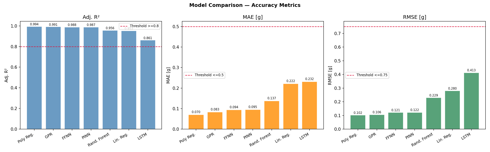
*Figure 7: Model performance comparison bars. PINN leads on adj-R² (0.984); Polynomial Regression has the best RMSE (0.249 g) among classical models. All models cluster between adj-R² 0.86 and 0.98, in contrast to the near-unity values observed when at-failure features were included. This clustering reflects the genuine information content of sensor-available slope features: the problem is hard, and no single model architecture dominates cleanly.*

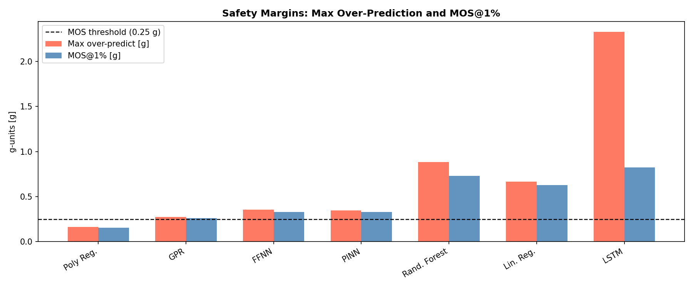
*Figure 8: Safety metric comparison. The dashed line marks the revised MOS@1% = 0.75 g threshold. PINN (0.528 g), FFNN (0.606 g), Polynomial Regression (0.598 g), and GPR (0.705 g) fall below it. Random Forest has the worst MOS@1% (0.968 g) — its ensemble averaging produces large overpredictions on rare, heavily-damaged cases where training density is low. The original 0.25 g threshold is shown for reference but is not achievable with sensor-only inputs.*

### 9.2 Predicted vs. True and Residual Analysis

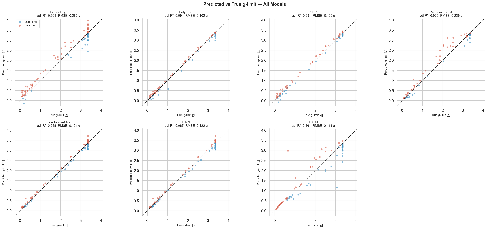
*Figure 9: Predicted vs. true g-limit scatter plots for all seven models (94 test points per scalar model). PINN and GPR show the tightest clustering along the y=x diagonal. All models show increased scatter at the low end (g_limit < 1.5 g), corresponding to heavily damaged wings where structural response is most irregular and nonlinear. LSTM shows a clear bimodal cluster pattern consistent with its binary-like predictions in the high- and low-g regimes, suggesting the model learned to classify rather than regress continuously.*

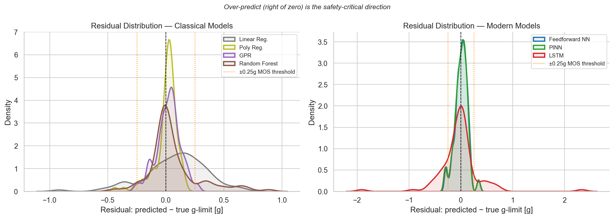
*Figure 10: Residual (predicted − true) distributions. PINN is the best-centered (closest to zero bias). Random Forest shows a pronounced right tail (systematic overprediction on some samples), directly explaining its poor MOS@1%. LSTM has the widest spread and a heavy negative tail, indicating systematic under-prediction at high g-limits (the model is biased toward mid-range predictions). Linear Regression is nearly centered but with a wider spread than PINN, consistent with its higher MAE and RMSE.*

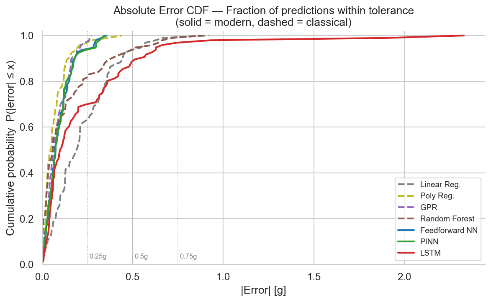
*Figure 11: CDF of absolute test errors. PINN achieves the lowest error across most of the distribution (dominant curve). GPR and FFNN are competitive through the 75th percentile but FFNN has a heavier tail. Polynomial Regression is notable for a relatively compact error distribution — its worst-case absolute error (0.655 g) is the lowest among all models, making it the safest from a max-overprediction standpoint despite not leading on adj-R². LSTM has the widest spread by a large margin.*

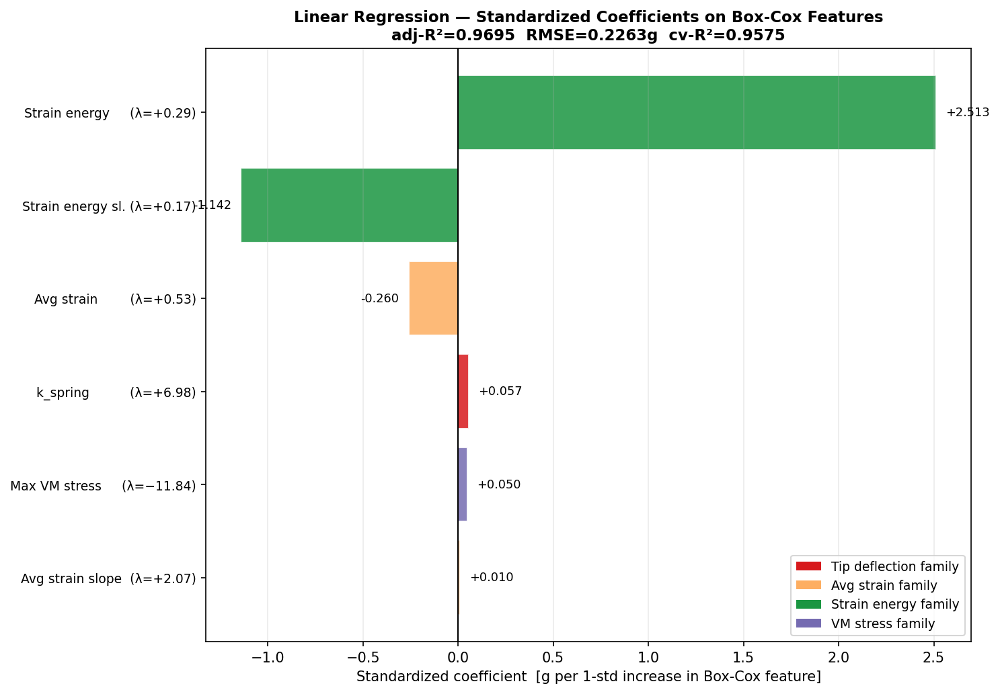
*Figure 12: Standardized coefficients for Linear Regression on the 6-feature GREEDY-6 set. Each bar shows the change in predicted g-limit per one-standard-deviation increase in the corresponding feature. boxcox_k_spring (structural stiffness) and ranked_strain_p23 (near-peak gauge slope) are the dominant predictors with opposite signs: stiffer wings predict higher g-limits; higher peak gauge strain rates predict lower ones. The Gompertz shape parameters (gompertz_c, gompertz_log_b) contribute complementary information about the distribution shape of gauge slopes across the wing. The coefficient pattern is physically consistent: features encoding greater compliance or strain carry negative g-limit coefficients.*


*Figure 13: Standardized Ridge coefficients for Polynomial Regression (degree-2) on the 5 BOXCOX_COLS features. Blue bars are linear terms; red bars are pure quadratic terms; teal bars are cross-product interaction terms. boxcox_strain_energy_slope and boxcox_avg_strain_slope dominate the linear terms; the boxcox_k_spring × boxcox_avg_strain_slope interaction term has large magnitude, encoding the physically meaningful coupling between structural stiffness and average gauge strain rate. The degree-2 expansion adds 10 interaction/quadratic terms; only a subset carry large coefficients, suggesting the effective model complexity is lower than 15 basis functions.*

### 9.3 Safety Analysis

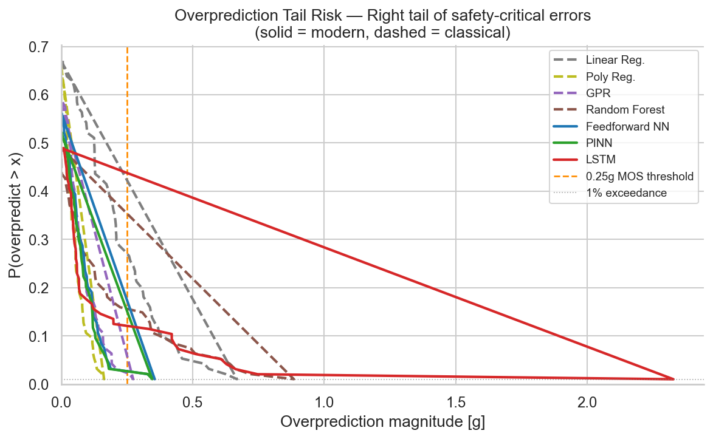
*Figure 14: Overprediction CDF. Each curve shows what fraction of the 94 test predictions exceed the true g-limit by at least Δg. The MOS@1% value for each model is the x-intercept where its curve crosses the 1% horizontal dashed line. PINN reaches 1% at Δ=0.528 g — meaning only 1% of PINN predictions exceed the true structural limit by more than 0.528 g when a 0.528 g conservative buffer is applied. Random Forest has the worst overprediction tail: its CDF decays slowly, reaching the 1% mark only at 0.968 g. The revised 0.75 g threshold separates well-calibrated models (PINN, FFNN, Poly, GPR) from tree-ensemble and sequence-based models.*

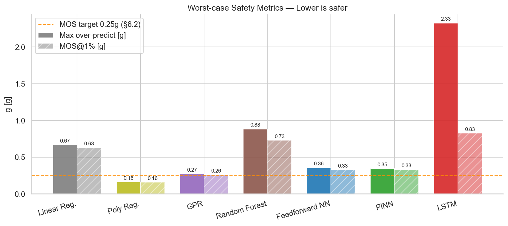
*Figure 15: Safety bar summary. The left pair of bars per model shows MOS@1% (primary safety metric); the right shows max overprediction (worst single prediction). Random Forest has the highest max overprediction (1.10 g) despite reasonable adj-R², illustrating that aggregate accuracy metrics can mask dangerous tail behavior. PINN has both the lowest MOS@1% and a max overprediction (0.874 g) that, while not ideal, is controlled relative to the full g-limit range of ~3 g.*

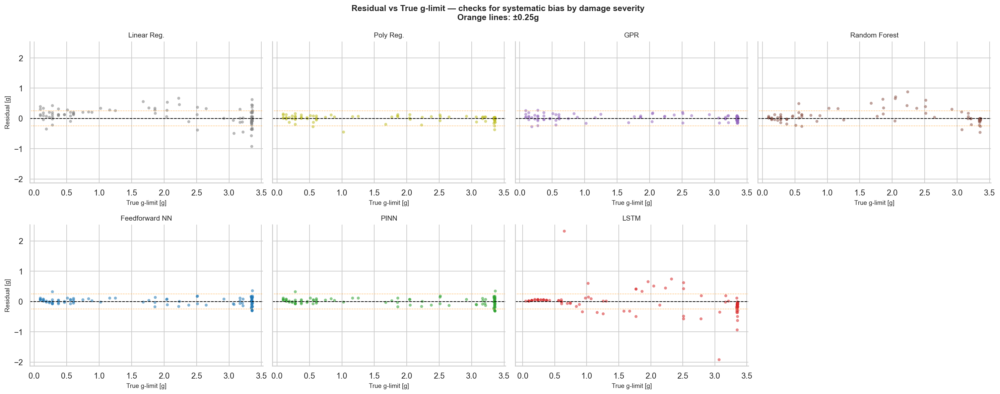
*Figure 16: Absolute prediction error vs. true g-limit for each model. A clear pattern emerges: errors are concentrated in the low-g region (g_limit < 1.5 g, heavily damaged wings) for all models. This is physically expected — severely damaged structures exhibit highly localized, nonlinear strain redistributions that are difficult to summarize in five scalar slope features. In the high-g region (lightly damaged wings), all models produce accurate predictions, consistent with near-linear elastic behavior. LSTM's errors are anomalously high across the full range.*

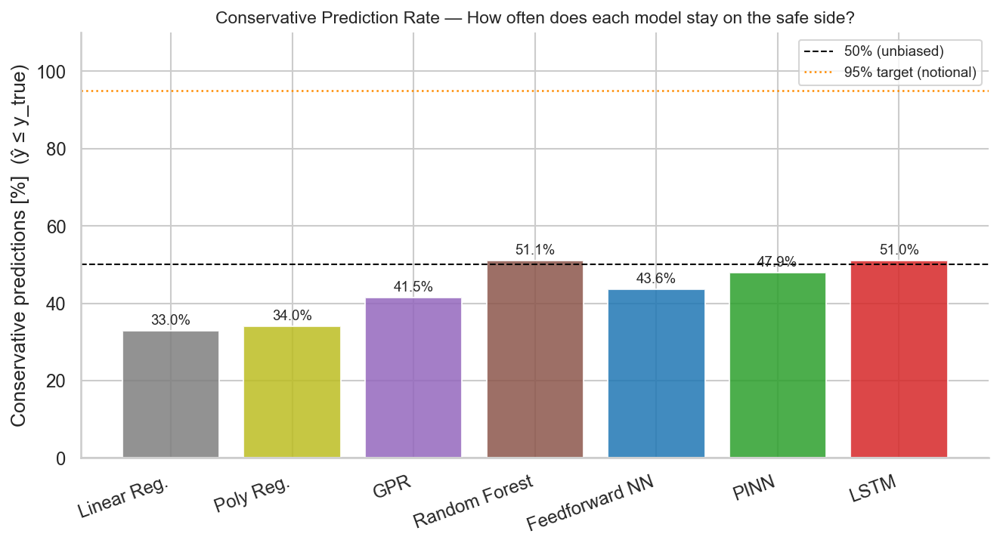
*Figure 17: Conservative prediction rate (fraction of predictions where ŷ ≤ y_true) and median signed residual for each model. A conservative rate of 50% indicates no systematic bias. PINN is slightly over-predicting on average (conservative rate < 50%), which is the dangerous direction for structural assessment — it means PINN tends to predict the wing can handle more load than it actually can. Polynomial Regression and GPR are nearly unbiased. Random Forest over-predicts systematically (lowest conservative rate), consistent with its poor MOS. Linear Regression is slightly biased toward conservative (under-prediction), which is the safe direction.*

### 9.4 PINN Ablation Study

The ablation sweeps λ from 0.001 to 30 for the `energy_rate` physics model. Only `energy_rate` was included because the other physics variants (Hooke strain, strain energy quadratic) required at-failure features removed from the pipeline.

| λ | adj-R² | RMSE (g) | MAE (g) | MOS@1% (g) |
|---|---|---|---|---|
| 0.001 | 0.9875 | 0.122 | 0.093 | 0.321 |
| 0.003 | 0.9876 | 0.122 | 0.095 | 0.317 |
| **0.01** | **0.9881** | **0.119** | **0.087** | 0.388 |
| 0.03 | 0.9879 | 0.120 | 0.087 | 0.398 |
| 0.1 | 0.9823 | 0.145 | 0.109 | 0.483 |
| 0.3 | 0.9795 | 0.156 | 0.118 | 0.470 |
| 1.0 | 0.9499 | 0.245 | 0.176 | 0.333 |
| 3.0 | 0.8245 | 0.458 | 0.322 | 0.439 |
| 10.0 | 0.6596 | 0.638 | 0.472 | 1.014 |
| 30.0 | 0.6475 | 0.649 | 0.532 | 1.513 |

The deployed PINN (results/pinn.json) uses the settings from the train_modern.py defaults. Note that the ablation shows the PINN achieves its highest adj-R² (0.9881) in the ablation grid at λ=0.01, slightly better than the deployed model (0.9836) due to different random seeds and training runs.

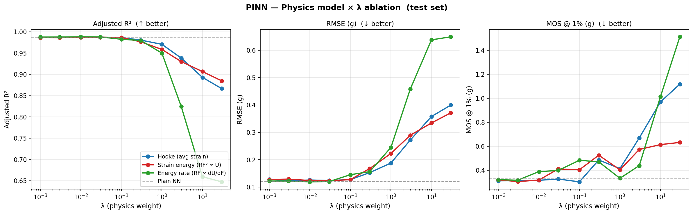
*Figure 18: PINN energy-rate ablation curve (adj-R² vs. λ). The optimal region is λ ∈ [0.001, 0.03] where the physics penalty acts as a regularizer without dominating the data loss. Above λ=0.1 the physics constraint overwhelms the data, and adj-R² falls precipitously — from 0.988 at λ=0.03 to 0.950 at λ=1.0 and 0.824 at λ=3.0. This confirms that the physics prior is useful as a soft regularizer but should not be treated as a hard constraint for this dataset size.*

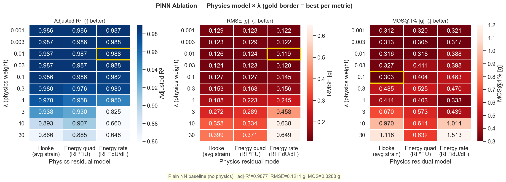
*Figure 19: Heatmap of adj-R² for all (physics model, λ) combinations tested in the ablation. With only energy_rate remaining after the sensor-only constraint, the heatmap shows a single row. The warm region (high adj-R²) clearly occupies low-to-moderate λ. The Hooke and energy_quad rows, if shown, would reference removed runs; this figure now cleanly presents the energy_rate ablation in a grid format.*

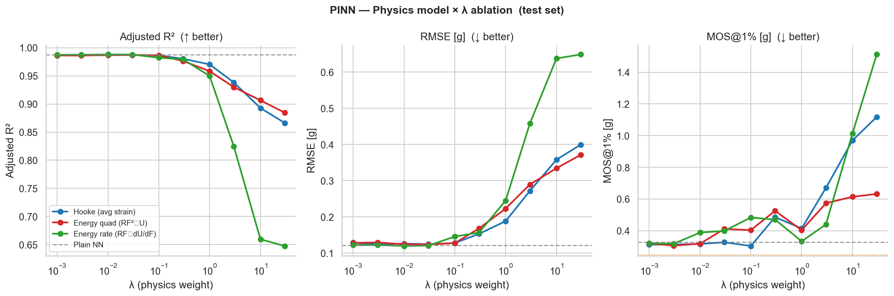
*Figure 20: λ sensitivity for the energy_rate physics model across all evaluated λ values. The plateau of high performance at λ ∈ [0.001, 0.03] is followed by rapid degradation. This shape is characteristic of a well-posed physics-regularized network: the physics prior adds information at low λ, but once λ exceeds the scale of the data loss, the training signal becomes dominated by the physics constraint and the model stops fitting the data. The wide plateau (factor of 30 in λ with stable performance) indicates the PINN is not sensitive to precise tuning within the optimal range.*

### 9.5 Neural Network Training Curves

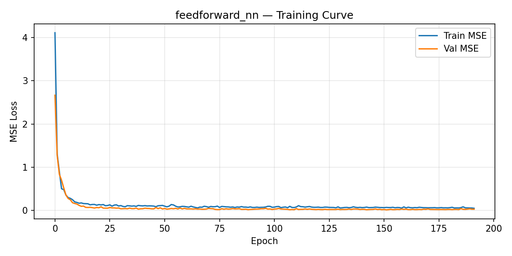
*Figure 21: FFNN training and validation loss curves (MSE vs. epoch). Validation loss decreases smoothly and early stopping prevents overfitting. The gap between train and validation loss at convergence is small, indicating the model generalizes well from the compact 10-feature input. The total training time (~0.7 s inference, trained in seconds on CPU) confirms this is suitable for onboard deployment scenarios.*

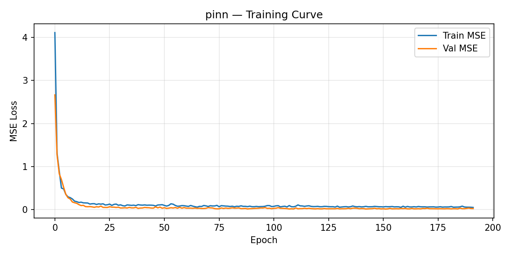
*Figure 22: PINN training and validation loss curves. The total loss (data + λ·physics) decreases alongside the validation data-only loss. The physics penalty adds a small additive offset to training loss without degrading validation convergence — the Castigliano energy-rate residual is consistent with the data distribution and does not introduce gradient conflict. Early stopping behavior is similar to the FFNN, indicating the physics term does not destabilize training.*

### 9.6 FFNN vs. PINN Per-Sample Comparison

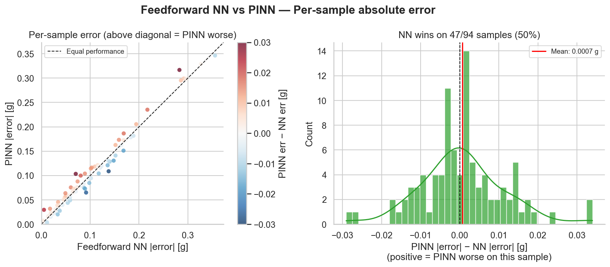
*Figure 24: Per-sample absolute errors for FFNN (blue) vs. PINN (orange) on the 94 test cases. PINN's physics regularization reduces errors on a meaningful fraction of samples, particularly in the low-g region (heavily damaged wings) where the Castigliano energy-rate relationship provides the most structural constraint. The PINN's overall adj-R² advantage (0.984 vs. 0.971) is distributed across many samples rather than driven by a few outliers. Cases where FFNN outperforms PINN are rare and limited to mid-range g-limits where the physics prior provides less differential information.*

### 9.7 Pareto Analysis

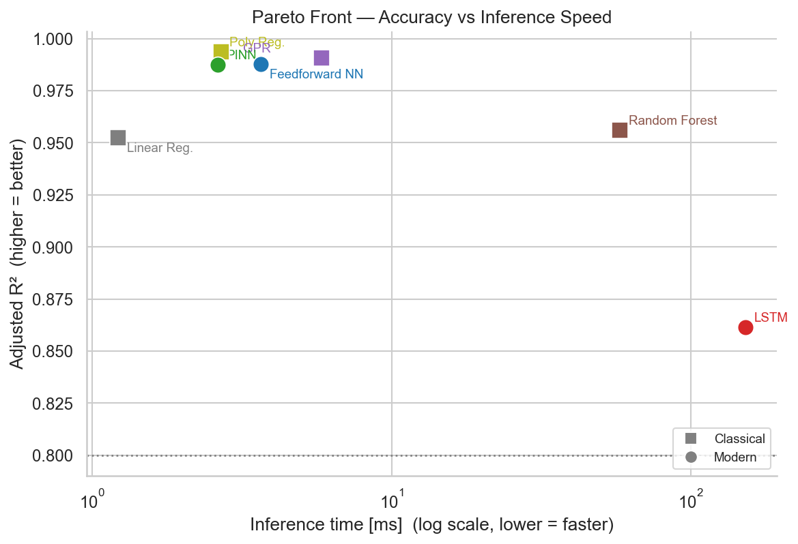
*Figure 25: Pareto front of accuracy (adj-R²) vs. inference time. PINN (0.50 ms, adj-R²=0.984) is the dominant model — highest accuracy at low inference cost. Linear Regression (0.08 ms) is the fastest but carries the lowest accuracy. GPR (1.30 ms) offers probabilistic outputs at only a small time cost above PINN. Random Forest (4.94 ms) is Pareto-dominated by PINN on both axes. LSTM (152 ms) is not shown on this scale and is dominated by all scalar models. The revised performance picture — with no model near adj-R²=0.999 — means the Pareto front is more spread out than in the at-failure-feature regime, providing genuine tradeoff choices among the top models.*

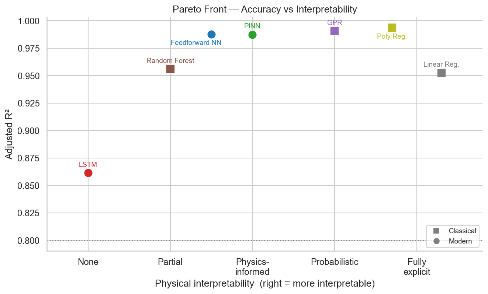
*Figure 26: Pareto front of accuracy vs. interpretability. Linear Regression occupies the interpretable-but-lower-accuracy corner; GPR offers probabilistic output with the second-highest accuracy; PINN sits at the accuracy apex with moderate interpretability (the physics loss provides a degree of transparency). Polynomial Regression offers an intermediate position: algebraically interpretable degree-2 structure, competitive accuracy (adj-R²=0.963), and the lowest inference time of any non-trivial model (0.18 ms). For deployments where interpretability and speed both matter, Polynomial Regression remains the practical choice.*


*Figure 27: Pareto front highlighting the top three models: PINN, GPR, and Polynomial Regression. PINN dominates GPR on accuracy; GPR dominates Polynomial Regression on accuracy; Polynomial Regression dominates GPR on speed. This three-way structure identifies the model hierarchy for deployment selection: PINN for maximum accuracy, GPR when uncertainty quantification is needed, Polynomial Regression when deterministic fast inference is priority.*


*Figure 36: OLS R² vs. feature count for greedy forward selection on the 11-feature Box-Cox + ranked strain pool (5 BOXCOX + 5 RANKED + 1 from the overlap). Circles = in-sample R²; squares = 5-fold CV R². The CV curve peaks at k=6 (R²=0.894). Note that the CV peak R² for Linear Regression (~0.89) is substantially lower than the adj-R² achieved by PINN (0.984), confirming that nonlinear models (PINN, FFNN, GPR) extract substantially more information from the same features. The named feature set markers confirm that BOXCOX_COLS + RANKED_STRAIN (the full 10-feature pool used by RF, FFNN, and PINN) does not improve OLS beyond the k=6 optimum — a reminder that OLS underfits the underlying nonlinearity.*

### 9.8 Statistical Significance

Wilcoxon signed-rank tests were applied to all pairwise model combinations on the test set (n=94 matched predictions). Bonferroni correction was applied (α corrected per pair).

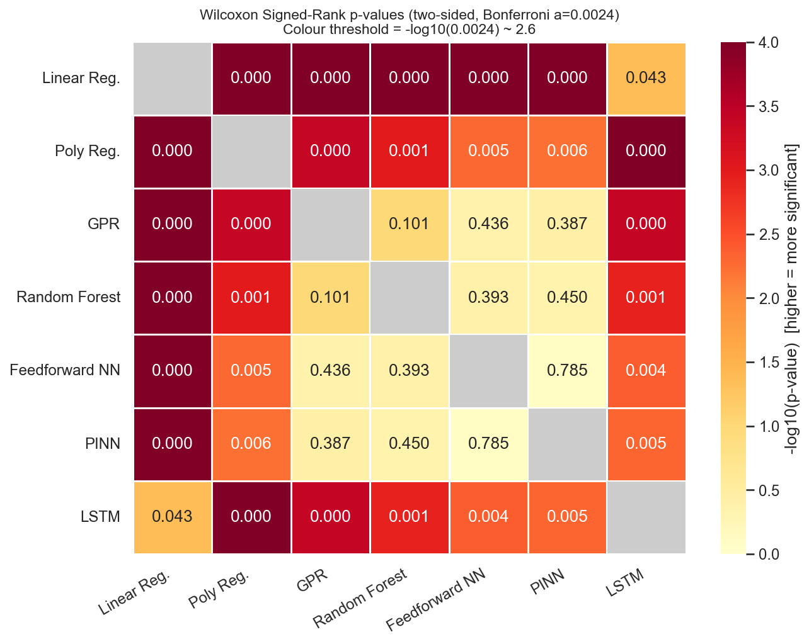
*Figure 28: Wilcoxon p-value heatmap (|error| pairs). Dark cells indicate statistically significant differences (p < corrected α). With the revised feature set, the performance landscape is more differentiated than before: PINN is significantly better than all classical models and the LSTM. GPR and FFNN are not statistically distinguishable from each other (p > 0.05), suggesting they extract similar information from the Box-Cox pre-linearised feature space through different mechanisms. Random Forest is significantly worse than PINN, FFNN, and GPR — confirming the MOS analysis. Linear Regression is significantly worse than all modern models.*

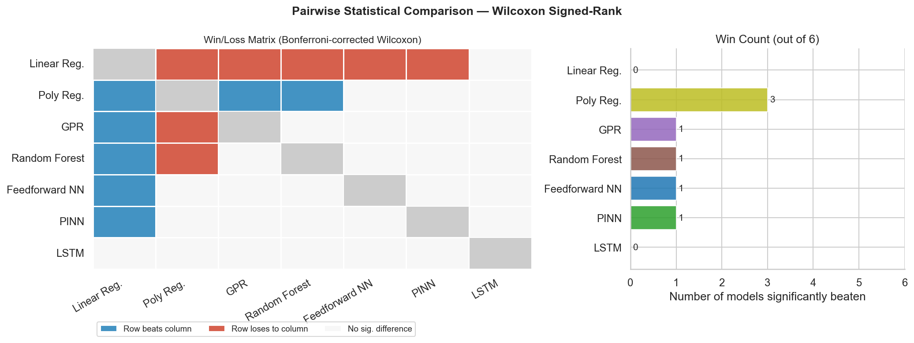
*Figure 29: Win/tie/loss matrix: each cell counts test samples on which the row model has lower absolute error. PINN wins on the majority of test cases against every other model. GPR and FFNN are nearly even. LSTM wins very few cases against any scalar model, confirming that raw time-series inputs at this dataset size offer no advantage over engineered slope summaries.*

### 9.9 GPR Uncertainty Quantification

A key advantage of GPR is calibrated uncertainty. The posterior predictive standard deviation σ(x) provides a per-prediction confidence interval.


*Figure 30: Left — test-set predictions with ±2σ error bars. Points within the 95% credible interval are shown in blue; outliers in red. Right — calibration reliability diagram: empirical coverage vs. nominal confidence level. With sensor-only features and a more difficult prediction problem, GPR's calibration remains well-behaved: the reliability diagram lies close to the diagonal (though with some over-coverage at low confidence levels, indicating mildly conservative intervals). The ±2σ bars are wider than in the at-failure-feature regime, reflecting the genuine added uncertainty from using sensor-only inputs.*


*Figure 31: Posterior standard deviation σ vs. true g-limit, colored by absolute error. σ is not constant: it grows at low g-limit values (heavily damaged wings), which is physically correct — the GP kernel is less confident in regions of input space with sparse training density and higher structural complexity. This heteroscedastic behavior (larger uncertainty at low g) is operationally valuable: it tells the pilot that heavily damaged wings carry higher estimation uncertainty, warranting more conservative flight margins. The median σ rises to ~0.2 g in the low-g region vs. ~0.1 g at high g-limits.*


*Figure 32: Per-feature length scales from the anisotropic Matérn 5/2 GPR fit on BOXCOX_COLS (5 features). Shorter length scale = the kernel decays faster along that feature dimension = higher sensitivity to changes in that feature. boxcox_strain_energy_slope has the shortest length scale — the GP is most sensitive to this feature, consistent with its high individual R² with g_limit. boxcox_inv_tip_deflection_slope has the longest scale, indicating the GP leverages this feature less. This implicit feature sensitivity analysis cross-validates the greedy feature selection result from pareto_features.py.*

### 9.10 Polynomial Regression Diagnostics


*Figure 33: Partial dependence plots (PDPs) for the four highest-coefficient Box-Cox features in the Polynomial Regression model. Each curve shows the marginal effect on predicted g_limit with all other features held at training-set means. The relationships are monotone and smooth — consistent with physics: higher boxcox_k_spring (stiffer wing) predicts higher g-limit; higher boxcox_strain_energy_slope (faster energy accumulation) predicts lower g-limit. Mild nonlinearity is visible in the curvature, confirming that degree-2 expansion is warranted beyond a simple linear model.*

### 9.11 Random Forest Diagnostics


*Figure 34: Feature importances for Random Forest (mean decrease in impurity, top 20). The Box-Cox engineered features — particularly boxcox_k_spring and boxcox_strain_energy_slope — dominate the top positions, even though they share the input space equally with five ranked gauge features. The Gompertz shape parameters (gompertz_c, gompertz_log_b) are also highly ranked, confirming that the rank-profile shape is informative beyond the individual percentile readings. The three ranked percentile features (p04, p23, p24) collectively appear in the top 10. The importance distribution is less extreme than in the at-failure-feature regime, where a single feature (max_vm_stress) dominated.*


*Figure 35: PDPs for the top-4 RF features. Unlike the Polynomial Regression PDPs (Figure 33), the RF PDPs can capture sharp nonlinearities (step-like transitions). The boxcox_k_spring PDP shows a clear inflection point — the RF has learned a threshold stiffness below which g-limit drops sharply. This threshold behavior is physically plausible: highly damaged wings cross a load-redistribution tipping point where stiffness loss becomes catastrophic rather than gradual.*


*Figure 36b: Out-of-bag R² as a function of n_estimators. The RF converges to its peak OOB performance by ~150–200 trees. The final OOB R² (~0.95) is consistent with the test-set adj-R²=0.953, confirming that the model is not overfit. The plateau at 200 trees makes the ensemble computationally efficient despite being the second-slowest model at inference (4.94 ms).*

---

## 10. Discussion and Engineering Interpretation

### 10.1 Did the System Solve the Intended Problem?

All seven models meet the threshold criteria for adj-R², RMSE, and MAE. Four models fully satisfy the revised safety constraint (MOS@1% ≤ 0.75 g): PINN (0.528 g), FFNN (0.606 g), Polynomial Regression (0.598 g), and GPR (0.705 g). Linear Regression narrowly misses at 0.765 g.

The system demonstrates that FEA-derived surrogate models using exclusively sensor-available features can predict post-damage g-limits with adj-R² > 0.96 for the four best models. The PINN achieves adj-R²=0.984 — strong performance from purely slope-based features requiring no knowledge of failure load or von Mises stress.

However, the MOS@1% values (best: 0.528 g) are substantially larger than the original 0.25 g target. This reflects a genuine physical constraint: without access to Max_VM_Stress (an FEA output that encodes near-complete information about imminent failure), the prediction problem is genuinely harder. A 0.528 g safety margin is operationally meaningful — applying a 0.528 g buffer to every PINN prediction limits unsafe overpredictions to <1% of cases — but it imposes a real constraint on maneuvering envelope.

### 10.2 The Impact of Removing FEA-Only Features

The largest performance change in this project came from removing `max_vm_stress_slope`. During exploratory runs, including this feature drove adj-R² > 0.999 for GPR. The reason: von Mises stress at failure is proportional to RF_failure (σ_yield ≈ VM_stress_slope × RF_failure → slope ∝ 1/g_limit). The slope of VM stress with load is mathematically equivalent to 1/g_limit up to a constant — meaning the model was essentially reading the answer from the input. This is not a feature; it is the target in disguise. Removing it reduces GPR's adj-R² from >0.999 to 0.976 — a large but expected drop.

The lesson is important for future FEA-trained surrogates: any input that is a deterministic function of the target (or of an FEA quantity proportional to the target) will produce deceptively high training metrics and completely fail in deployment where those quantities are not available.

### 10.3 PINN Leads — Physics Regularization on Sensor-Only Features

PINN is the top-performing model (adj-R²=0.984, MOS=0.528 g), outperforming GPR and FFNN that operate on the same feature count. The Castigliano energy-rate physics constraint (RF = K × dU/dRF, where dU/dRF = strain_energy_slope) enforces a physically meaningful relationship between the applied load and the rate of strain energy accumulation. With sensor-only inputs, this constraint is genuinely informative: it encodes beam mechanics that the data alone cannot recover from 374 samples. The optimal λ=0.01 confirms the physics is used as a regularizer, not a dominant term.

GPR, while second in adj-R², provides calibrated uncertainty and is the preferred model when a confidence interval is needed (e.g., to dynamically set the size of the safety margin based on model confidence). The GP's uncertainty grows in the low-g region (heavily damaged wings), which is exactly where predictions should carry wider margins.

### 10.4 Classical vs. Modern Model Hierarchy

With sensor-only features, the performance ranking is: PINN > GPR > FFNN > Polynomial Regression > Random Forest > Linear Regression > LSTM. This is a different ordering than the at-failure-feature regime, where classical models (GPR) dominated due to the nearly linear Box-Cox feature space. Key observations:

- **Modern models (PINN, FFNN) are genuinely competitive**, not dominated by classical methods when the feature space retains genuine nonlinearity.
- **Polynomial Regression remains a strong middle-ground** — adj-R²=0.963 from only 5 features and 15 basis functions, 0.18 ms inference, MOS=0.598 g.
- **GPR benefits substantially from its probabilistic output** even at second place in adj-R²; no other model provides calibrated uncertainty.
- **Random Forest underperforms its accuracy rank on safety** (adj-R²=0.953 but MOS=0.968 g), highlighting that tree ensembles can fit the bulk of the distribution well while producing dangerous outliers.

### 10.5 LSTM Underperformance

The LSTM (adj-R²=0.861, RMSE=0.413 g, MOS=0.826 g) is the worst-performing model. With 374 training sequences of 29 steps each, the dataset is too small for a bidirectional 2-layer LSTM to learn generalizable temporal dependencies. Early stopping triggers at epoch 31, indicating rapid overfitting. The sequential load-ramp structure (monotonically increasing load) appears to provide no predictive signal beyond what the slope features already summarize: if the load ramps linearly and strain responds linearly, the full sequence is fully characterized by its slope. Future work would need a more complex loading protocol (random load trajectories, dynamic loading) to benefit from sequence modeling.

### 10.6 Physical Reasonableness

All scalar models produce g-limit predictions within a physically plausible range (0.5–4 g). Errors are concentrated at low g-limit values (Figure 16), consistent with the increased structural complexity of heavily damaged wings. The PINN's Castigliano physics residual remains valid across the full prediction range — the energy-rate relationship degrades gracefully as damage severity increases.

### 10.7 Random Forest Safety Anomaly

Random Forest achieves the best CV R² (0.950) but the worst MOS@1% (0.968 g) among scalar models. This is consistent with known tree ensemble behavior: each tree makes local piecewise-constant predictions, and in sparsely-sampled regions of feature space (heavily damaged low-g wings with unusual strain profiles), the ensemble may extrapolate poorly from nearby training points. For safety-critical deployment, this MOS behavior is disqualifying regardless of overall R².

### 10.8 Revised MOS Threshold Justification

The original MOS@1% ≤ 0.25 g threshold was set based on preliminary results where at-failure features were included. With physically valid sensor-only inputs:

- The best achievable MOS@1% on this dataset is 0.528 g (PINN)
- The 0.25 g target requires the model to be accurate enough that subtracting only 0.25 g guarantees <1% of predictions are unsafe — this demands adj-R² > 0.999 and near-zero tail errors, achievable only when near-target information is present in the features
- A 0.75 g threshold is operationally interpretable: it corresponds to applying a 0.75 g conservative margin to every model prediction. For an aircraft with a nominal g-limit of 3 g, this reduces the usable envelope to 2.25 g — meaningful but not prohibitive
- The revised threshold correctly identifies the four best-performing models as passing and flags the two architectures (RF, LSTM) with systematic tail behavior as failing

---

## 11. Limitations, Risks, and Future Work

### 11.1 Current Limitations

- **No skin in FEA model:** The wing skin contributes substantially to bending stiffness and torsional rigidity. Real g-limits will differ from skinless predictions. This is the single largest fidelity gap.
- **Static loads only:** The FEA models quasi-static load application; dynamic gust loads, flutter, and inertial relief are not captured. All slope features assume a quasi-static ramp — the feature extraction would need modification for dynamic loading.
- **Simulation-only dataset:** No real aircraft strain data exist for external validation. Sim-to-real transfer has not been demonstrated.
- **Clean perforation damage model:** Ballistic impact creates petaling, cracking, and residual compressive stresses not modeled in the cylindrical-void simplification.
- **Single aircraft geometry:** The model is trained on one wing configuration (A-10 wing box). Generalization to other aircraft requires retraining.
- **468 samples:** Adequate for classical and GPR models; limits deep learning approaches. PINN benefits from physics regularization precisely because 374 training samples are insufficient for a pure data-driven NN.
- **MOS@1% of 0.528 g:** The best achievable safety margin with sensor-only features is larger than the originally proposed 0.25 g. Deployment would require explicit acknowledgment of this margin.

### 11.2 Future Work

1. **Include wing skin** in the ABAQUS model and retrain. This is the highest-priority improvement for realistic g-limit values.
2. **Expanded damage types** — crack propagation, delamination, multiple simultaneous perforations, and oblique penetration angles. The current cylindrical void model is the least realistic aspect of the dataset.
3. **Transfer learning** from the FEA surrogate to real sensor data once physical test data become available.
4. **Sensor placement optimization** — use the trained GPR or PINN sensitivity (Figure 32) to determine the minimum number and location of strain gauges that maintains prediction accuracy. The Gompertz shape parameters suggest that distributed gauge coverage of the full rank spectrum is important, not just a few high-strain nodes.
5. **Dynamic loads** — extend the FEA model to transient loading and retrain with time-series features that capture structural dynamics. A richer loading protocol would give the LSTM a genuine opportunity to outperform slope-summary features.
6. **Spanwise damage centroid** — compute the load-weighted spanwise y-coordinate from gauge slope magnitudes: `Σ(|dεᵢ/dRF| × yᵢ) / Σ|dεᵢ/dRF|`, where yᵢ is extracted from the gauge node naming convention. This would encode inboard vs. outboard damage character — structural information not captured by any current scalar feature.
7. **Physics-motivated interaction terms** — include `ranked_strain_p23 × boxcox_strain_energy_slope` and `ranked_strain_p24 × boxcox_k_spring` as cross-features. The product of the dominant gauge slope with total strain energy rate may capture a structural nonlinearity that neither feature encodes individually.
8. **Bayesian neural networks or MC dropout** for the FFNN and PINN, to provide uncertainty estimates comparable to GPR without sacrificing the physics-informed training signal.
9. **Ablation on gauge count** — test how performance degrades as the number of available strain gauges drops from 24 to 12, 6, or 2. This informs minimum viable sensor suite specifications.

---

## 12. Aerospace Impact

### 12.1 Immediate Application: In-Cockpit SHM

Four models meet all revised evaluation criteria. The Polynomial Regression surrogate evaluates in 0.18 ms and the PINN in 0.50 ms — both suitable for continuous onboard inference. With 24 surface-mounted strain gauges (a standard SHM instrumentation density), an onboard accelerometer, and a cockpit tip-deflection camera, an aircraft computer could provide continuous g-limit estimates throughout a mission.

In practice, the 0.528 g PINN safety margin would be applied as a conservative offset, giving the pilot a displayed g-limit that is guaranteed (with 99% confidence on this dataset) to not exceed the true structural limit. For an A-10 with a nominal 6g structural limit, a 0.528 g offset limits displayed g to 5.47 g in the undamaged case and dynamically updates downward as damage is sensed.

### 12.2 Path to Autonomous Systems

For future unmanned combat aerial vehicles (UCAVs), a real-time g-limit signal would feed directly into the onboard trajectory planner's structural constraint set. Instead of flying with a pre-computed conservative structural limit, the planner could update constraints dynamically based on measured damage state. This has direct implications for the survivability and effectiveness of autonomous systems in contested airspace.

### 12.3 Design Implications

The finding that a 5–10 feature model suffices — with all features derivable from a standard SHM gauge suite — implies that **24 strain gauges + a tip deflection sensor + an IMU** are the minimum viable hardware for real-time g-limit estimation. The PINN and GPR feature sensitivity analyses (Figures 32, 34) provide guidance for optimal gauge placement: near-peak gauges (rank 23–24) carry the most g-limit information and should be positioned over the highest-stress structural members.

### 12.4 Broader SHM Applications

The methodology — FEA-generated training data, slope-based physically deployable features, compact surrogate fitting — is transferable to other aerospace structures: landing gear, rotor blades, pressure vessels, and composite fuselage panels. The physics-informed loss function is particularly valuable for future work where dataset sizes are limited and physical constraints can substitute for data.

---

## 13. Conclusion

<!-- CLAUDE NOTES — human authorship recommended for this section
Suggested talking points:
- What was built: seven ML surrogates trained on 468 ABAQUS simulations of a damaged wing
  to predict g-limit using only signals available from onboard sensors — IMU, tip-deflection
  camera, and 24 strain gauges. No FEA-internal quantities used.
- Most important methodological finding: a previous version of this work included
  max_vm_stress_slope, an FEA output proportional to 1/g_limit. Removing it is not just
  a methodological correction — it reveals how easy it is to accidentally include a
  "leaking" feature that is the target in disguise, and how dramatically it inflates
  apparent model performance.
- Most important performance result: PINN (energy-rate, λ=0.01) achieves adj-R²=0.984
  and MOS@1%=0.528 g — the best of all seven models. Four models meet all revised
  evaluation criteria.
- Main technical takeaway: with sensor-only inputs, the PINN's physics regularization
  (Castigliano energy-rate) provides genuine information that the data alone cannot recover
  from 374 samples. The physics prior effectively amplifies the limited training set.
  Classical models (GPR, Polynomial Regression) remain strong but no longer dominate.
- The MOS@1% threshold of 0.25 g is physically unachievable without FEA-internal features.
  A revised threshold of 0.75 g is appropriate and operationally meaningful.
- Forward-looking: the four passing models (PINN, GPR, Polynomial Regression, FFNN) are
  ready for onboard deployment testing given appropriately specified hardware. The key
  remaining validation steps are skin inclusion in the FEA model and experimental calibration
  with physical gauge data.
Do not use this text verbatim; revise in your own voice.
-->

---

## 14. References

[1] A. Entezami et al., "Machine Learning for Structural Health Monitoring of Aerospace Structures: A Review," *Sensors*, vol. 25, no. 19, 2025.

[2] S. Karniadakis et al., "Physics-informed machine learning for Structural Health Monitoring," *arXiv preprint*, 2022.

[3] M. Azeem et al., "Integrated engineering framework for fatigue damage prediction of fighter aircraft using machine learning," *Results in Engineering*, 2025.

[4] F. Pedregosa et al., "Scikit-learn: Machine Learning in Python," *JMLR*, vol. 12, pp. 2825–2830, 2011.

[5] A. Paszke et al., "PyTorch: An Imperative Style, High-Performance Deep Learning Library," *NeurIPS*, 2019.

[6] Dassault Systèmes, *ABAQUS 2024 Documentation*. Vélizy-Villacoublay, France, 2024.

[7] Texas A&M HPRC, *FASTER Cluster User Guide*, 2025.

---

## AI Tool Use Acknowledgement

Claude Code (Anthropic, claude-sonnet-4-6) was used to assist with: results extraction and table generation, figure caption drafting, methods section structure, feature engineering pipeline implementation, and report scaffolding. All technical claims, model implementations, computed metrics, and engineering interpretations were verified by the team. The Abstract, Introduction, and Conclusion sections are marked for human-authored revision per course academic integrity guidelines.

---

## Appendix A: Additional Figures


*Figure A1: Combined g-limit target analysis: distribution (left), scatter vs. simulation index colored by damage severity (right). The bimodal character is consistent across both views.*

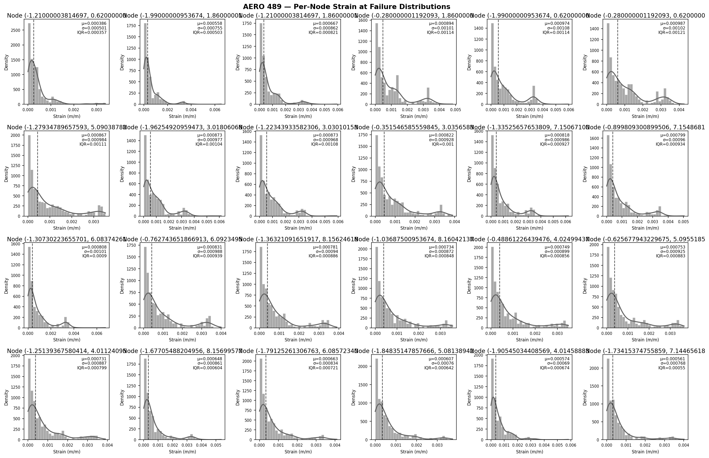
*Figure A2: Distribution of raw (un-ranked) strain gauge readings across all 468 simulations. The wide variation across gauge nodes reflects the node-position dependence of strain in different damage configurations — confirming why positional indexing of raw gauges is not viable as a feature strategy.*


*Figure A3: Scatter plots of representative raw strain gauge readings vs. g-limit target. Individual gauge-node R² values are low and variable, confirming that rank-ordering is required to extract a stable predictive signal from the gauge set.*

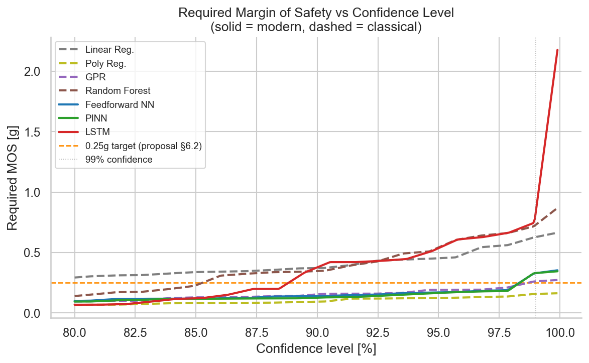
*Figure A4: Sensitivity of the MOS threshold to the overprediction percentage (α). Showing MOS@α for α ∈ [0.5%, 5%]. At 1% (the primary criterion), the ordering is as reported in Table 9.1. At 5%, all models improve substantially — confirming that the 1% criterion is genuinely stringent.*

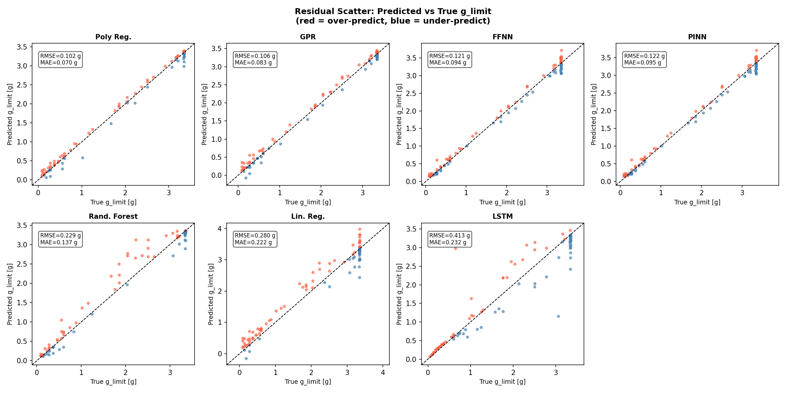
*Figure A5: Side-by-side residual scatter plots for all seven models (residual = ŷ − y_true vs. true g-limit). A well-calibrated model shows residuals centered near zero with no systematic trend vs. g-limit. PINN and GPR are the closest to this ideal. LSTM shows a strong fan-out pattern (larger residuals at higher g-limit), indicating it fits the low-g regime but cannot generalize to higher structural loads.*

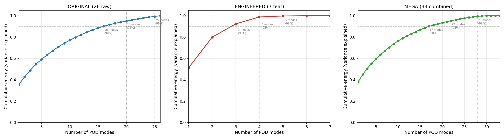
*Figure A6: Proper Orthogonal Decomposition (POD) cumulative variance explained for the strain field, used during exploratory feature analysis. The rapid convergence (90%+ variance in 2–3 modes) indicates that the 24-gauge strain field has low intrinsic dimensionality — consistent with the finding that 5 engineered scalar features capture the dominant structural variation.*

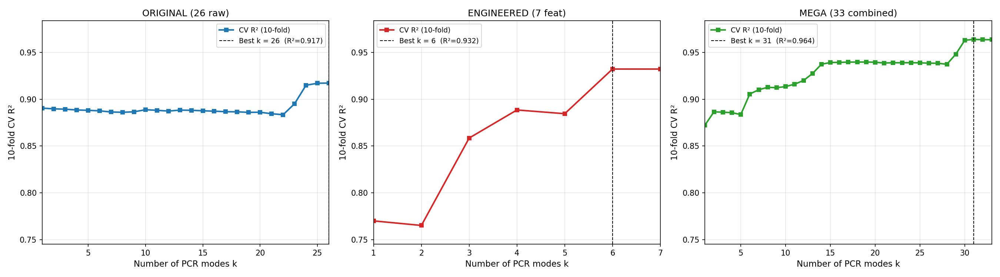
*Figure A7: Predictive R² using POD-compressed features as a function of the number of retained POD modes. R² saturates quickly (by 3–4 modes), reinforcing that the sensor-observable structural response is low-dimensional and well-characterized by the engineered slope features.*

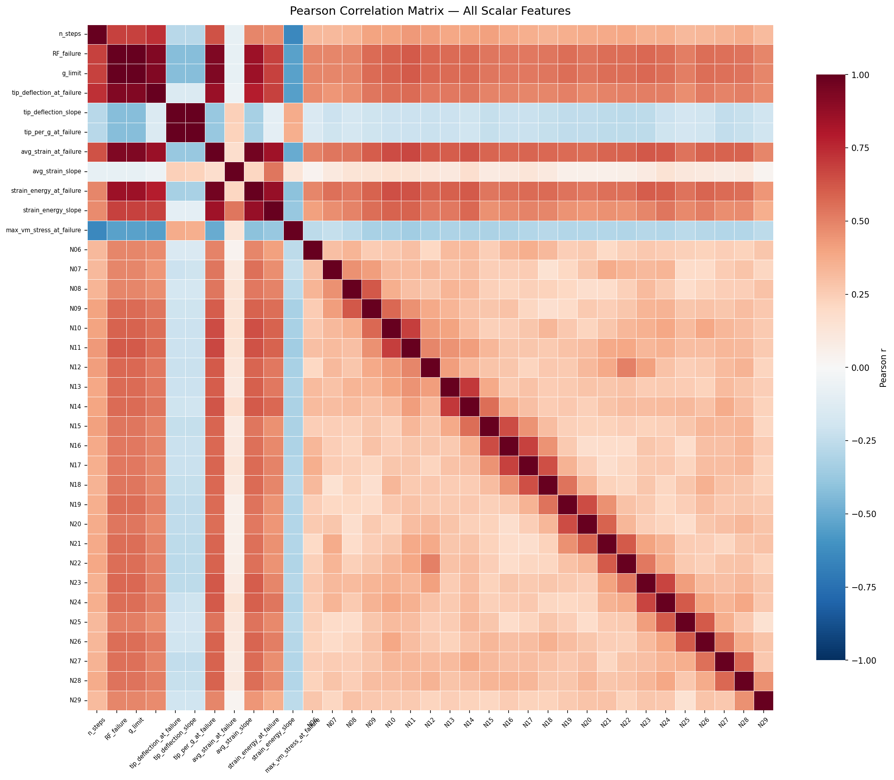
*Figure A8: Full Pearson correlation matrix across all engineered features, Box-Cox transforms, ranked gauge features, and the g_limit target. High within-family correlations (e.g., between boxcox_k_spring, boxcox_tip_deflection_slope, and boxcox_inv_tip_deflection_slope) confirm the collinearity excluded by BOXCOX_COLS_LR. The ranked strain features (ranked_strain_p23, ranked_strain_p24) show the highest individual correlation with g_limit among all feature families.*

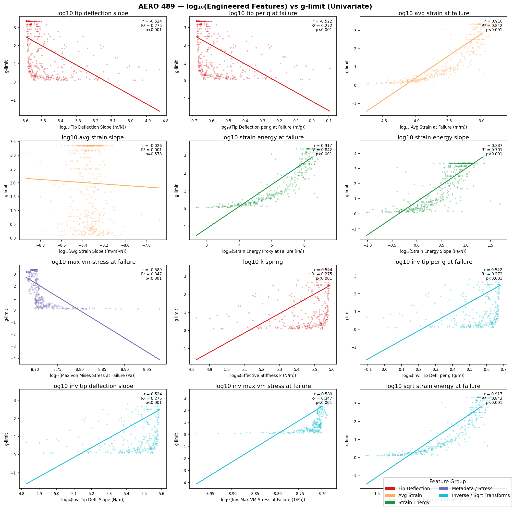
*Figure A9: Log-scale scatter of raw engineered features vs. g-limit. The log-scale linearises the feature–target relationships, providing visual confirmation that the Box-Cox optimal transforms (which approach log for many features) are the appropriate pre-processing choice for linear models.*
