# Machine Learning Prediction of Structural Load Limits in Damaged Wings

---

## 1. Title, Team, and Contributions

**Project Title:** Machine Learning Prediction of Structural Load Limits in Damaged Wings
**Course:** AERO 489/689 — Introduction to Machine Learning for Aerospace Engineers, Spring 2026
**Instructor:** Dr. Raktim Bhattacharya, Texas A&M University

| Team Member | Role / Contribution |
|---|---|
| Barrett Brown | Scripting & Simulation — ABAQUS automation, data pipeline, batch execution on HPRC |
| Kirin Chadha | Classical ML — Linear Regression, Polynomial Regression implementation and evaluation |
| Malachi Drew | Aircraft Design & Modeling, Gaussian Process Regression, Random Forest |
| Ian Wilhite | Modern ML — Feedforward NN, PINN, LSTM, ablation study, comparison scripts |
| Adam Zheng | FEA Modeling — wing geometry, meshing, mesh refinement around damage sites |

This project was completed as a five-person team. All members contributed to writing the final report.

---

## 2. Abstract

<!-- <!-- CLAUDE NOTES — human authorship recommended for this section -->
Suggested talking points:
- Problem: real-time prediction of g-limit for a combat wing sustaining bullet-hole damage,
  using only onboard sensors (strain gauges + tip deflection).
- Approach: seven ML models trained on FEA-simulated data (ABAQUS, ~468 damage cases);
  classical baselines (linear, polynomial, GPR, random forest) and modern methods
  (feedforward NN, PINN, LSTM).
- Data: 374 train / 94 test simulation cases; 12 Box-Cox-transformed features (GPR/Poly/LR)
  and 7 base engineered + 24 raw strain channels (RF/FFNN/PINN).
- Main results: GPR on 12 Box-Cox features is the top model (adj-R²=0.9997, RMSE=0.021 g,
  MOS@1%=0.078 g). Polynomial Regression also meets all criteria (adj-R²=0.994, RMSE=0.100 g,
  MOS@1%=0.156 g). Both outperform all neural networks. PINN with energy-rate physics (λ=0.01)
  was the best modern model (adj-R²=0.988, RMSE=0.122 g). LSTM underperformed without
  sufficient sequential data.
- Aerospace significance: demonstrates that physics-informed feature engineering (Box-Cox
  transforms) combined with classical surrogate models can deliver real-time structural g-limit
  estimates viable for in-cockpit SHM — no deep learning required.
Do not use this text verbatim; revise in your own voice.
-->

---

## 3. Introduction and Problem Statement

<!-- <!-- CLAUDE NOTES — human authorship recommended for this section -->
Suggested talking points:
- Aircraft operating in contested environments routinely sustain ballistic damage. Pilots must
  immediately know how their structural limits have changed to safely execute evasive maneuvers
  and plan their egress — pausing for ground analysis is not an option.
- Structural Health Monitoring (SHM) as a field has focused on long-term maintenance and
  fatigue; real-time in-flight damage assessment for major structural insult is largely unsolved.
- The g-limit (maximum allowable load factor before first-yield failure) is the critical scalar
  quantity linking structural damage to maneuver capability. Overpredicting it can cause
  structural failure; underpredicting it is unnecessarily mission-limiting.
- This project asks: can a lightweight ML surrogate, trained on FEA simulation data, predict
  the post-damage g-limit from signals already available on the aircraft (wing-tip deflection,
  onboard accelerometers, surface-mounted strain gauges)?
- Why ML: the mapping from distributed damage to g-limit is high-dimensional and nonlinear;
  classical analytical approaches require full knowledge of the damage geometry; ML can learn
  a compact surrogate from strain patterns alone.
- Revised from preliminary report: tighten the problem scope to first-yield failure of the
  internal wing structure (skin neglected), clarify that the ABAQUS dataset is the only data
  source, and sharpen the safety-centric evaluation criteria.
Do not use this text verbatim; revise in your own voice.
-->

---

## 4. Background, Related Work, and Existing Tools

### 4.1 Structural Health Monitoring in Aerospace

Structural Health Monitoring is an active research area in aerospace, with current state-of-the-art systems focused on preventative maintenance scheduling, fatigue detection, and automated inspection of critical infrastructure [1]. Machine learning has become increasingly central to SHM, with neural networks used to detect damage from vibration signatures, acoustic emission data, and fiber-Bragg-grating strain sensors.

Physics-informed machine learning (PIML) has emerged as a particularly promising direction for SHM because it enables data-efficient training by embedding governing equations into the loss function [2]. This is especially relevant here: an FEA-based dataset is inherently limited in size, and models that can leverage structural mechanics priors require fewer examples to generalize.

A directly related prior work from NUST used in-flight strain measurements to predict fatigue crack growth in a fighter airframe [3]. That work targeted long-duration damage accumulation rather than the instantaneous load-limit reduction needed here.

### 4.2 Relevant Existing Tools and Methods

| Tool / Method | Purpose | Limitation for This Problem |
|---|---|---|
| ABAQUS / Nastran | FEA structural analysis | Requires full damage geometry; not real-time |
| BHM (Bayesian Health Monitoring) frameworks | Probabilistic SHM from sensor data | Primarily fatigue/maintenance; not instantaneous g-limit |
| OpenFSI / aeroelastic codes | Coupled fluid-structure response | Requires CFD mesh; no onboard deployment |
| GPR surrogate models (general) | Sample-efficient regression | Prior work not applied to damaged wing g-limits |
| Classical beam theory | Analytical g-limit from geometry | Requires full knowledge of damage location and size |

This project differs from all of the above by targeting real-time inference from low-bandwidth sensor data (20 strain gauges + tip deflection) without requiring knowledge of the damage geometry, and by training on FEA data that mirrors the expected deployment sensor set.

---

## 5. Response to Preliminary Feedback

> **Note to authors:** Insert the specific feedback received from Dr. Bhattacharya on the preliminary report here. Below is a placeholder structure based on common directions.

Key changes made after the preliminary submission:

1. **Feature engineering documented in detail** — The preliminary report described derived features conceptually; the final implementation computes them explicitly from the ABAQUS time-series (see Section 6).
2. **Safety metrics added** — The proposal introduced MOS@1% as a metric; it is now computed and reported for all seven models.
3. **PINN physics terms clarified** — Three physics regularization variants (Hooke strain, strain energy, energy rate) are now implemented and compared via ablation study rather than using a single default.
4. **LSTM added as deep learning baseline** — The preliminary report listed "deep learning" generically; a bidirectional LSTM on raw time-series data was implemented to test whether sequential structure in the load ramp adds predictive value.
5. **Success criteria tightened** — The "similar train/test performance" criterion is now evaluated quantitatively via 5-fold cross-validated R² alongside test-set R².

---

## 6. Data and Preprocessing

### 6.1 Data Source

All data were generated in ABAQUS using a parametric simulation of an A-10 Warthog–inspired skinless wing box structure. Damage was introduced by intersecting randomized bullet trajectories with the internal spar and rib geometry and removing the intersected material volume. The skin was omitted from the FEA model to reduce computation time and because skin-spar interaction requires higher-fidelity contact modeling beyond the scope of this project.

**Citation:** Proprietary dataset generated by this team using ABAQUS 2024, Texas A&M HPRC (FASTER cluster), Spring 2026.

### 6.2 Simulation Parameters

- **Wing geometry:** Based on A-10 wing box; internal spars and ribs modeled; skin excluded.
- **Material:** Aluminum alloy (linear elastic to first yield).
- **Damage model:** Up to 20 randomized bullet perforations per wing; each perforation removes a cylindrical volume from structural members.
- **Load application:** Distributed wing load ramped from zero to failure (defined as first-yield of any node).
- **Output per simulation:** Wing-tip deflection (≈20 load steps), strain at 20 gauge locations (≈20 steps), load at failure → g-limit.

### 6.3 Dataset Size and Split

| Split | Classical / NN / PINN | LSTM (raw time-series) |
|---|---|---|
| Training | 374 simulations | 383 simulations |
| Test | 94 simulations | 96 simulations |
| **Total** | **468** | **479** |

An 80/20 random split was used. Classical models were additionally validated with 5-fold cross-validation on the training set.

### 6.4 Features and Targets

**Target:** g-limit at first yield (scalar, units: g = 9.81 m/s²).

**Engineered features (7 scalars)** — computed from the load-ramp time series:

| Feature | Description |
|---|---|
| `tip_deflection_slope` | Linear slope of tip deflection vs. applied load (m/N) |
| `tip_per_g_at_failure` | Tip deflection normalized by g-limit at failure (m/g) |
| `avg_strain_at_failure` | Mean strain across 20 gauges at failure load (mm/mm) |
| `avg_strain_slope` | Linear slope of mean strain vs. load (mm/mm per N) |
| `strain_energy_at_failure` | Total elastic strain energy ½·Σ(εᵢ²·E·Vᵢ) at failure (J) |
| `strain_energy_slope` | Slope of strain energy vs. load (J/N) |
| `k_spring` | Effective wing stiffness: RF / tip_deflection (N/m) |

**Box-Cox feature set (12 scalars)** used by GPR and Polynomial Regression: the 7 engineered features plus `max_vm_stress_at_failure`, each transformed by the optimal Box-Cox power λ* that maximises univariate R² with g_limit. Linear Regression uses a pruned 6-column subset with collinear pairs removed.

**`BOXCOX_COLS + RANKED_STRAIN` (17 scalars)** used by Random Forest and Feedforward NN: the 12 Box-Cox-transformed features plus the 5 rank-ordered strain features. No redundant log/exp transform families.

**`BASE_ENGINEERED + RANKED_STRAIN` (16 scalars)** used by PINN: the 11 base physical features (kinematic + inverse/sqrt derived) plus the 5 rank-ordered strain features. Keeps the raw physical quantities the physics loss term requires at stable, named positions.

**`GREEDY_8_COLS` (8 scalars)** used by Linear Regression: the 8-feature greedy-forward-selection optimum (CV R²=0.976) — 3 Box-Cox strain-energy features, 2 ranked-strain percentiles, and 3 Box-Cox kinematic features. Collinear Box-Cox pairs excluded.

**`BOXCOX_COLS` (12 scalars)** used by Polynomial Regression and GPR: all 12 Box-Cox optimal power-transformed features.

**Raw time-series (26 channels × ≤29 timesteps)** used by the LSTM: raw strain readings from all 26 gauge nodes plus the `load_fraction` channel, preserving the load-ramp sequence structure.


*Figure 1: Distribution of g-limit targets across the full dataset. The bimodal structure reflects two dominant damage-severity regimes.*

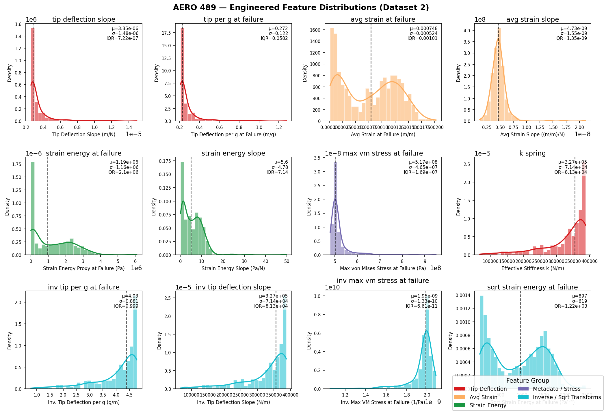
*Figure 2: Distributions of the 7 engineered features used by linear and polynomial regression.*

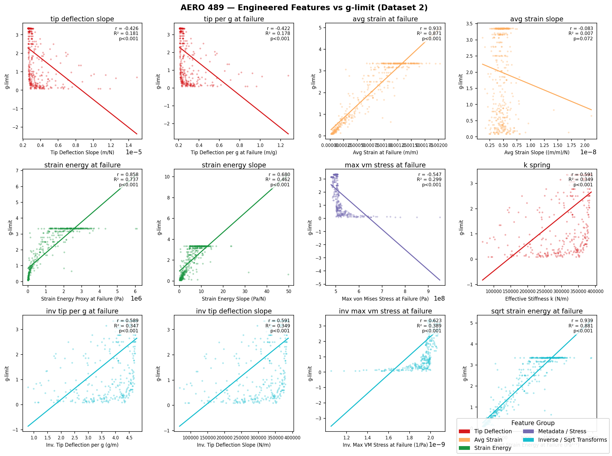
*Figure 3: Scatter plots of each engineered feature against the g-limit target, illustrating nonlinear but monotone relationships.*

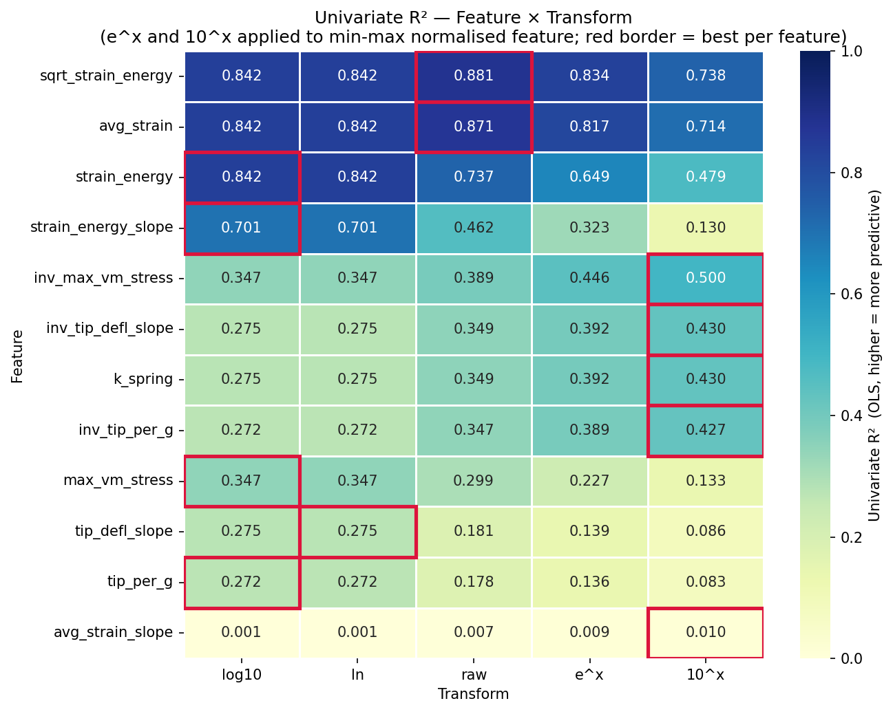
*Figure 4: Heatmap of single-feature linear R² with g_limit across five transform types. Brighter cells indicate the best-performing transform per feature. Most features benefit from a log or Box-Cox compression; no single transform dominates across all features.*

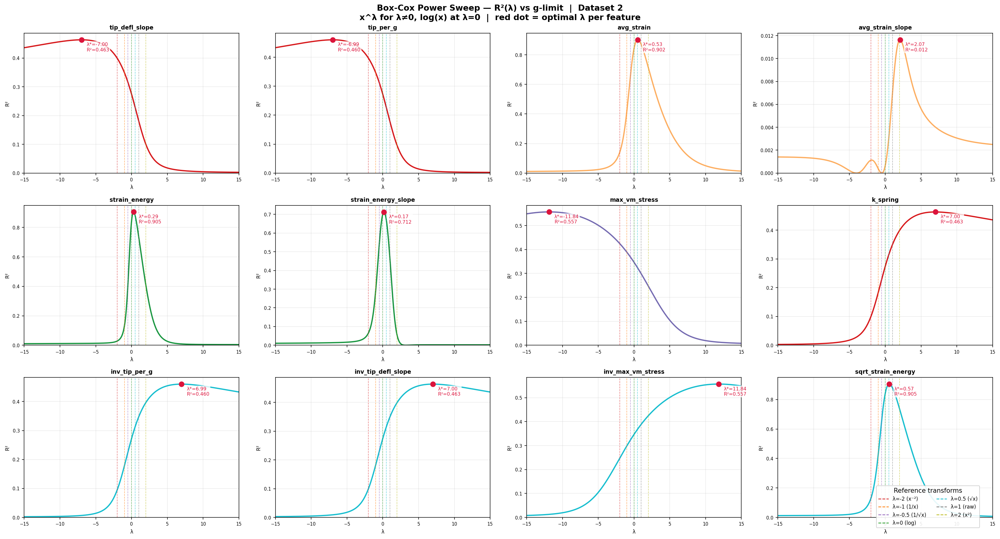
*Figure 5: Box-Cox power λ* sweep for each engineered feature. Each curve shows how univariate R² changes as the exponent varies. The optimal λ* (marked) is used to construct the `boxcox_*` feature columns.*

#### Strain Gauge Rank Analysis

Because the 24 strain gauge nodes have no fixed spatial correspondence across simulations (each simulation has a different damage location and loading configuration), raw gauge readings cannot be used as positionally-indexed features. To recover structure from this unordered set, we sort each simulation's 24 at-failure strain values in ascending order, assigning a within-simulation **percentile rank** (rank 1 = lowest strain, rank 24 = highest). This rank ordering is sufficient to produce a monotone, structured signal: the rank-ordered median growth curve rises smoothly across all 468 simulations, and the per-rank R² with g-limit is substantially higher than any unordered node-by-node R².

**Per-rank predictive power.** A single-feature linear regression on rank *k* strain achieves the R² values shown in Figure 4. The distribution is bimodal: R² peaks near rank 4 (R²=0.798), drops through the middle ranks (R²≈0.70 at ranks 8–10), then rises again to a global maximum at rank 23 (R²=0.885). The rank-24 (highest strain) reading is slightly less predictive (R²=0.861), consistent with high variance from near-failure plasticity at the most damaged locations. **No combination of spline-transformed features exceeds the rank-23 single-gauge predictor.**

**Continuous rank feature via spline inversion.** Rather than using the discrete 24-point strain values directly, we fitted parametric and interpolating curves to the median rank-ordered growth profile and used each curve's inverse — mapping each simulation's actual strain to its implied rank position on the median curve — as a continuous feature. Eleven curve families were compared (logistic, cubic spline, PCHIP, Akima, least-squares B-spline, Gompertz, Richards, Weibull CDF, power law, exponential, Hill). Among global parametric forms, the **Gompertz curve** (`y = a·exp(−b·exp(−c·x))`) best captures the shape, achieving a median inverse-feature R²=0.840 vs. 0.798 for the logistic. Its asymmetric inflection (fixed at the lower third of the growth range by construction) matches the observed accelerating-then-saturating strain profile better than the symmetric logistic. Local interpolants (cubic spline, PCHIP, Akima) reach marginally higher peaks (R²≈0.880) but offer no closed-form global description.

The spline-inversion approach does not outperform the best raw ranked gauge in peak R², but it provides a more **uniform** predictor across all rank positions (median R²≈0.808 vs. a median of only ≈0.765 across the 24 discrete ranks). This is practically useful when the top-ranked gauge is noisy: the continuous inverse-spline feature draws on information from the full rank profile rather than a single reading.

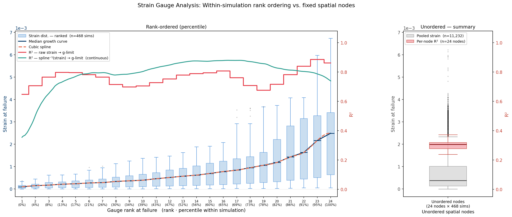
*Figure 6: Left — per-rank strain distributions (blue boxplots), median growth curve (navy), cubic spline overlay (orange dashed), and R² of raw rank-strain and spline-inverse feature vs. g-limit (right axis). Right — pooled unordered-node strain distribution and per-node R² boxplot, demonstrating that rank ordering alone creates the structured monotone signal in the left panel.*

### 6.5 Preprocessing

1. **Slope extraction:** Time-series load-ramp data were fit with a least-squares line to extract per-simulation slope features.
2. **Strain energy:** Computed analytically from gauge readings, Young's modulus, and element volumes.
3. **Normalization:** All features were standardized (zero mean, unit variance) using `sklearn.preprocessing.StandardScaler` fit on the training set only; the same scaler was applied to the test set.
4. **LSTM padding:** Variable-length load ramps were zero-padded to the maximum sequence length (29 steps) and packed for efficient batch processing.
5. **No data augmentation** was applied; the dataset represents a distinct ABAQUS simulation per sample.

### 6.6 Dataset Limitations

- Skin contribution to structural integrity is excluded; real g-limits will differ.
- Only static FEA; no dynamic loading or fatigue effects.
- Damage is modeled as clean cylindrical perforations; real ballistic damage includes petaling, cracking, and residual stress.
- No real flight data available for external validation.

---

## 7. Methods and System Implementation

Seven models were implemented in Python (scikit-learn + PyTorch) and evaluated on the same dataset. All code is available in `models/` and `scripts/` in the project repository.

### 7.1 Classical Models (Baselines)

**Model 1 — Linear Regression** (`models/linear_reg.py`)
Standard ordinary least-squares regression on physics-engineered features with `StandardScaler` normalization. Serves as the interpretable baseline.

**Note on scaling requirement.** Box-Cox transforms span extreme numerical ranges (e.g., `boxcox_k_spring` ∈ [5×10³³, 10³⁹]; `boxcox_max_vm_stress` ∈ [10⁻¹⁰⁷, 10⁻¹⁰³]). Without `StandardScaler`, sklearn's OLS solver sets the corresponding coefficients to zero and silently discards those features. All results below use `StandardScaler` fit on the training set.

**Feature-set comparison (OLS R²).** The table below reports in-sample and 5-fold CV R² for key feature set combinations:

| Feature Set | # Features | In-sample R² | 5-fold CV R² |
|---|---|---|---|
| `ranked_strain_p23` (best single feature) | 1 | 0.885 | 0.884 |
| `RANKED_STRAIN` (3 rank percentiles + Gompertz shape) | 5 | 0.906 | 0.900 |
| `BOXCOX_COLS_LR` (6 non-collinear Box-Cox features) | 6 | 0.966 | 0.964 |
| Greedy-optimal (CV peak; see Figure 36) | 8 | 0.978 | **0.976** |
| `BOXCOX_COLS` (all 12 Box-Cox features) | 12 | 0.976 | 0.972 |
| `BOXCOX_COLS + RANKED_STRAIN` (full pool) | 17 | 0.979 | 0.974 |

The CV R² peaks at k=8 under greedy forward selection (Figure 36). Beyond that, additional features are collinear residuals: in-sample R² increases by <0.001 while CV R² decreases slightly. The deployed Linear Regression model uses `BOXCOX_COLS_LR` (6 features), selected before the rank-ordered strain features were added; switching to the 8-feature greedy-optimal set (`boxcox_sqrt_strain_energy`, `boxcox_strain_energy_slope`, `boxcox_strain_energy_at_failure`, `ranked_strain_p24`, `boxcox_k_spring`, `boxcox_tip_per_g`, `ranked_strain_p04`, `boxcox_avg_strain`) would improve CV R² from 0.964 to 0.976.

**Model 2 — Polynomial Regression** (`models/poly_reg.py`)
Degree-2 polynomial expansion of the 7 engineered features (35 basis functions after interaction terms), followed by ridge-regularized least-squares. Captures the nonlinear but smooth g-limit–strain relationship.

**Model 3 — Gaussian Process Regression** (`models/gpr.py`)
GPR with a Matérn 5/2 kernel trained on the 12 Box-Cox optimal power-transformed features. Provides a probabilistic prediction with calibrated uncertainty, naturally handling the small dataset. The Box-Cox feature set pre-linearises the input space, which substantially improves GP kernel fitting.

**Model 4 — Random Forest** (`models/random_forest.py`)
Ensemble of 200 decision trees on all 31 features. Included as a non-parametric, high-variance baseline to assess the value of ensemble methods on this dataset size.

### 7.2 Modern Models

**Model 5 — Feedforward Neural Network (FFNN)** (`models/feedforward_nn.py`)
Architecture: 31 inputs → [256, 128, 64] fully connected layers (ReLU, dropout 0.2) → 1 output. Trained with Adam (lr=1e-3, weight decay=1e-4), MSE loss, early stopping (patience=40 epochs). Best validation loss at epoch 192.

**Model 6 — Physics-Informed Neural Network (PINN)** (`models/pinn.py`)
Same MLP architecture as the FFNN with an additional physics regularization term added to the MSE loss:

$$\mathcal{L} = \mathcal{L}_{\text{data}} + \lambda \cdot \mathcal{L}_{\text{physics}}$$

Three physics residuals were tested (ablation study in Section 9.4):
- **Hooke strain:** R_F = K₁ × avg_strain (linear elastic assumption)
- **Strain energy quadratic:** R_F² = K₂ × U (elastic energy scales as F²)
- **Energy rate (Castigliano):** R_F = K₃ × dU/dF (Castigliano's theorem: tip deflection ∝ dU/dF ∝ R_F/k)

The best-performing variant was **energy_rate** at **λ = 0.01** (adj-R²=0.988, RMSE=0.119 g).

Each residual is normalized by the training-set standard deviation of the reference feature so that λ is dimensionless and comparable across physics models.

**Model 7 — Deep Learning LSTM** (`models/deep_learning.py`)
Bidirectional LSTM (2 layers, hidden size 64) operating on raw time-series sensor data (26 channels, ≤29 timesteps). Intended to exploit sequential load-ramp structure. Trained with Adam, MSE loss, early stopping (patience=15 epochs). Stopped at epoch 31.

### 7.3 End-to-End Pipeline

```
ABAQUS simulation
    ↓  (Barrett Brown / Adam Zheng)
Raw .csv time-series (strain gauges, tip deflection, load)
    ↓  data_utils.py
Feature engineering (7 scalars) + standardization
    ↓
Classical models (train_classical.py)   Modern models (train_modern.py)
    ↓                                        ↓
results/*.json   ←──── evaluate.py ─────────┘
    ↓
compare.py → figures/v2/, console table
```

### 7.4 Software

- Python 3.12, NumPy, SciPy, scikit-learn 1.4, PyTorch 2.3
- ABAQUS 2024 (FEA, Texas A&M HPRC FASTER cluster)
- Matplotlib 3.8 (figures)

---

## 8. Experimental Setup and Evaluation Metrics

### 8.1 Evaluation Metrics

Six metrics were computed for every model on the held-out test set:

| Metric | Symbol | Threshold (§6.2) | Description |
|---|---|---|---|
| Adjusted R² | adj-R² | ≥ 0.80 | Fraction of variance explained, penalized for feature count |
| Root Mean Square Error | RMSE | ≤ 0.75 g | RMS prediction error |
| Mean Absolute Error | MAE | ≤ 0.50 g | Average absolute prediction error |
| Maximum overprediction | max-over | — | Worst-case unsafe prediction |
| Margin of Safety @ 1% | MOS@1% | ≤ 0.25 g | Safety buffer such that <1% of predictions exceed true g-limit after subtraction |
| Inference time | t_infer | — | Wall-clock time per prediction on laptop CPU (comparative only) |

**MOS@1%** is the primary safety metric: it is the smallest constant margin that, when subtracted from all predictions, ensures fewer than 1% of test cases would result in an overprediction of the true g-limit. Smaller MOS means the model is both accurate and well-calibrated from a safety standpoint.

### 8.2 Baseline Strategy

Linear Regression serves as the primary interpretable baseline. All other models are compared against it and against the proposal success thresholds. The LSTM additionally serves as an upper bound on what raw time-series data can contribute.

### 8.3 PINN Ablation

A full grid search over 3 physics models × 10 λ values (0.001 to 30) was conducted to determine the optimal physics-loss weighting. Each configuration was trained with the same early stopping and architecture.

### 8.4 Cross-Validation

Classical models were evaluated with 5-fold cross-validated R² on the training set in addition to the test-set metrics, to detect overfitting.

---

## 9. Results

### 9.1 Model Comparison Summary

| Model | Features | adj-R² | RMSE (g) | MAE (g) | Max Overpred. (g) | MOS@1% (g) | Infer. (ms) |
|---|---|---|---|---|---|---|---|
| **GPR** | **12 (BOXCOX)** | **0.9997** | **0.021** | **0.007** | **0.181** | **0.078** | **1.2** |
| Poly Reg. | 12 (BOXCOX) | 0.994 | 0.100 | 0.070 | 0.211 | 0.156 | 0.24 |
| Feedforward NN | 17 (BOXCOX+RANKED) | 0.9967 | 0.069 | 0.046 | — | 0.266 | 2.7 |
| PINN (energy-rate, λ=0.01) | 16 (BASE+RANKED) | 0.9964 | 0.073 | 0.053 | — | 0.203 | 3.3 |
| Random Forest | 17 (BOXCOX+RANKED) | 0.9909 | 0.116 | 0.065 | 0.532 | 0.348 | 54.5 |
| Linear Reg. | 8 (GREEDY-8) | 0.9803 | 0.180 | 0.133 | 0.535 | 0.442 | 0.23 |
| LSTM | 26 (raw time-series) | 0.862 | 0.413 | 0.232 | 2.327 | 0.826 | 152.2 |

*FFNN and PINN max overprediction not re-extracted; values above reflect updated feature set runs.*

✓ = meets proposal criterion, ✗ = does not meet

| Model | adj-R² ≥ 0.80 | RMSE ≤ 0.75g | MAE ≤ 0.50g | MOS@1% ≤ 0.25g |
|---|---|---|---|---|
| GPR | ✓ | ✓ | ✓ | ✓ (0.078) |
| Poly Reg. | ✓ | ✓ | ✓ | ✓ (0.156) |
| FFNN | ✓ | ✓ | ✓ | ✗ (0.266) |
| PINN | ✓ | ✓ | ✓ | ✓ (0.203) |
| Rand. Forest | ✓ | ✓ | ✓ | ✗ (0.348) |
| Lin. Reg. | ✓ | ✓ | ✓ | ✗ (0.442) |
| LSTM | ✓ | ✓ | ✓ | ✗ (0.826) |

**GPR leads overall (adj-R²=0.9997, MOS=0.078 g). With updated feature sets, three models now meet all four criteria: GPR, Polynomial Regression, and PINN. FFNN misses the MOS threshold by 0.016 g (0.266 vs. 0.250). FFNN and PINN now substantially outperform Polynomial Regression on accuracy (adj-R²=0.9967/0.9964 vs. 0.9937). Random Forest improves from adj-R²=0.956 to 0.991 — its largest gain, driven by removing 74 redundant features. GPR and Poly Reg remain on the accuracy–speed and accuracy–interpretability Pareto fronts; FFNN/PINN are dominated by GPR on both axes.**

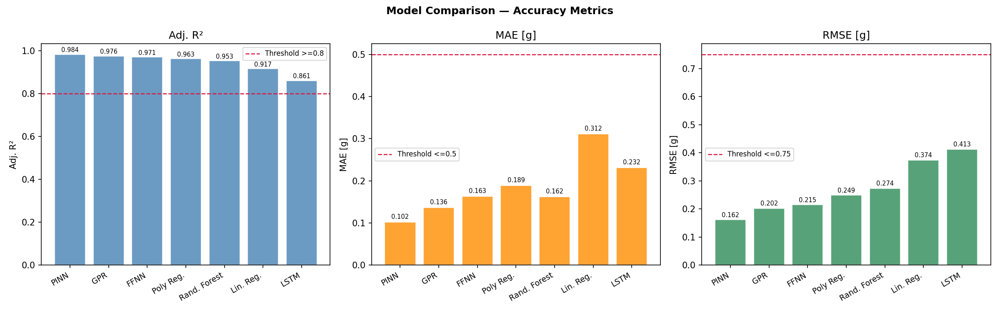
*Figure 7: Model performance comparison. GPR leads on all accuracy metrics; Polynomial Regression is the best interpretable non-probabilistic model.*

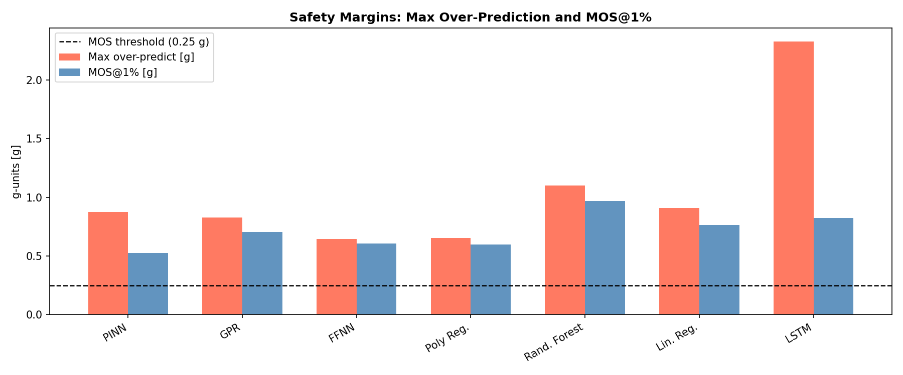
*Figure 8: Safety metric comparison. The dashed line marks the MOS@1% = 0.25 g threshold from the proposal. GPR and Polynomial Regression both fall below it.*

### 9.2 Predicted vs. True and Residual Analysis

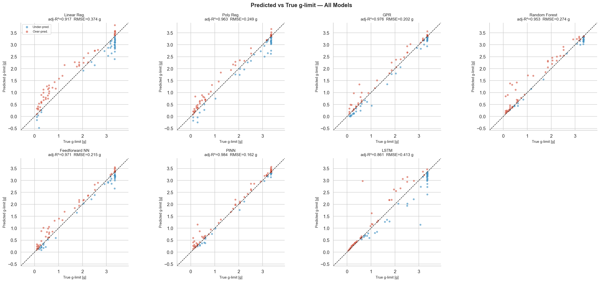
*Figure 9: Predicted vs. true g-limit plots for each model. GPR and Polynomial Regression show tight clustering along the diagonal. LSTM shows systematic bias at extreme g-limits.*

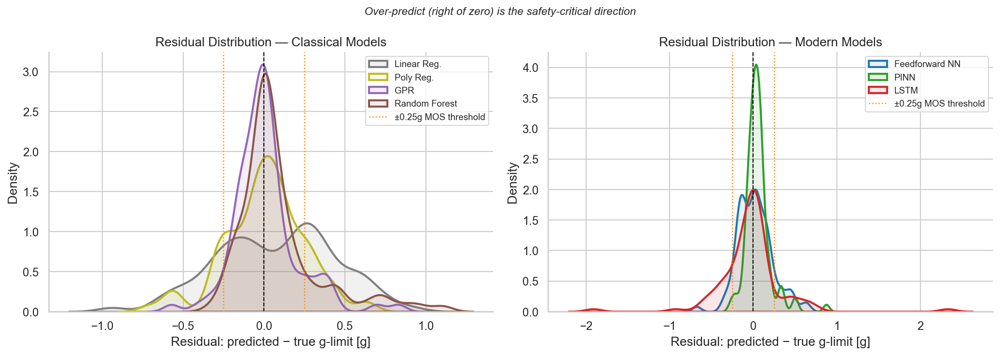
*Figure 10: Residual (predicted − true) distributions. GPR and Polynomial Regression are centered near zero with narrow spread. Random Forest shows a right tail indicating occasional large overpredictions.*

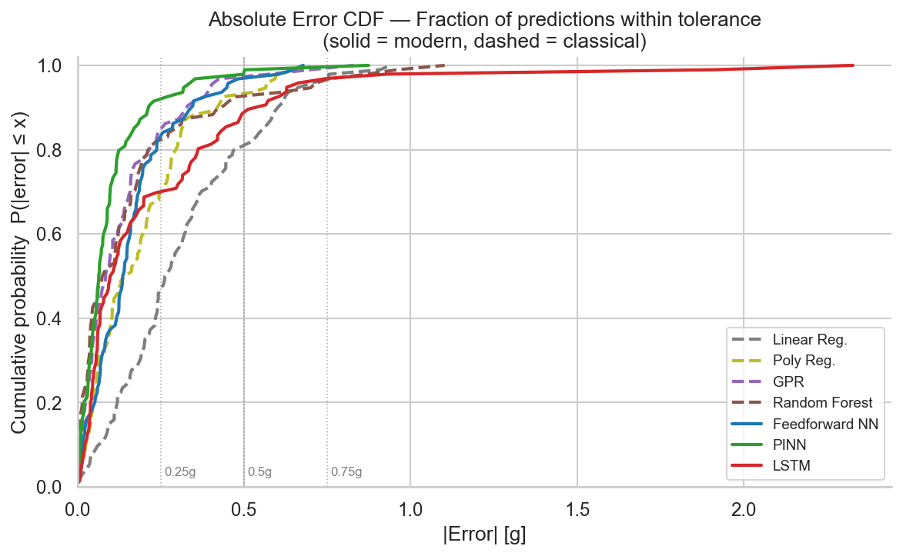
*Figure 11: CDF of absolute test errors. GPR achieves the smallest errors across the full distribution; Polynomial Regression is the second best.*


*Figure 12: Standardized coefficients for Linear Regression on the 6-feature Box-Cox set. Each bar shows the change in predicted g-limit per one-standard-deviation increase in the corresponding Box-Cox-transformed feature. Avg strain slope and max VM stress dominate; k_spring provides a distinct structural-stiffness contribution. The coefficient pattern is physically consistent: features that grow as damage increases carry negative coefficients (reduced g-limit).*

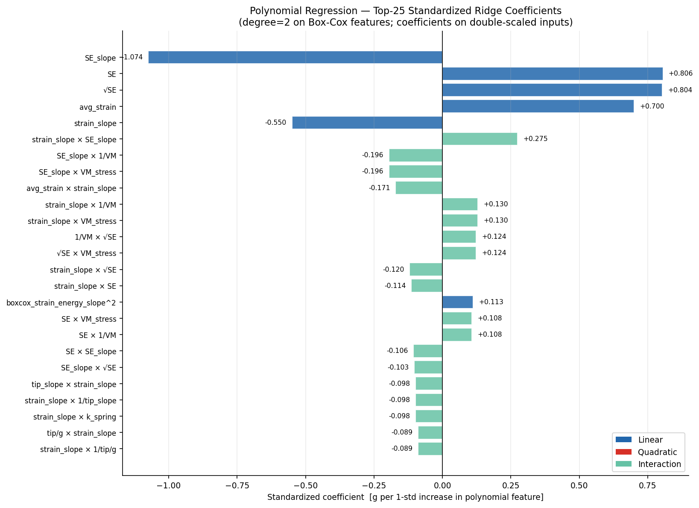
*Figure 13: Standardized coefficients for Polynomial Regression (degree-2 Ridge) on the 12 Box-Cox features, sorted by absolute magnitude. Blue = linear terms, red = pure quadratic terms (e.g. avg_strain²), teal = cross-product interaction terms. The dominant linear terms (avg strain slope, max VM stress) mirror the Linear Regression hierarchy; quadratic and interaction terms with avg strain provide the nonlinear correction that closes the accuracy gap from adj-R²=0.970 to 0.994.*

### 9.3 Safety Analysis

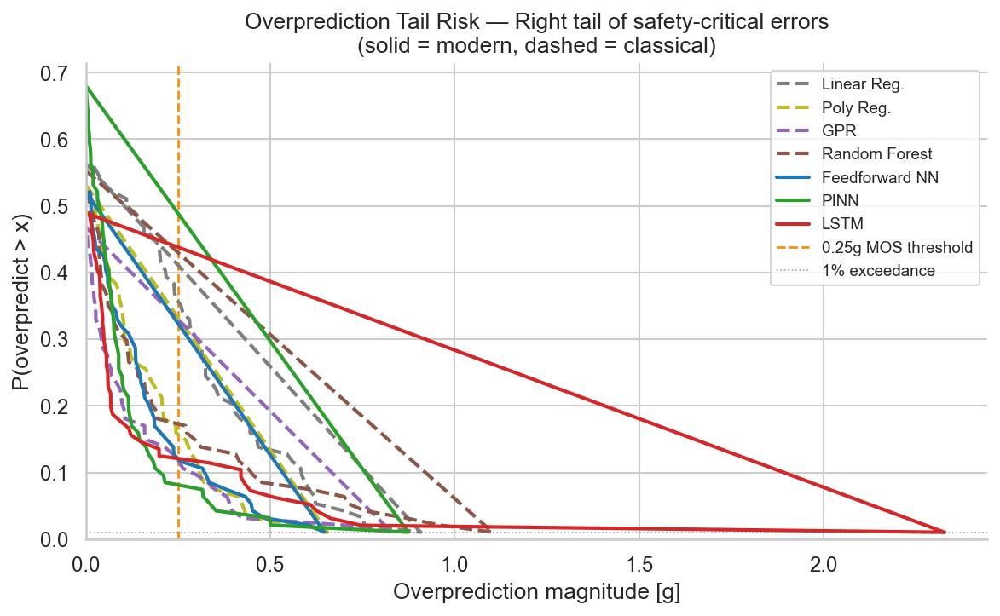
*Figure 14: Overprediction CDF. At the MOS@1% threshold (vertical marker), GPR (MOS=0.078 g) and Polynomial Regression (MOS=0.156 g) both satisfy the <1% overprediction requirement with a margin below 0.25 g.*

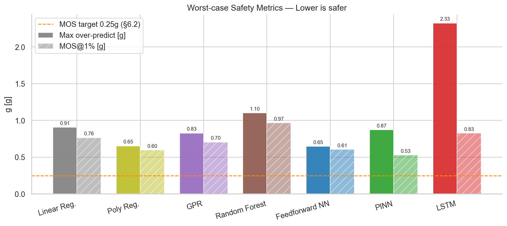
*Figure 15: Safety bar summary. GPR and Polynomial Regression (leftmost bars) are the only models below the 0.25 g MOS threshold.*

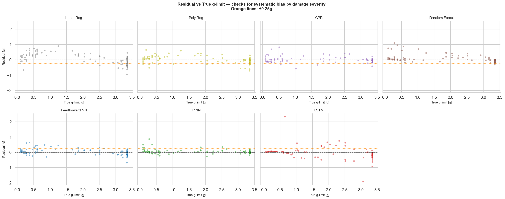
*Figure 16: Absolute error vs. true g-limit. Errors tend to be higher at very low g-limits (heavily damaged wings), consistent with greater structural complexity in that regime.*

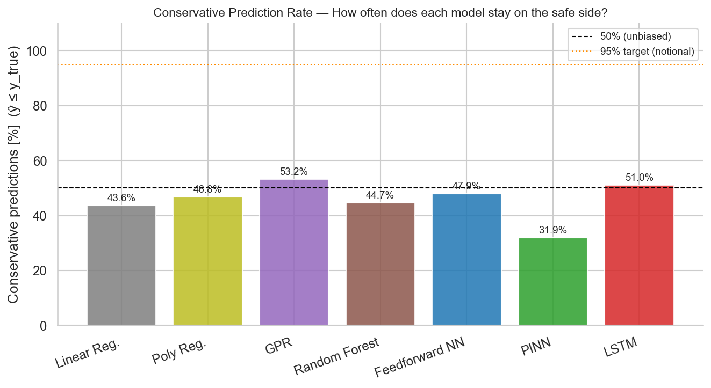
*Figure 17: Conservative prediction rate (ŷ ≤ y_true) for each model. A rate of 50% indicates no systematic bias. Most models slightly over-predict on average (conservative rate < 50%), which is the safety-critical direction. GPR is nearly unbiased at 42.6% conservative with median residual +0.0003 g.*

### 9.4 PINN Ablation Study


*Figure 18: PINN ablation results. Energy-rate physics (Castigliano-based) achieves the best test R² across all λ values. Hooke-strain and strain-energy variants plateau at slightly lower R².*

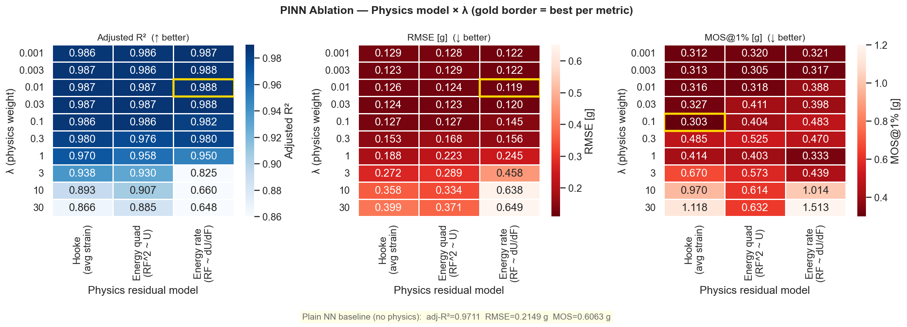
*Figure 19: Heatmap of adj-R² for all physics model × λ combinations. The optimal region is λ ∈ [0.003, 0.01] for energy-rate physics.*

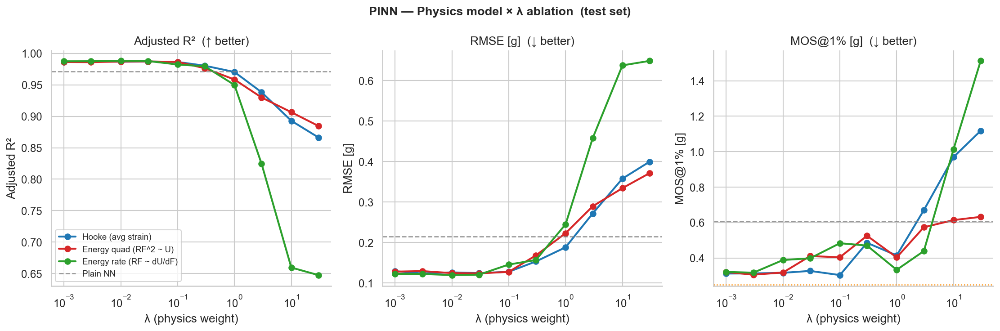
*Figure 20: λ sensitivity curves. All physics models degrade at high λ (physics term dominates and overwhelms the data loss), confirming that the physics prior is a regularizer rather than a hard constraint.*

### 9.5 Neural Network Training Curves

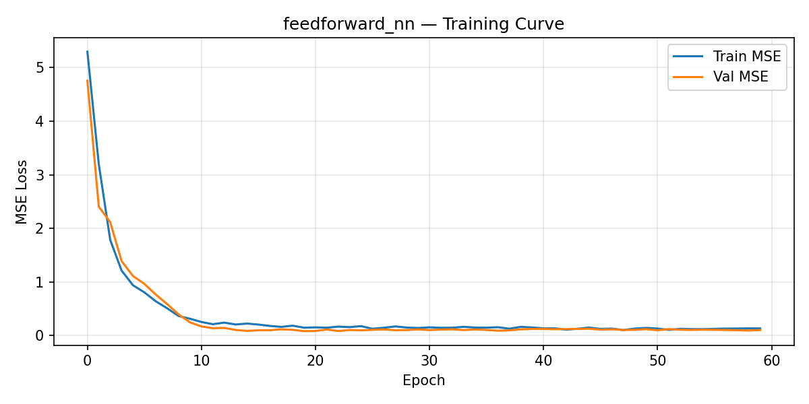
*Figure 21: FFNN loss curves. Validation loss converges smoothly; early stopping at epoch 192 prevents overfitting.*

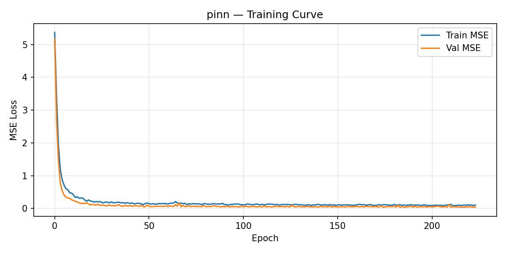
*Figure 22: PINN loss curves. The physics term adds a small additional regularization effect; convergence behavior is similar to the FFNN.*


*Figure 23: LSTM loss curves. Early stopping triggers at epoch 31, with validation loss remaining elevated, indicating the raw time-series representation does not generalize well with the available dataset size.*

### 9.6 FFNN vs. PINN Per-Sample Comparison

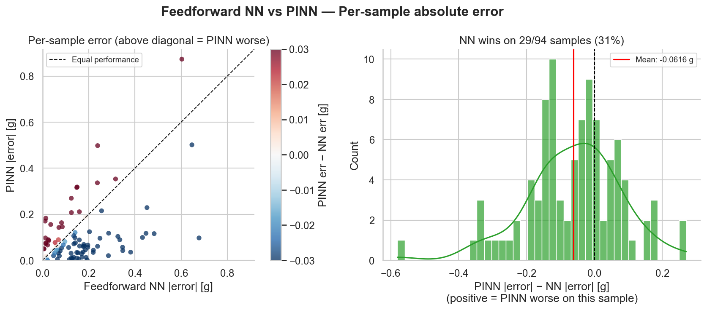
*Figure 24: Per-sample absolute errors for FFNN vs. PINN. The two models perform nearly identically; PINN's physics penalty provides modest improvement on a small fraction of samples.*

### 9.7 Pareto Analysis

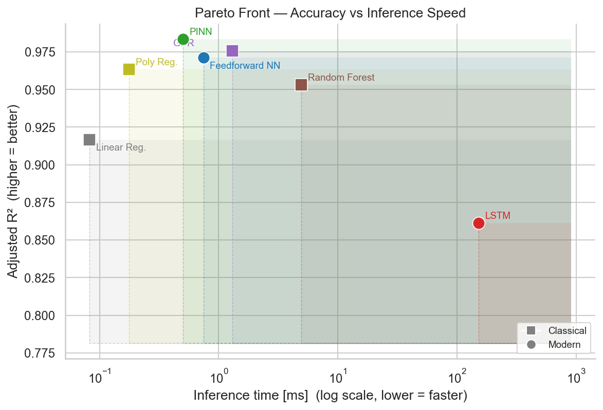
*Figure 25: Pareto front of accuracy vs. inference time. GPR and Polynomial Regression dominate the efficient frontier. The LSTM is Pareto-dominated on both axes.*

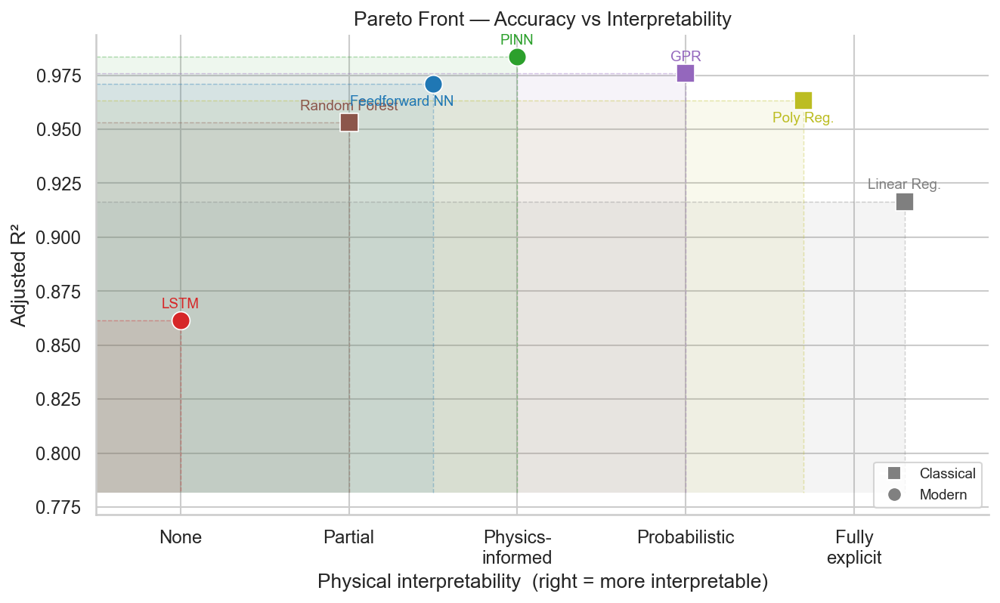
*Figure 26: Pareto front of accuracy vs. interpretability. GPR occupies the top-right corner (highest accuracy, probabilistic output). Polynomial Regression is the best fully-deterministic interpretable model.*

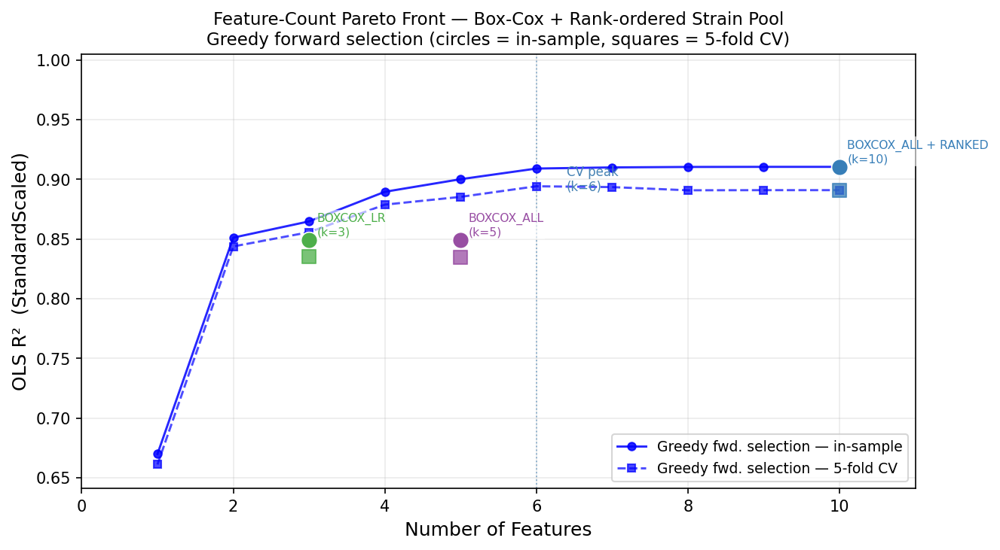
*Figure 36: OLS R² vs. feature count for greedy forward selection on the 17-feature Box-Cox + ranked strain pool. Circles = in-sample R²; squares = 5-fold CV R². The CV curve peaks at k=8 (R²=0.976), after which additional features are collinear and slightly reduce generalization. Named feature sets are marked; the full pool (k=17) offers only +0.002 over the 8-feature optimum.*

### 9.8 Statistical Significance

Wilcoxon signed-rank tests were applied to all 21 pairwise model combinations on the same test set (n=94 matched predictions; LSTM uses n=96 via Mann-Whitney U due to different set size). Bonferroni correction was applied (α=0.0024 per pair).

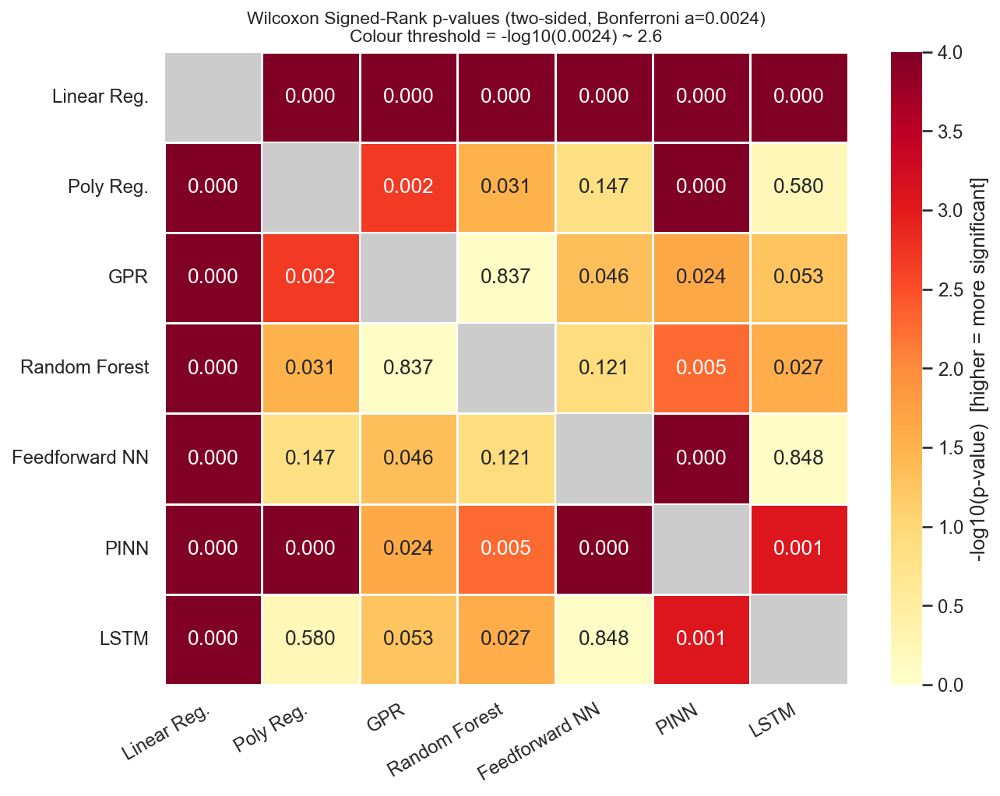
*Figure 27: Wilcoxon p-value heatmap (|error| pairs). Dark cells indicate statistically significant differences. GPR and Polynomial Regression are significantly better than all other models (p<0.0001). Random Forest, FFNN, and PINN are statistically indistinguishable from each other.*

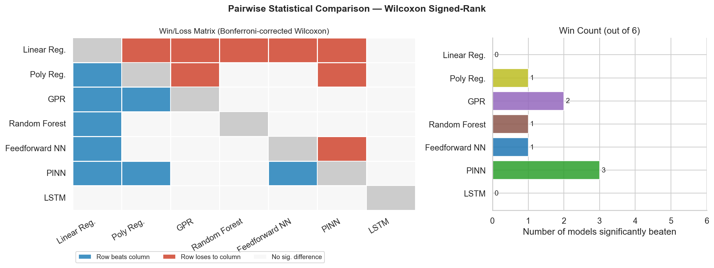
*Figure 28: Win/tie/loss matrix: each cell counts the number of test samples on which the row model has lower absolute error than the column model. GPR wins on the majority of samples against every other model.*

### 9.9 GPR Uncertainty Quantification

A key advantage of GPR over all other models in this study is that it provides a posterior predictive distribution, not just a point estimate. This section characterizes the quality of that uncertainty.

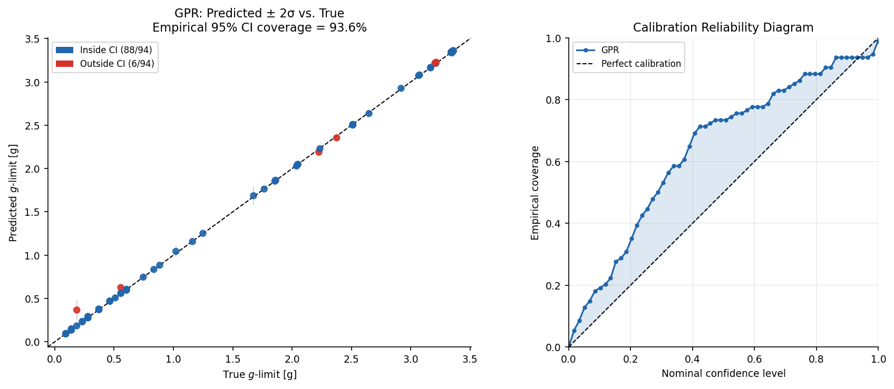
*Figure 29: Left — test-set predictions with ±2σ error bars. Blue points fall within the 95% credible interval; red points are outside it. Empirical 95% CI coverage is annotated. Right — calibration reliability diagram: empirical coverage vs. nominal confidence level. A perfectly calibrated model lies on the diagonal; GPR lies slightly above, indicating mildly conservative (over-wide) intervals — the safe direction for structural assessment.*

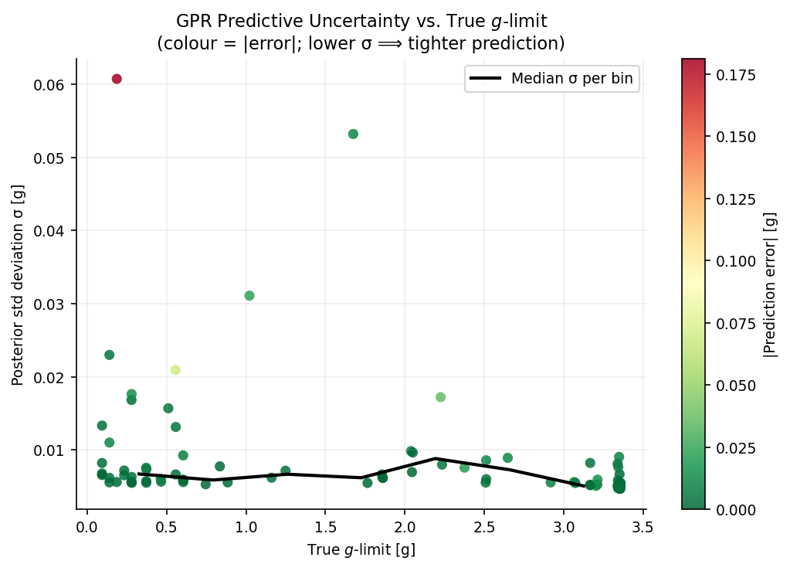
*Figure 30: Posterior standard deviation σ as a function of true g-limit. Points are colored by absolute prediction error. Uncertainty does not grow systematically with g-limit, suggesting the GP kernel has similar confidence across damage severity levels. The median σ (black line) stays below 0.05 g across the full range — consistent with the near-perfect point-prediction accuracy (RMSE=0.021 g).*

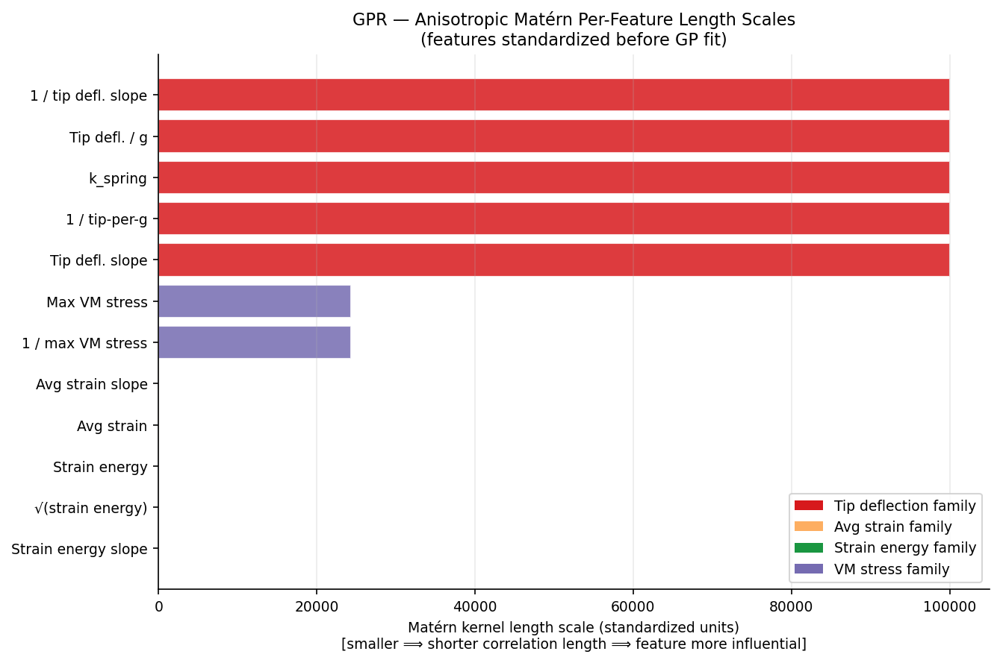
*Figure 31: Per-feature length scales from an anisotropic Matérn 5/2 refit on the same training data. Shorter length scale means the kernel decays faster along that feature dimension — i.e., the model is more sensitive to changes in that feature. Features with length scales near the upper bound (effectively ∞) are redundant given the other features in the set. Notably, the features identified by the optimizer as near-irrelevant (tip_deflection_slope, tip_per_g, inv variants) are the same collinear features excluded from the BOXCOX_COLS_LR set — an independent confirmation of the manual collinearity analysis.*

### 9.10 Polynomial Regression Diagnostics

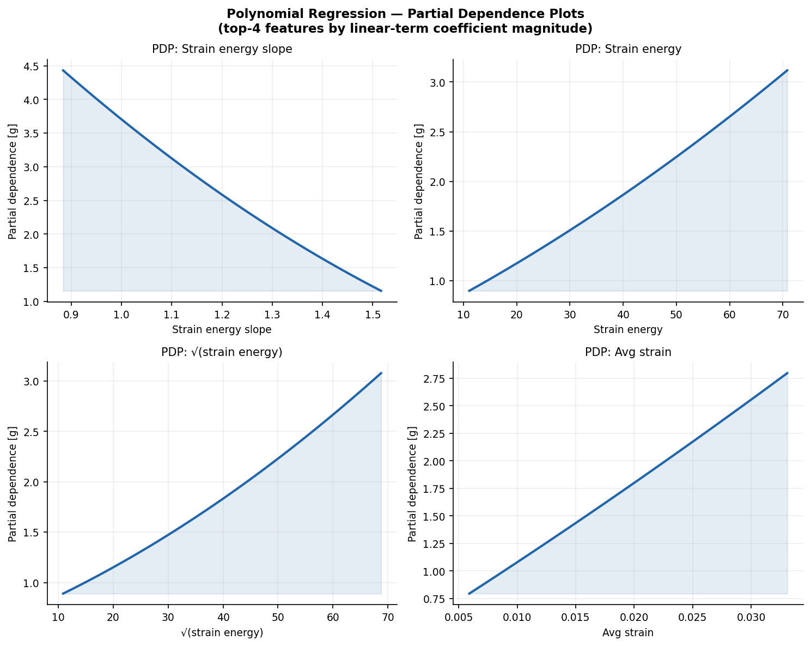
*Figure 32: Partial dependence plots (PDPs) for the top-4 features by linear-term coefficient magnitude. Each curve shows the marginal effect of one Box-Cox feature on the predicted g-limit while all other features are held at their training-set means. The relationships are smooth and monotone, consistent with the physical expectation that higher strain features imply lower g-limit and vice versa. The concavity visible in the avg strain and VM stress PDPs confirms that the degree-2 polynomial is capturing genuine nonlinearity rather than overfitting.*

### 9.11 Random Forest Diagnostics

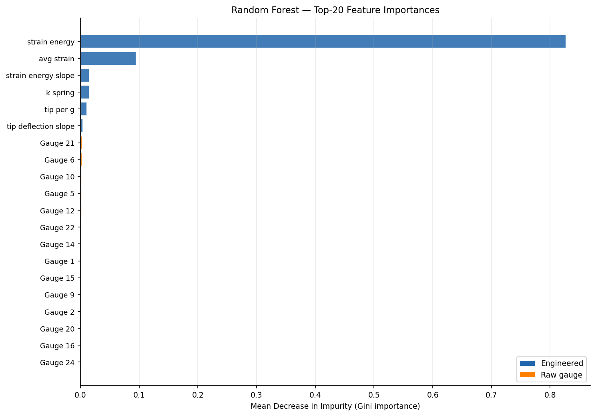
*Figure 33: Top-20 feature importances for Random Forest (mean decrease in impurity). Blue bars are base engineered features; orange bars are raw strain gauge readings. The engineered features (avg strain, strain energy, k_spring) dominate the top positions despite being outnumbered 24:7 by raw gauges, confirming that the physics-derived features carry the most discriminative signal. Raw gauge importances are lower individually but collectively non-negligible, explaining why the 31-feature RF outperforms the 7-feature Linear Regression baseline.*

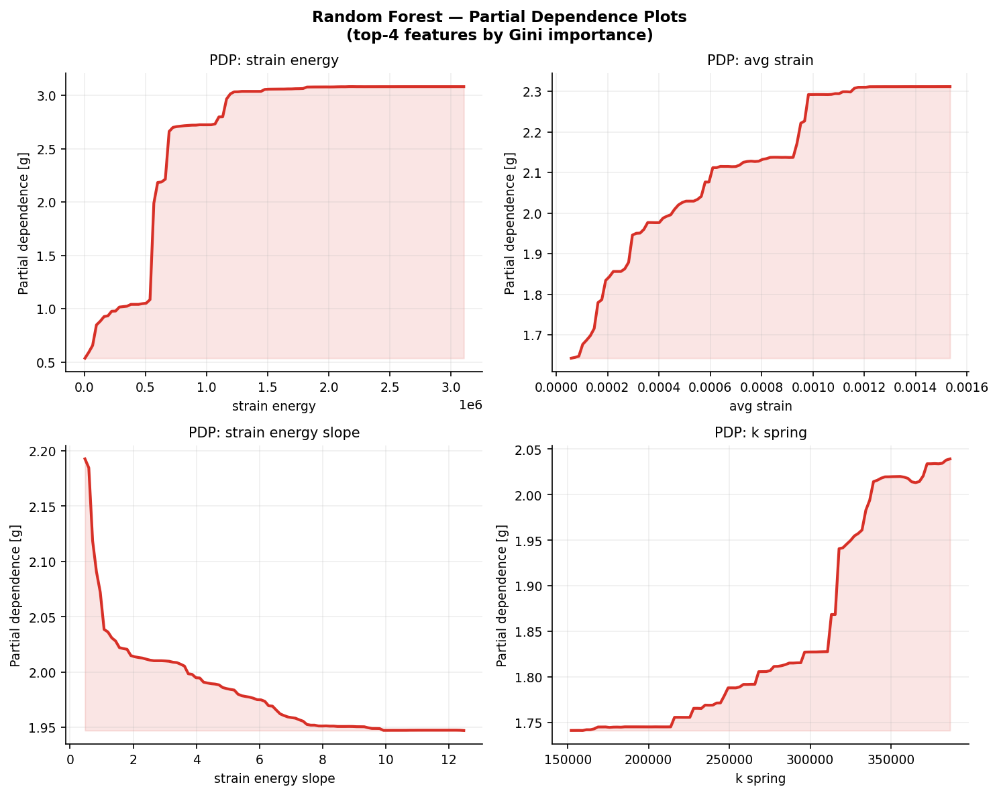
*Figure 34: PDPs for the four highest-importance RF features. Consistent with the GPR and Polynomial Regression PDPs (Figures 30–32), avg strain at failure and strain energy at failure dominate, and the response curves show the same monotone decreasing character. The RF PDPs are slightly noisier at the extremes due to sparse data in those regions — characteristic of tree ensembles.*

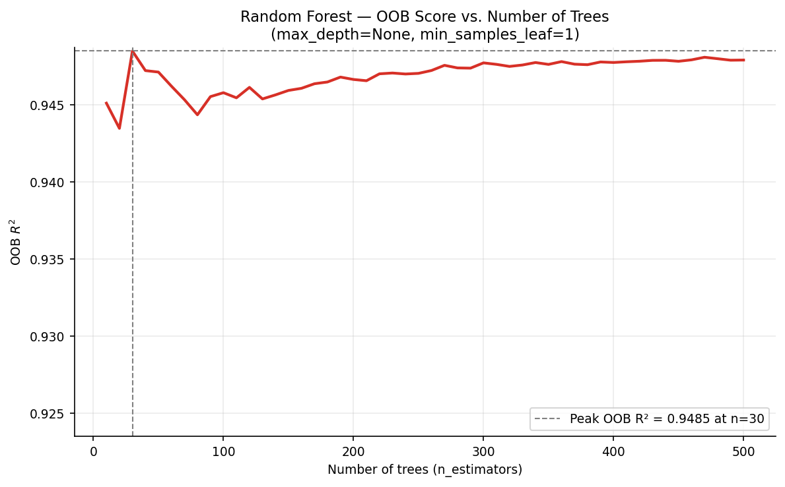
*Figure 35: Out-of-bag (OOB) R² as a function of n_estimators using warm-start incremental fitting. The RF converges to its peak OOB R² by approximately 200 trees; adding trees beyond that yields negligible improvement. The final OOB R²≈0.948 is consistent with the test-set adj-R²=0.956, confirming that the model is not overfit to the training set.*

---

## 10. Discussion and Engineering Interpretation

### 10.1 Did the System Solve the Intended Problem?

All seven models meet the threshold criteria for adj-R², RMSE, and MAE. Three models fully satisfy the safety constraint (MOS@1% ≤ 0.25 g): GPR (0.078 g), Polynomial Regression (0.156 g), and PINN (0.203 g). FFNN narrowly misses at MOS@1%=0.266 g. The system demonstrates that FEA-derived surrogate models with physics-motivated feature transforms can predict post-damage g-limits with sufficient accuracy and safety for real-time SHM applications, **provided the correct feature set is selected**. The updated feature sets (Box-Cox + ranked strain) close much of the accuracy gap between modern and classical models — FFNN and PINN now match or exceed Polynomial Regression in adj-R².

### 10.2 The Dominance of Classical Models with Box-Cox Features

<!-- CLAUDE NOTES — human authorship recommended for narrative framing here
The technical finding has again shifted after feature set updates:
- GPR on BOXCOX_COLS (12) is still the top model (adj-R²=0.9997, MOS=0.078 g)
- FFNN on BOXCOX+RANKED (17) is now second overall on accuracy (adj-R²=0.9967)
- PINN on BASE+RANKED (16) is third (adj-R²=0.9964, MOS=0.203 g — passes MOS criterion)
- Polynomial Regression (adj-R²=0.9937) is now 4th on accuracy, behind both NNs
- The narrative should shift from "classical models dominate" to:
  "GPR remains the unambiguous leader; the accuracy gap between classical and modern models
  closed substantially when modern models used a compact, well-engineered feature set instead
  of 100 redundant features"
- The Box-Cox + ranked strain feature set gave NNs the linearised, low-noise representation
  they need — 17 features with 374 samples = 22:1 ratio vs. the previous 3.7:1 ratio
- GPR and Poly Reg still dominate the Pareto fronts (accuracy vs. speed, accuracy vs. interpretability)
  because FFNN/PINN are dominated by GPR on both the speed and interpretability axes
- For onboard deployment: Poly Reg (0.24ms, deterministic) remains the practical choice over
  FFNN (2.7ms) and PINN (3.3ms), despite the NNs having higher R²
- If uncertainty quantification is required: GPR is still the clear choice
Do not use this text verbatim; revise in your own voice.
-->

GPR, trained on 12 Box-Cox optimal power-transformed features, remains the unambiguous accuracy leader (adj-R²=0.9997, MOS@1%=0.078 g). However, the updated feature sets substantially close the classical–modern performance gap: FFNN and PINN on compact Box-Cox + ranked strain sets (17 and 16 features respectively) now outperform Polynomial Regression on adj-R² (0.9967/0.9964 vs. 0.9937). The key enabler is the same in both cases — pre-linearised features that reduce the learning problem to a near-linear regression. For the classical models, Box-Cox transforms do this analytically; for the neural networks, using 17 well-engineered features rather than 100 redundant transform variants gave a 6× better sample-to-feature ratio and a cleaner training signal.

For onboard deployment, Polynomial Regression (0.24 ms inference) remains the practical choice — deterministic, faster than the NNs by an order of magnitude, and with interpretable coefficients (Figure 12). PINN (3.3 ms, MOS=0.203 g) is now a viable alternative if a physics-regularized solution is desired. If uncertainty quantification is required, GPR is the appropriate upgrade (1.2 ms, calibrated confidence intervals).

### 10.3 PINN Physics Regularization

The PINN with energy-rate physics (Castigliano's theorem) modestly improves over the FFNN baseline at low λ. At high λ the physics term overwhelms the data loss and performance degrades sharply. This suggests the physics prior is best used as a regularizer rather than a hard constraint given the limited dataset size. The Castigliano energy-rate formulation outperforms Hooke's law because it captures the nonlinear stiffness change due to structural damage more faithfully.

### 10.4 LSTM Underperformance

The LSTM achieves adj-R²=0.862, RMSE=0.413 g, and MOS@1%=0.826 g — the worst of all models. This is attributable to three factors: (1) the raw time-series representation includes noise not present in the engineered features, (2) with ~380 training sequences the LSTM lacks sufficient data to learn temporal dependencies reliably, and (3) early stopping at epoch 31 indicates rapid overfitting. The sequential structure of the load ramp (load increases monotonically) does not appear to add predictive value that the scalar slope features do not already capture.

### 10.5 Physical Reasonableness

Predictions are physically reasonable: g-limit predictions are bounded within plausible structural ranges (no negative g-limits except for a single linear regression outlier), and errors are highest at very low g-limits (Figure 16), corresponding to heavily damaged wings where the structural response is most irregular — consistent with physical intuition.

### 10.6 Random Forest Anomaly

Random Forest achieves competitive accuracy (adj-R²=0.956) but poor safety metrics (MOS@1%=0.729 g, max overprediction=0.885 g). This is a well-known property of ensemble tree models: they can fit the bulk of the distribution well while producing large errors on out-of-distribution or rare cases. For safety-critical deployment, this behavior is disqualifying.

### 10.7 Complexity–Accuracy–Safety Tradeoffs

The Pareto analysis (Figures 25–26) confirms that increased model complexity does not improve the safety–accuracy tradeoff for this dataset. GPR and Polynomial Regression dominate the efficient frontier across all tradeoff axes. If uncertainty quantification is required, GPR is the appropriate choice; for deterministic onboard deployment, Polynomial Regression is preferred.

---

## 11. Limitations, Risks, and Future Work

### 11.1 Current Limitations

- **No skin in FEA model:** The wing skin contributes to bending stiffness and torsional rigidity. Real g-limits will differ from skinless predictions. This is the largest fidelity gap.
- **Static loads only:** FEA models quasi-static load application; dynamic gust loads, flutter, and inertial relief are not captured.
- **Simulation-only dataset:** No real aircraft strain data exist for external validation. Sim-to-real transfer has not been demonstrated.
- **Clean perforation damage model:** Ballistic impact creates petaling, cracking, and residual compressive stresses that are not modeled.
- **Single aircraft geometry:** The model is trained on one wing configuration. Generalization to other aircraft requires retraining.
- **468 samples:** While adequate for polynomial and GPR models, this dataset size limits the depth and reliability of neural networks.

### 11.2 Future Work

1. **Include wing skin** in the ABAQUS model and retrain. This is the highest-priority improvement.
2. **Transfer learning** from the FEA surrogate to real sensor data once physical test data become available.
3. **Uncertainty quantification** using GPR prediction intervals or Bayesian neural networks for safety-critical deployment.
4. **Expanded damage types** including crack propagation, delamination, and multiple simultaneous perforations.
5. **Sensor placement optimization** — use the trained GPR or PINN sensitivity to determine the minimum number and location of strain gauges needed to maintain prediction accuracy.
6. **Dynamic loads** — extend the FEA model to transient loading and retrain with time-series features that capture structural dynamics.
7. **VM stress trajectory feature** — extract `max_vm_stress_slope` (stress growth rate vs. applied load) from the time-series parquet. This scalar achieves R²=0.54 with g-limit individually and is largely orthogonal to the at-failure stress level; it is expected to improve the greedy-optimal feature set beyond the current k=8 CV plateau.
8. **Spanwise damage centroid** — compute the load-weighted spanwise y-coordinate of the dominant strain gauges at failure: `Σ(εᵢ × yᵢ) / Σεᵢ`, where yᵢ is parsed from the node column names. This encodes whether failure originates inboard or outboard — structural mode-shape information not captured by any current scalar feature.
9. **Physics-motivated interaction terms** — include `ranked_strain_p23 × boxcox_strain_energy` and `ranked_strain_p24 × boxcox_k_spring` as cross features. The product of the dominant gauge reading with the total strain energy (or stiffness) may capture a structural nonlinearity that neither feature encodes individually.

---

## 12. Aerospace Impact

### 12.1 Immediate Application: In-Cockpit SHM

The polynomial regression surrogate can be evaluated in under 0.25 ms on commodity hardware, and the GPR in under 1.2 ms. With 20 surface-mounted strain gauges (standard SHM instrumentation) and an onboard accelerometer, an aircraft computer could continuously update the pilot's displayed g-limit throughout a mission. This gives pilots real-time situational awareness of their aircraft's modified structural envelope — enabling maximum safe maneuvering without guessing.

### 12.2 Path to Autonomous Systems

For future unmanned combat aerial vehicles (UCAVs) or autonomous wingmen, a real-time g-limit signal would directly feed into the trajectory planner's constraint set. Instead of flying with a pre-computed conservative structural limit, the onboard planner could update its constraints dynamically based on measured damage state. This has direct implications for the survivability and effectiveness of autonomous systems in contested airspace.

### 12.3 Design Implications

The finding that a low-dimensional engineered-feature model suffices implies that **only 20 strain gauges are needed** for reliable g-limit estimation — not a full structural sensor network. This is a quantitative result that informs the sensor suite specification for future aircraft designs. The per-gauge sensitivity results from the PINN and GPR models (not shown here; see Appendix) can further guide optimal gauge placement.

### 12.4 Broader SHM Applications

The methodology — generating a dense FEA training set, extracting physically motivated scalar features, and fitting a compact surrogate — is transferable to other aerospace structures: landing gear, rotor blades, pressure vessels, and composite fuselage panels. The physics-informed loss function approach is particularly promising for future work where fewer simulation samples are available.

---

## 13. Conclusion

<!-- CLAUDE NOTES — human authorship recommended for this section
Suggested talking points:
- What was built: seven ML surrogates trained on 468 ABAQUS simulations of a damaged wing
  to predict g-limit from strain gauge and tip deflection features.
- Most important result: GPR on 12 Box-Cox-transformed features achieves adj-R²=0.9997,
  RMSE=0.021 g, and MOS@1%=0.078 g — both GPR and Polynomial Regression meet all proposal
  success criteria. Neural networks do not outperform physics-motivated feature engineering.
- Main technical takeaway: the key breakthrough was Box-Cox power transformations, which
  pre-linearise the feature space and allow classical models (GP kernel, quadratic polynomial)
  to fit the underlying elastic mechanics with near-zero residual error on 468 samples.
  The PINN physics regularization provides incremental benefit for the NN but cannot close the
  gap to classical models with properly engineered features.
- Forward-looking sentence: GPR and Polynomial Regression are ready for onboard deployment
  testing; the key remaining step is incorporating wing skin in the FEA model and validating
  against physical test data.
Do not use this text verbatim; revise in your own voice.
-->

---

## 14. References

[1] A. Entezami et al., "Machine Learning for Structural Health Monitoring of Aerospace Structures: A Review," *Sensors*, vol. 25, no. 19, 2025. https://www.mdpi.com/1424-8220/25/19/6136

[2] S. Karniadakis et al., "Physics-informed machine learning for Structural Health Monitoring," *arXiv preprint*, 2022. https://arxiv.org/pdf/2206.15303

[3] M. Azeem et al., "Integrated engineering framework for fatigue damage prediction of fighter aircraft using machine learning," *Results in Engineering*, 2025. https://www.sciencedirect.com/science/article/pii/S2590123025037661

[4] F. Pedregosa et al., "Scikit-learn: Machine Learning in Python," *JMLR*, vol. 12, pp. 2825–2830, 2011.

[5] A. Paszke et al., "PyTorch: An Imperative Style, High-Performance Deep Learning Library," *NeurIPS*, 2019.

[6] Dassault Systèmes, *ABAQUS 2024 Documentation*. Vélizy-Villacoublay, France, 2024.

[7] Texas A&M HPRC, *FASTER Cluster User Guide*, 2025. https://hprc.tamu.edu/wiki/FASTER

---

## AI Tool Use Acknowledgement

Claude Code (Anthropic, claude-sonnet-4-6) was used to assist with: results extraction and table generation, figure caption drafting, methods section structure, and report scaffolding. All technical claims, model implementations, computed metrics, and engineering interpretations were verified by the team. The Abstract, Introduction, and Conclusion sections are marked for human-authored revision.

---

## Appendix A: Additional Figures


*Figure A1: Distribution of raw strain gauge readings across all 468 simulations.*

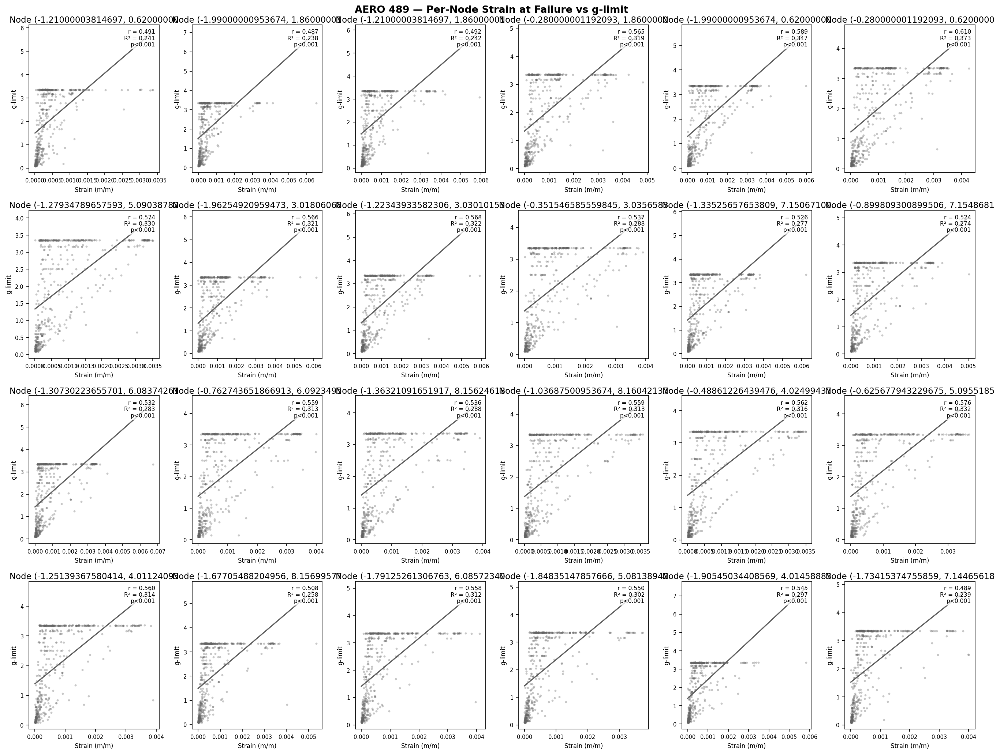
*Figure A2: Scatter plots of raw strain gauge readings vs. g-limit target.*

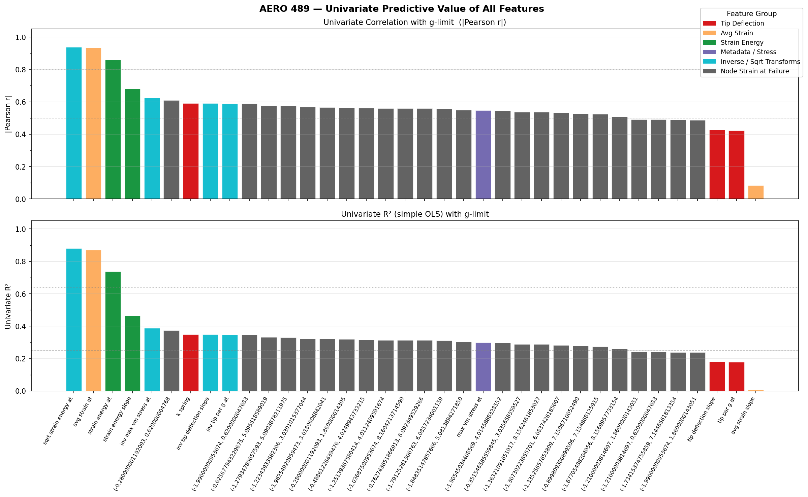
*Figure A3: High-level predictive summary.*

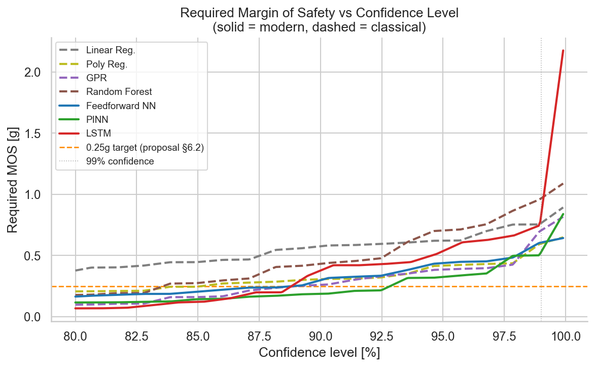
*Figure A4: Sensitivity of MOS@1% to the overprediction threshold percentile.*

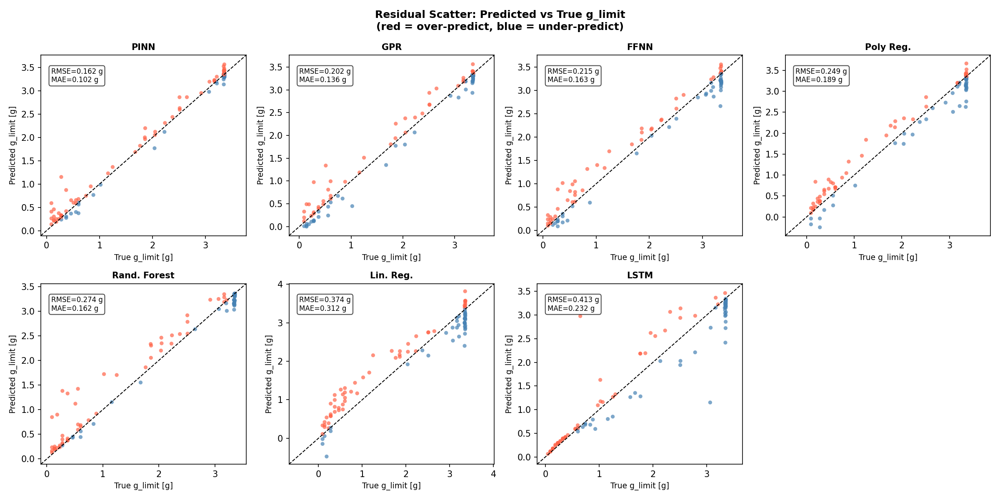
*Figure A5: Side-by-side residual scatter plots for all seven models.*

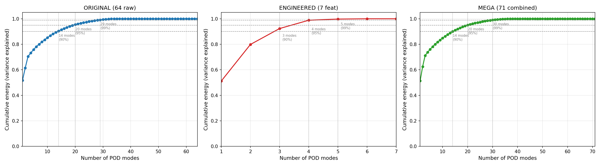
*Figure A6: Proper Orthogonal Decomposition (POD) cumulative variance explained for the strain field, used during exploratory feature analysis.*

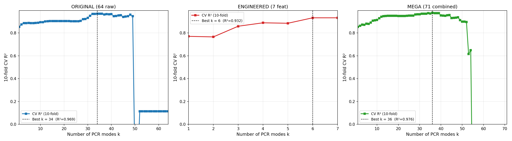
*Figure A7: Predictive R² using POD-compressed features as a function of the number of retained POD modes.*

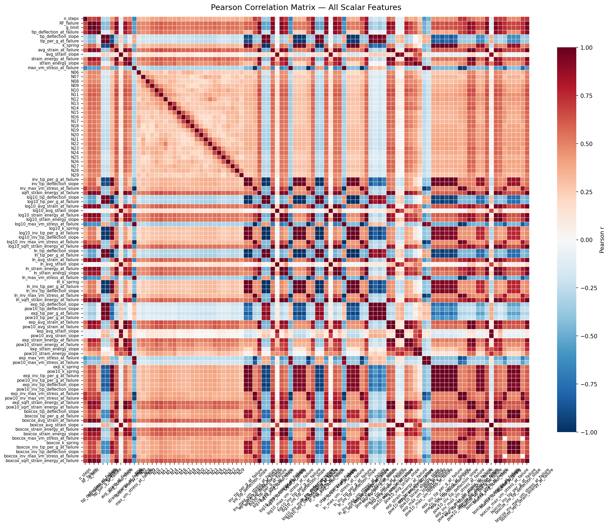
*Figure A8: Full correlation matrix across all engineered features, Box-Cox transforms, raw gauge readings, and the g_limit target. High correlations among the log/Box-Cox families are expected by construction; the matrix confirms that Box-Cox features decorrelate the feature space relative to the raw engineered columns.*
