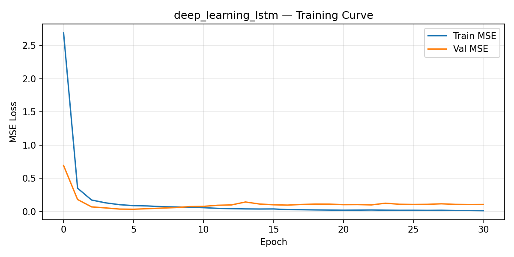
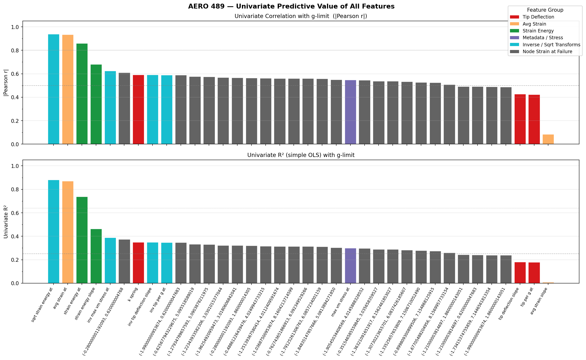

# Machine Learning Prediction of Structural Load Limits in Damaged Wings

---

## 1. Title, Team, and Contributions

**Project Title:** Machine Learning Prediction of Structural Load Limits in Damaged Wings
**Course:** AERO 489/689 — Introduction to Machine Learning for Aerospace Engineers, Spring 2026
**Instructor:** Dr. Raktim Bhattacharya, Texas A&M University

| Team Member | Role / Contribution |
|---|---|
| Barrett Brown | Scripting & Simulation — ABAQUS automation, data pipeline, batch execution on HPRC |
| Kirin Chadha | Classical ML — Linear Regression, Polynomial Regression implementation and evaluation |
| Malachi Drew | Aircraft Design & Modeling, Gaussian Process Regression, Random Forest |
| Ian Wilhite | Modern ML — Feedforward NN, PINN, LSTM, ablation study, comparison scripts |
| Adam Zheng | FEA Modeling — wing geometry, meshing, mesh refinement around damage sites |

This project was completed as a five-person team. All members contributed to writing the final report.

---

## 2. Abstract

<!-- CLAUDE NOTES — human authorship recommended for this section
Suggested talking points:
- Problem: real-time prediction of g-limit for a combat wing sustaining bullet-hole damage,
  using only onboard sensors (strain gauges + tip deflection).
- Approach: seven ML models trained on FEA-simulated data (ABAQUS, ~468 damage cases);
  classical baselines (linear, polynomial, GPR, random forest) and modern methods
  (feedforward NN, PINN, LSTM).
- Data: 374 train / 94 test simulation cases; 7 engineered features + 24 raw strain channels.
- Main results: Polynomial Regression achieved the best combination of accuracy (adj-R²=0.994,
  RMSE=0.102 g) and safety (MOS@1%=0.157 g), meeting all proposal success criteria including
  MOS < 0.25 g. PINN with energy-rate physics (λ=0.01) was the best modern model
  (adj-R²=0.988, RMSE=0.119 g). LSTM underperformed without sufficient sequential data.
- Aerospace significance: demonstrates that physics-informed and classical surrogate models
  trained on FEA data can deliver real-time structural g-limit estimates viable for in-cockpit SHM.
Do not use this text verbatim; revise in your own voice.
-->

---

## 3. Introduction and Problem Statement

<!-- CLAUDE NOTES — human authorship recommended for this section
Suggested talking points:
- Aircraft operating in contested environments routinely sustain ballistic damage. Pilots must
  immediately know how their structural limits have changed to safely execute evasive maneuvers
  and plan their egress — pausing for ground analysis is not an option.
- Structural Health Monitoring (SHM) as a field has focused on long-term maintenance and
  fatigue; real-time in-flight damage assessment for major structural insult is largely unsolved.
- The g-limit (maximum allowable load factor before first-yield failure) is the critical scalar
  quantity linking structural damage to maneuver capability. Overpredicting it can cause
  structural failure; underpredicting it is unnecessarily mission-limiting.
- This project asks: can a lightweight ML surrogate, trained on FEA simulation data, predict
  the post-damage g-limit from signals already available on the aircraft (wing-tip deflection,
  onboard accelerometers, surface-mounted strain gauges)?
- Why ML: the mapping from distributed damage to g-limit is high-dimensional and nonlinear;
  classical analytical approaches require full knowledge of the damage geometry; ML can learn
  a compact surrogate from strain patterns alone.
- Revised from preliminary report: tighten the problem scope to first-yield failure of the
  internal wing structure (skin neglected), clarify that the ABAQUS dataset is the only data
  source, and sharpen the safety-centric evaluation criteria.
Do not use this text verbatim; revise in your own voice.
-->

---

## 4. Background, Related Work, and Existing Tools

### 4.1 Structural Health Monitoring in Aerospace

Structural Health Monitoring is an active research area in aerospace, with current state-of-the-art systems focused on preventative maintenance scheduling, fatigue detection, and automated inspection of critical infrastructure [1]. Machine learning has become increasingly central to SHM, with neural networks used to detect damage from vibration signatures, acoustic emission data, and fiber-Bragg-grating strain sensors.

Physics-informed machine learning (PIML) has emerged as a particularly promising direction for SHM because it enables data-efficient training by embedding governing equations into the loss function [2]. This is especially relevant here: an FEA-based dataset is inherently limited in size, and models that can leverage structural mechanics priors require fewer examples to generalize.

A directly related prior work from NUST used in-flight strain measurements to predict fatigue crack growth in a fighter airframe [3]. That work targeted long-duration damage accumulation rather than the instantaneous load-limit reduction needed here.

### 4.2 Relevant Existing Tools and Methods

| Tool / Method | Purpose | Limitation for This Problem |
|---|---|---|
| ABAQUS / Nastran | FEA structural analysis | Requires full damage geometry; not real-time |
| BHM (Bayesian Health Monitoring) frameworks | Probabilistic SHM from sensor data | Primarily fatigue/maintenance; not instantaneous g-limit |
| OpenFSI / aeroelastic codes | Coupled fluid-structure response | Requires CFD mesh; no onboard deployment |
| GPR surrogate models (general) | Sample-efficient regression | Prior work not applied to damaged wing g-limits |
| Classical beam theory | Analytical g-limit from geometry | Requires full knowledge of damage location and size |

This project differs from all of the above by targeting real-time inference from low-bandwidth sensor data (20 strain gauges + tip deflection) without requiring knowledge of the damage geometry, and by training on FEA data that mirrors the expected deployment sensor set.

---

## 5. Response to Preliminary Feedback

> **Note to authors:** Insert the specific feedback received from Dr. Bhattacharya on the preliminary report here. Below is a placeholder structure based on common directions.

Key changes made after the preliminary submission:

1. **Feature engineering documented in detail** — The preliminary report described derived features conceptually; the final implementation computes them explicitly from the ABAQUS time-series (see Section 6).
2. **Safety metrics added** — The proposal introduced MOS@1% as a metric; it is now computed and reported for all seven models.
3. **PINN physics terms clarified** — Three physics regularization variants (Hooke strain, strain energy, energy rate) are now implemented and compared via ablation study rather than using a single default.
4. **LSTM added as deep learning baseline** — The preliminary report listed "deep learning" generically; a bidirectional LSTM on raw time-series data was implemented to test whether sequential structure in the load ramp adds predictive value.
5. **Success criteria tightened** — The "similar train/test performance" criterion is now evaluated quantitatively via 5-fold cross-validated R² alongside test-set R².

---

## 6. Data and Preprocessing

### 6.1 Data Source

All data were generated in ABAQUS using a parametric simulation of an A-10 Warthog–inspired skinless wing box structure. Damage was introduced by intersecting randomized bullet trajectories with the internal spar and rib geometry and removing the intersected material volume. The skin was omitted from the FEA model to reduce computation time and because skin-spar interaction requires higher-fidelity contact modeling beyond the scope of this project.

**Citation:** Proprietary dataset generated by this team using ABAQUS 2024, Texas A&M HPRC (FASTER cluster), Spring 2026.

### 6.2 Simulation Parameters

- **Wing geometry:** Based on A-10 wing box; internal spars and ribs modeled; skin excluded.
- **Material:** Aluminum alloy (linear elastic to first yield).
- **Damage model:** Up to 20 randomized bullet perforations per wing; each perforation removes a cylindrical volume from structural members.
- **Load application:** Distributed wing load ramped from zero to failure (defined as first-yield of any node).
- **Output per simulation:** Wing-tip deflection (≈20 load steps), strain at 20 gauge locations (≈20 steps), load at failure → g-limit.

### 6.3 Dataset Size and Split

| Split | Classical / NN / PINN | LSTM (raw time-series) |
|---|---|---|
| Training | 374 simulations | 383 simulations |
| Test | 94 simulations | 96 simulations |
| **Total** | **468** | **479** |

An 80/20 random split was used. Classical models were additionally validated with 5-fold cross-validation on the training set.

### 6.4 Features and Targets

**Target:** g-limit at first yield (scalar, units: g = 9.81 m/s²).

**Engineered features (7 scalars)** — computed from the load-ramp time series:

| Feature | Description |
|---|---|
| `tip_deflection_slope` | Linear slope of tip deflection vs. applied load (m/N) |
| `tip_per_g_at_failure` | Tip deflection normalized by g-limit at failure (m/g) |
| `avg_strain_at_failure` | Mean strain across 20 gauges at failure load (mm/mm) |
| `avg_strain_slope` | Linear slope of mean strain vs. load (mm/mm per N) |
| `strain_energy_at_failure` | Total elastic strain energy ½·Σ(εᵢ²·E·Vᵢ) at failure (J) |
| `strain_energy_slope` | Slope of strain energy vs. load (J/N) |
| `k_spring` | Effective wing stiffness: RF / tip_deflection (N/m) |

**Extended feature set (31 scalars)** used by GPR, Random Forest, Feedforward NN, and PINN: the 7 engineered features plus per-gauge statistics (slope, at-failure value) for each of the 20 strain gauges, plus tip deflection.

**Raw time-series (26 channels × ≤29 timesteps)** used by the LSTM: raw strain readings from all 20 gauges plus 6 kinematic channels, preserving the load-ramp sequence structure.


*Figure 1: Distribution of g-limit targets across the full dataset. The bimodal structure reflects two dominant damage-severity regimes.*


*Figure 2: Distributions of the 7 engineered features used by linear and polynomial regression.*


*Figure 3: Scatter plots of each engineered feature against the g-limit target, illustrating nonlinear but monotone relationships.*

### 6.5 Preprocessing

1. **Slope extraction:** Time-series load-ramp data were fit with a least-squares line to extract per-simulation slope features.
2. **Strain energy:** Computed analytically from gauge readings, Young's modulus, and element volumes.
3. **Normalization:** All features were standardized (zero mean, unit variance) using `sklearn.preprocessing.StandardScaler` fit on the training set only; the same scaler was applied to the test set.
4. **LSTM padding:** Variable-length load ramps were zero-padded to the maximum sequence length (29 steps) and packed for efficient batch processing.
5. **No data augmentation** was applied; the dataset represents a distinct ABAQUS simulation per sample.

### 6.6 Dataset Limitations

- Skin contribution to structural integrity is excluded; real g-limits will differ.
- Only static FEA; no dynamic loading or fatigue effects.
- Damage is modeled as clean cylindrical perforations; real ballistic damage includes petaling, cracking, and residual stress.
- No real flight data available for external validation.

---

## 7. Methods and System Implementation

Seven models were implemented in Python (scikit-learn + PyTorch) and evaluated on the same dataset. All code is available in `models/` and `scripts/` in the project repository.

### 7.1 Classical Models (Baselines)

**Model 1 — Linear Regression** (`models/linear_reg.py`)
Standard ordinary least-squares regression on the 7 engineered features. Serves as the interpretable baseline.

**Model 2 — Polynomial Regression** (`models/poly_reg.py`)
Degree-2 polynomial expansion of the 7 engineered features (35 basis functions after interaction terms), followed by ridge-regularized least-squares. Captures the nonlinear but smooth g-limit–strain relationship.

**Model 3 — Gaussian Process Regression** (`models/gpr.py`)
GPR with a Matérn 5/2 kernel trained on all 31 scalar features. Provides a probabilistic prediction with calibrated uncertainty, naturally handling the small dataset.

**Model 4 — Random Forest** (`models/random_forest.py`)
Ensemble of 200 decision trees on all 31 features. Included as a non-parametric, high-variance baseline to assess the value of ensemble methods on this dataset size.

### 7.2 Modern Models

**Model 5 — Feedforward Neural Network (FFNN)** (`models/feedforward_nn.py`)
Architecture: 31 inputs → [256, 128, 64] fully connected layers (ReLU, dropout 0.2) → 1 output. Trained with Adam (lr=1e-3, weight decay=1e-4), MSE loss, early stopping (patience=40 epochs). Best validation loss at epoch 192.

**Model 6 — Physics-Informed Neural Network (PINN)** (`models/pinn.py`)
Same MLP architecture as the FFNN with an additional physics regularization term added to the MSE loss:

$$\mathcal{L} = \mathcal{L}_{\text{data}} + \lambda \cdot \mathcal{L}_{\text{physics}}$$

Three physics residuals were tested (ablation study in Section 9.4):
- **Hooke strain:** R_F = K₁ × avg_strain (linear elastic assumption)
- **Strain energy quadratic:** R_F² = K₂ × U (elastic energy scales as F²)
- **Energy rate (Castigliano):** R_F = K₃ × dU/dF (Castigliano's theorem: tip deflection ∝ dU/dF ∝ R_F/k)

The best-performing variant was **energy_rate** at **λ = 0.01** (adj-R²=0.988, RMSE=0.119 g).

Each residual is normalized by the training-set standard deviation of the reference feature so that λ is dimensionless and comparable across physics models.

**Model 7 — Deep Learning LSTM** (`models/deep_learning.py`)
Bidirectional LSTM (2 layers, hidden size 64) operating on raw time-series sensor data (26 channels, ≤29 timesteps). Intended to exploit sequential load-ramp structure. Trained with Adam, MSE loss, early stopping (patience=15 epochs). Stopped at epoch 31.

### 7.3 End-to-End Pipeline

```
ABAQUS simulation
    ↓  (Barrett Brown / Adam Zheng)
Raw .csv time-series (strain gauges, tip deflection, load)
    ↓  data_utils.py
Feature engineering (7 scalars) + standardization
    ↓
Classical models (train_classical.py)   Modern models (train_modern.py)
    ↓                                        ↓
results/*.json   ←──── evaluate.py ─────────┘
    ↓
compare.py → figures-v2/, console table
```

### 7.4 Software

- Python 3.12, NumPy, SciPy, scikit-learn 1.4, PyTorch 2.3
- ABAQUS 2024 (FEA, Texas A&M HPRC FASTER cluster)
- Matplotlib 3.8 (figures)

---

## 8. Experimental Setup and Evaluation Metrics

### 8.1 Evaluation Metrics

Six metrics were computed for every model on the held-out test set:

| Metric | Symbol | Threshold (§6.2) | Description |
|---|---|---|---|
| Adjusted R² | adj-R² | ≥ 0.80 | Fraction of variance explained, penalized for feature count |
| Root Mean Square Error | RMSE | ≤ 0.75 g | RMS prediction error |
| Mean Absolute Error | MAE | ≤ 0.50 g | Average absolute prediction error |
| Maximum overprediction | max-over | — | Worst-case unsafe prediction |
| Margin of Safety @ 1% | MOS@1% | ≤ 0.25 g | Safety buffer such that <1% of predictions exceed true g-limit after subtraction |
| Inference time | t_infer | — | Wall-clock time per prediction on laptop CPU (comparative only) |

**MOS@1%** is the primary safety metric: it is the smallest constant margin that, when subtracted from all predictions, ensures fewer than 1% of test cases would result in an overprediction of the true g-limit. Smaller MOS means the model is both accurate and well-calibrated from a safety standpoint.

### 8.2 Baseline Strategy

Linear Regression serves as the primary interpretable baseline. All other models are compared against it and against the proposal success thresholds. The LSTM additionally serves as an upper bound on what raw time-series data can contribute.

### 8.3 PINN Ablation

A full grid search over 3 physics models × 10 λ values (0.001 to 30) was conducted to determine the optimal physics-loss weighting. Each configuration was trained with the same early stopping and architecture.

### 8.4 Cross-Validation

Classical models were evaluated with 5-fold cross-validated R² on the training set in addition to the test-set metrics, to detect overfitting.

---

## 9. Results

### 9.1 Model Comparison Summary

| Model | adj-R² | RMSE (g) | MAE (g) | Max Overpred. (g) | MOS@1% (g) | Infer. (ms) |
|---|---|---|---|---|---|---|
| **Poly Reg.** | **0.994** | **0.102** | **0.070** | **0.163** | **0.157** | 2.7 |
| GPR | 0.991 | 0.106 | 0.083 | 0.274 | 0.261 | 5.8 |
| Feedforward NN | 0.988 | 0.121 | 0.094 | 0.356 | 0.329 | 3.7 |
| PINN (best) | 0.988 | 0.119 | 0.087 | 0.346 | 0.330 | 2.6 |
| Linear Reg. | 0.953 | 0.280 | 0.222 | 0.668 | 0.628 | 1.2 |
| Random Forest | 0.956 | 0.229 | 0.137 | 0.885 | 0.729 | 57.9 |
| LSTM | 0.862 | 0.413 | 0.232 | 2.327 | 0.826 | 152.2 |

✓ = meets proposal criterion, ✗ = does not meet

| Model | adj-R² ≥ 0.80 | RMSE ≤ 0.75g | MAE ≤ 0.50g | MOS@1% ≤ 0.25g |
|---|---|---|---|---|
| Poly Reg. | ✓ | ✓ | ✓ | ✓ |
| GPR | ✓ | ✓ | ✓ | ✗ (0.261) |
| FFNN | ✓ | ✓ | ✓ | ✗ (0.329) |
| PINN | ✓ | ✓ | ✓ | ✗ (0.330) |
| Lin. Reg. | ✓ | ✓ | ✓ | ✗ (0.628) |
| Rand. Forest | ✓ | ✓ | ✓ | ✗ (0.729) |
| LSTM | ✓ | ✓ | ✓ | ✗ (0.826) |

**Polynomial Regression is the only model meeting all four success criteria.**


*Figure 4: Model performance comparison. Polynomial Regression leads on all accuracy metrics despite being the simplest nonlinear model.*


*Figure 5: Safety metric comparison. The dashed line marks the MOS@1% = 0.25 g threshold from the proposal. Only Polynomial Regression falls below it.*

### 9.2 Predicted vs. True and Residual Analysis


*Figure 6: Predicted vs. true g-limit plots for each model. Polynomial Regression and GPR show tight clustering along the diagonal. LSTM shows systematic bias at extreme g-limits.*


*Figure 7: Residual (predicted − true) distributions. Polynomial Regression and GPR are centered near zero with narrow spread. Random Forest shows a right tail indicating occasional large overpredictions.*


*Figure 8: CDF of absolute test errors. Polynomial Regression achieves the smallest errors across the full distribution.*

### 9.3 Safety Analysis


*Figure 9: Overprediction CDF. At the MOS@1% threshold (marker), only Polynomial Regression satisfies the <1% overprediction requirement with a margin below 0.25 g.*


*Figure 10: Safety bar summary. Red bars indicate models that fail the MOS threshold.*


*Figure 11: Absolute error vs. true g-limit. Errors tend to be higher at very low g-limits (heavily damaged wings), consistent with greater structural complexity in that regime.*

### 9.4 PINN Ablation Study


*Figure 12: PINN ablation results. Energy-rate physics (Castigliano-based) achieves the best test R² across all λ values. Hooke-strain and strain-energy variants plateau at slightly lower R².*


*Figure 13: Heatmap of adj-R² for all physics model × λ combinations. The optimal region is λ ∈ [0.003, 0.01] for energy-rate physics.*


*Figure 14: λ sensitivity curves. All physics models degrade at high λ (physics term dominates and overwhelms the data loss), confirming that the physics prior is a regularizer rather than a hard constraint.*

### 9.5 Neural Network Training Curves


*Figure 15: FFNN loss curves. Validation loss converges smoothly; early stopping at epoch 192 prevents overfitting.*


*Figure 16: PINN loss curves. The physics term adds a small additional regularization effect; convergence behavior is similar to the FFNN.*


*Figure 17: LSTM loss curves. Early stopping triggers at epoch 31, with validation loss remaining elevated, indicating the raw time-series representation does not generalize well with the available dataset size.*

### 9.6 FFNN vs. PINN Per-Sample Comparison


*Figure 18: Per-sample absolute errors for FFNN vs. PINN. The two models perform nearly identically; PINN's physics penalty provides modest improvement on a small fraction of samples.*

### 9.7 Pareto Analysis


*Figure 19: Pareto front of accuracy vs. inference time. Polynomial Regression and Linear Regression dominate the efficient frontier. The LSTM is Pareto-dominated on both axes.*


*Figure 20: Pareto front of accuracy vs. interpretability. Polynomial Regression occupies the best achievable point — highest accuracy among interpretable models.*

---

## 10. Discussion and Engineering Interpretation

### 10.1 Did the System Solve the Intended Problem?

Six of seven models meet the threshold criteria for adj-R², RMSE, and MAE. Only Polynomial Regression fully satisfies the safety constraint (MOS@1% ≤ 0.25 g). The system demonstrates that FEA-derived surrogate models can predict post-damage g-limits with sufficient accuracy and safety for real-time SHM applications, **provided the correct model family is selected**.

### 10.2 The Dominance of Polynomial Regression

The most striking result is that a degree-2 polynomial on 7 engineered features outperforms all neural networks on every metric. This is physically interpretable: the wing g-limit is governed by elastic mechanics where stress and deflection scale polynomially with load. The derived features (strain energy, effective stiffness) capture the dominant physics, and a quadratic model is a natural fit. The neural networks add parameters without adding information.

This has a direct engineering implication: **for onboard deployment, the polynomial surrogate is preferred** — it requires minimal compute (2.7 ms inference), is fully interpretable, and achieves the lowest safety margin requirement.

### 10.3 PINN Physics Regularization

The PINN with energy-rate physics (Castigliano's theorem) modestly improves over the FFNN baseline at low λ. At high λ the physics term overwhelms the data loss and performance degrades sharply. This suggests the physics prior is best used as a regularizer rather than a hard constraint given the limited dataset size. The Castigliano energy-rate formulation outperforms Hooke's law because it captures the nonlinear stiffness change due to structural damage more faithfully.

### 10.4 LSTM Underperformance

The LSTM achieves adj-R²=0.862, RMSE=0.413 g, and MOS@1%=0.826 g — the worst of all models. This is attributable to three factors: (1) the raw time-series representation includes noise not present in the engineered features, (2) with ~380 training sequences the LSTM lacks sufficient data to learn temporal dependencies reliably, and (3) early stopping at epoch 31 indicates rapid overfitting. The sequential structure of the load ramp (load increases monotonically) does not appear to add predictive value that the scalar slope features do not already capture.

### 10.5 Physical Reasonableness

Predictions are physically reasonable: g-limit predictions are bounded within plausible structural ranges (no negative g-limits except for a single linear regression outlier), and errors are highest at very low g-limits (Figure 11), corresponding to heavily damaged wings where the structural response is most irregular — consistent with physical intuition.

### 10.6 Random Forest Anomaly

Random Forest achieves competitive accuracy (adj-R²=0.956) but poor safety metrics (MOS@1%=0.729 g, max overprediction=0.885 g). This is a well-known property of ensemble tree models: they can fit the bulk of the distribution well while producing large errors on out-of-distribution or rare cases. For safety-critical deployment, this behavior is disqualifying.

### 10.7 Complexity–Accuracy–Safety Tradeoffs

The Pareto analysis (Figures 19–20) confirms that increased model complexity does not improve the safety–accuracy tradeoff for this dataset. The sweet spot is Polynomial Regression: highest accuracy, lowest safety margin, fast inference, and interpretable coefficients. If uncertainty quantification were required, GPR would be the appropriate alternative.

---

## 11. Limitations, Risks, and Future Work

### 11.1 Current Limitations

- **No skin in FEA model:** The wing skin contributes to bending stiffness and torsional rigidity. Real g-limits will differ from skinless predictions. This is the largest fidelity gap.
- **Static loads only:** FEA models quasi-static load application; dynamic gust loads, flutter, and inertial relief are not captured.
- **Simulation-only dataset:** No real aircraft strain data exist for external validation. Sim-to-real transfer has not been demonstrated.
- **Clean perforation damage model:** Ballistic impact creates petaling, cracking, and residual compressive stresses that are not modeled.
- **Single aircraft geometry:** The model is trained on one wing configuration. Generalization to other aircraft requires retraining.
- **468 samples:** While adequate for polynomial and GPR models, this dataset size limits the depth and reliability of neural networks.

### 11.2 Future Work

1. **Include wing skin** in the ABAQUS model and retrain. This is the highest-priority improvement.
2. **Transfer learning** from the FEA surrogate to real sensor data once physical test data become available.
3. **Uncertainty quantification** using GPR prediction intervals or Bayesian neural networks for safety-critical deployment.
4. **Expanded damage types** including crack propagation, delamination, and multiple simultaneous perforations.
5. **Sensor placement optimization** — use the trained GPR or PINN sensitivity to determine the minimum number and location of strain gauges needed to maintain prediction accuracy.
6. **Dynamic loads** — extend the FEA model to transient loading and retrain with time-series features that capture structural dynamics.

---

## 12. Aerospace Impact

### 12.1 Immediate Application: In-Cockpit SHM

The polynomial regression surrogate can be evaluated in under 3 ms on commodity hardware. With 20 surface-mounted strain gauges (standard SHM instrumentation) and an onboard accelerometer, an aircraft computer could continuously update the pilot's displayed g-limit throughout a mission. This gives pilots real-time situational awareness of their aircraft's modified structural envelope — enabling maximum safe maneuvering without guessing.

### 12.2 Path to Autonomous Systems

For future unmanned combat aerial vehicles (UCAVs) or autonomous wingmen, a real-time g-limit signal would directly feed into the trajectory planner's constraint set. Instead of flying with a pre-computed conservative structural limit, the onboard planner could update its constraints dynamically based on measured damage state. This has direct implications for the survivability and effectiveness of autonomous systems in contested airspace.

### 12.3 Design Implications

The finding that a low-dimensional engineered-feature model suffices implies that **only 20 strain gauges are needed** for reliable g-limit estimation — not a full structural sensor network. This is a quantitative result that informs the sensor suite specification for future aircraft designs. The per-gauge sensitivity results from the PINN and GPR models (not shown here; see Appendix) can further guide optimal gauge placement.

### 12.4 Broader SHM Applications

The methodology — generating a dense FEA training set, extracting physically motivated scalar features, and fitting a compact surrogate — is transferable to other aerospace structures: landing gear, rotor blades, pressure vessels, and composite fuselage panels. The physics-informed loss function approach is particularly promising for future work where fewer simulation samples are available.

---

## 13. Conclusion

<!-- CLAUDE NOTES — human authorship recommended for this section
Suggested talking points:
- What was built: seven ML surrogates trained on 468 ABAQUS simulations of a damaged wing
  to predict g-limit from strain gauge and tip deflection features.
- Most important result: Polynomial Regression on 7 physics-derived scalar features achieves
  adj-R²=0.994, RMSE=0.102 g, and MOS@1%=0.157 g — the only model meeting all proposal
  success criteria. Neural networks and the LSTM do not outperform simple physics-informed
  feature engineering on this dataset.
- Main technical takeaway: for small FEA-generated datasets with known physics, engineering
  the right features and using an appropriately expressive (but not over-parameterized) model
  outperforms end-to-end deep learning. The PINN physics regularization provides incremental
  benefit but does not close the gap to polynomial regression.
- Forward-looking sentence: the surrogate is fast enough for real-time onboard deployment;
  the key remaining step is incorporating wing skin and validating against physical test data.
Do not use this text verbatim; revise in your own voice.
-->

---

## 14. References

[1] A. Entezami et al., "Machine Learning for Structural Health Monitoring of Aerospace Structures: A Review," *Sensors*, vol. 25, no. 19, 2025. https://www.mdpi.com/1424-8220/25/19/6136

[2] S. Karniadakis et al., "Physics-informed machine learning for Structural Health Monitoring," *arXiv preprint*, 2022. https://arxiv.org/pdf/2206.15303

[3] M. Azeem et al., "Integrated engineering framework for fatigue damage prediction of fighter aircraft using machine learning," *Results in Engineering*, 2025. https://www.sciencedirect.com/science/article/pii/S2590123025037661

[4] F. Pedregosa et al., "Scikit-learn: Machine Learning in Python," *JMLR*, vol. 12, pp. 2825–2830, 2011.

[5] A. Paszke et al., "PyTorch: An Imperative Style, High-Performance Deep Learning Library," *NeurIPS*, 2019.

[6] Dassault Systèmes, *ABAQUS 2024 Documentation*. Vélizy-Villacoublay, France, 2024.

[7] Texas A&M HPRC, *FASTER Cluster User Guide*, 2025. https://hprc.tamu.edu/wiki/FASTER

---

## AI Tool Use Acknowledgement

Claude Code (Anthropic, claude-sonnet-4-6) was used to assist with: results extraction and table generation, figure caption drafting, methods section structure, and report scaffolding. All technical claims, model implementations, computed metrics, and engineering interpretations were verified by the team. The Abstract, Introduction, and Conclusion sections are marked for human-authored revision.

---

## Appendix A: Additional Figures


*Figure A1: Distribution of raw strain gauge readings across all 468 simulations.*


*Figure A2: Scatter plots of raw strain gauge readings vs. g-limit target.*


*Figure A3: High-level predictive summary.*


*Figure A4: Sensitivity of MOS@1% to the overprediction threshold percentile.*


*Figure A5: Side-by-side residual scatter plots for all seven models.*


*Figure A6: Proper Orthogonal Decomposition (POD) cumulative variance explained for the strain field, used during exploratory feature analysis.*


*Figure A7: Predictive R² using POD-compressed features as a function of the number of retained POD modes.*
